# ArceOS

[](https://github.com/rcore-os/arceos/actions)

An experimental modular operating system (or unikernel) written in Rust.

ArceOS was inspired a lot by [Unikraft](https://github.com/unikraft/unikraft).

🚧 Working In Progress.

## Features & TODOs

* [x] Architecture: riscv64, aarch64
* [x] Platform: QEMU virt riscv64/aarch64
* [x] Multi-thread
* [x] Cooperative FIFO scheduler
* [x] VirtIO net/blk drivers
* [x] TCP net stack using [smoltcp](https://github.com/smoltcp-rs/smoltcp)
* [ ] File system
* [ ] Compatible with Linux apps
* [ ] Synchronization/Mutex
* [ ] Interrupt driven device I/O
* [ ] Async I/O
* [ ] Kernel preemption
* [ ] SMP

## Example apps

Example applications can be found in the [apps/](apps/) directory. All applications must at least depend on the following modules, while other modules are optional:

* [axruntime](modules/axruntime/): Bootstraping from the bare-metal environment, and initialization.
* [axhal](modules/axhal/): Hardware abstraction layer, provides unified APIs for cross-platform.
* [axconfig](modules/axconfig/): Platform constants and kernel parameters, such as physical memory base, kernel load addresses, stack size, etc.
* [axlog](modules/axlog/): Multi-level log definition and printing.
* [axerror](modules/axerror/): Error code definition.

The currently supported applications (Rust), as well as their dependent modules and features, are shown in the following table:

| App | Extra modules | Enabled features | Description |
|-|-|-|-|
| [helloworld](apps/helloworld/) | | | A minimal app that just prints a string |
| [exception](apps/exception/) | | paging | Exception handling test |
| [memtest](apps/memtest/) | axalloc | alloc, paging | Dynamic memory allocation test |
| [multitask](apps/multitask/) | axalloc, axtask | alloc, paging, multitask, sched_fifo | Multi-threading test |
| [httpclient](apps/net/httpclient/) | axalloc, axdriver, axnet | alloc, paging, net | A simple client that sends an HTTP request and then prints the response |
| [echoserver](apps/net/echoserver/) | axalloc, axdriver, axnet, axtask | alloc, paging, net, multitask | A multi-threaded TCP server that reverses messages sent by the client  |
| [httpserver](apps/net/httpserver/) | axalloc, axdriver, axnet, axtask | alloc, paging, net, multitask | A multi-threaded HTTP server that serves a static web page |

## Build & Run

### Rust apps

```bash
make ARCH=<arch> APP=<app> LOG=<log> NET=[on|off] FS=[on|off] run
```

Where `<arch>` should be one of `riscv64`, `aarch64`.

`<log>` should be one of `off`, `error`, `warn`, `info`, `debug`, `trace`.

`<app>` should be one of the application names. (as shown in the [apps/](apps/) directory)

### C apps

```bash
make ARCH=<arch> APP=<app> LOG=<log> NET=[on|off] FS=[on|off] APP_LANG=c run
```

## Design


