# ArceOS

[](https://github.com/arceos-org/arceos/actions/workflows/build.yml)
[](https://github.com/arceos-org/arceos/actions/workflows/test.yml)
[](https://arceos-org.github.io/arceos/)

An experimental modular operating system (or unikernel) written in Rust.

ArceOS was inspired a lot by [Unikraft](https://github.com/unikraft/unikraft).

🚧 Working In Progress.

## Features & TODOs

* [x] Architecture: x86_64, riscv64, aarch64, loongarch64
* [x] Platform: QEMU pc-q35 (x86_64), virt (riscv64/aarch64/loongarch64)
* [x] Multi-thread
* [x] FIFO/RR/CFS scheduler
* [x] VirtIO net/blk/gpu drivers
* [x] TCP/UDP net stack using [smoltcp](https://github.com/smoltcp-rs/smoltcp)
* [x] Synchronization/Mutex
* [x] SMP scheduling with [per-cpu run queue](https://github.com/arceos-org/arceos/discussions/181)
* [x] File system
* [ ] Compatible with Linux apps
* [ ] Interrupt driven device I/O
* [ ] Async I/O

## Quick Start

### Build and Run through Docker

Install [Docker](https://www.docker.com/) in your system.

Then build all dependencies through provided dockerfile:

```bash
docker build -t arceos -f Dockerfile .
```

Create a container and build/run app:
```bash
docker run -it -v $(pwd):/arceos -w /arceos arceos bash

# Now build/run app in the container
make A=examples/helloworld ARCH=aarch64 run
```

### Manually Build and Run
#### 1. Install Build Dependencies

Install [cargo-binutils](https://github.com/rust-embedded/cargo-binutils) to use `rust-objcopy` and `rust-objdump` tools, and [axconfig-gen](https://github.com/arceos-org/axconfig-gen) for kernel configuration:

```bash
cargo install cargo-binutils axconfig-gen
```

##### Dependencies for running apps

```bash
# for Debian/Ubuntu
sudo apt-get install qemu-system
# for macos
brew install qemu
```

##### Dependencies for building C apps (optional)

Install `libclang-dev`:

```bash
sudo apt install libclang-dev
```

Download & install [musl](https://musl.cc) toolchains:

```bash
# download
wget https://musl.cc/aarch64-linux-musl-cross.tgz
wget https://musl.cc/riscv64-linux-musl-cross.tgz
wget https://musl.cc/x86_64-linux-musl-cross.tgz
wget https://github.com/LoongsonLab/oscomp-toolchains-for-oskernel/releases/download/loongarch64-linux-musl-cross-gcc-13.2.0/loongarch64-linux-musl-cross.tgz
# install
tar zxf aarch64-linux-musl-cross.tgz
tar zxf riscv64-linux-musl-cross.tgz
tar zxf x86_64-linux-musl-cross.tgz
tar zxf loongarch64-linux-musl-cross.tgz
# exec below command in bash OR add below info in ~/.bashrc
export PATH=`pwd`/x86_64-linux-musl-cross/bin:`pwd`/aarch64-linux-musl-cross/bin:`pwd`/riscv64-linux-musl-cross/bin:`pwd`/loongarch64-linux-musl-cross/bin:$PATH
```

Other systems and arch please refer to [Qemu Download](https://www.qemu.org/download/#linux)

#### 2. Build & Run

```bash
# build app in arceos directory
make A=path/to/app ARCH=<arch> LOG=<log>
```

Where `path/to/app` is the relative path to the application. Examples applications can be found in the [examples](examples/) directory or the [arceos-apps](https://github.com/arceos-org/arceos-apps) repository.

`<arch>` should be one of `riscv64`, `aarch64`, `x86_64`, `loongarch64`.

`<log>` should be one of `off`, `error`, `warn`, `info`, `debug`, `trace`.

More arguments and targets can be found in [Makefile](Makefile).

For example, to run the [httpserver](examples/httpserver/) on `qemu-system-aarch64` with 4 cores and log level `info`:

```bash
make A=examples/httpserver ARCH=aarch64 LOG=info SMP=4 run NET=y
```

Note that the `NET=y` argument is required to enable the network device in QEMU. These arguments (`BLK`, `GRAPHIC`, etc.) only take effect at runtime not build time.

## How to write ArceOS apps

You can write and build your custom applications outside the ArceOS source tree.
Examples are given below and in the [app-helloworld](https://github.com/arceos-org/app-helloworld) and [arceos-apps](https://github.com/arceos-org/arceos-apps) repositories.

### Rust

1. Create a new rust package with `no_std` and `no_main` environment.
2. Add `axstd` dependency and features to enable to `Cargo.toml`:

    ```toml
    [dependencies]
    axstd = { path = "/path/to/arceos/ulib/axstd", features = ["..."] }
    # or use git repository:
    # axstd = { git = "https://github.com/arceos-org/arceos.git", features = ["..."] }
    ```

3. Call library functions from `axstd` in your code, just like the Rust [std](https://doc.rust-lang.org/std/) library.

    Remember to annotate the `main` function with `#[unsafe(no_mangle)]` (see this [example](examples/helloworld/src/main.rs)).

4. Build your application with ArceOS, by running the `make` command in the application directory:

    ```bash
    # in app directory
    make -C /path/to/arceos A=$(pwd) ARCH=<arch> run
    # more args: LOG=<log> SMP=<smp> NET=[y|n] ...
    ```

    All arguments and targets are the same as above.

### C

1. Create `axbuild.mk` and `features.txt` in your project:

    ```bash
    app/
    ├── foo.c
    ├── bar.c
    ├── axbuild.mk      # optional, if there is only one `main.c`
    └── features.txt    # optional, if only use default features
    ```

2. Add build targets to `axbuild.mk`, add features to enable to `features.txt` (see this [example](examples/httpserver-c/)):

    ```bash
    # in axbuild.mk
    app-objs := foo.o bar.o
    ```

    ```bash
    # in features.txt
    alloc
    paging
    net
    ```

3. Build your application with ArceOS, by running the `make` command in the application directory:

    ```bash
    # in app directory
    make -C /path/to/arceos A=$(pwd) ARCH=<arch> run
    # more args: LOG=<log> SMP=<smp> NET=[y|n] ...
    ```

## How to build ArceOS for specific platforms and devices

Set the `PLATFORM` variable when run `make`:

```bash
# Build helloworld for raspi4
make PLATFORM=aarch64-raspi4 SMP=4 A=examples/helloworld
```

You may also need to select the corrsponding device drivers by setting the `FEATURES` variable:

```bash
# Build the shell app for raspi4, and use the SD card driver
make PLATFORM=aarch64-raspi4 SMP=4 A=examples/shell FEATURES=page-alloc-4g,driver-bcm2835-sdhci BUS=mmio
# Build httpserver for the bare-metal x86_64 platform, and use the ixgbe and ramdisk driver
make PLATFORM=x86_64-pc-oslab A=examples/httpserver FEATURES=page-alloc-4g,driver-ixgbe,driver-ramdisk SMP=4
```

## How to reuse ArceOS modules in your own project

```toml
# In Cargo.toml
[dependencies]
axalloc = { git = "https://github.com/arceos-org/arceos.git", tag = "v0.1.0" } # modules/axalloc
axhal = { git = "https://github.com/arceos-org/arceos.git", tag = "v0.1.0" } # modules/axhal
```

## Design


