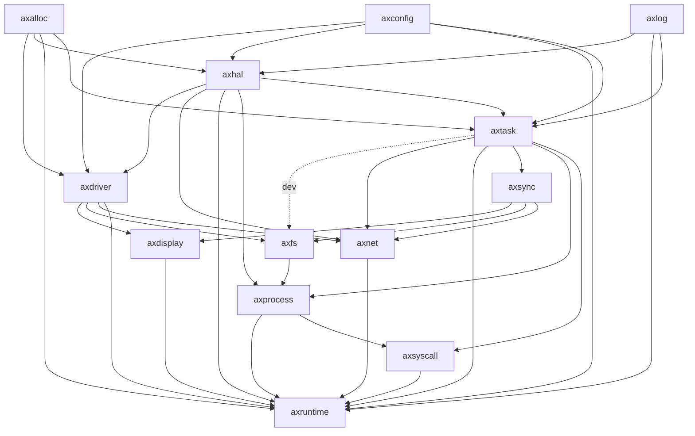

# StarryOS

## 简介

这里是StarryOS，一个基于ArceOS实现的宏内核。

> Starry意指布满星星的，寓意本OS的开发学习借鉴了许多前辈的思路，并将其汇总归一为这个内核。

## 成员

陈嘉钰、郑友捷、王昱栋

## Usage

```shell
# 构建镜像
./build_img.sh
# 运行内核
make run
```

## 项目结构

### 整体结构图

**下图为ArceOS结构图，StarryOS在此基础上添加了一系列模块，改变了运行逻辑，但总体结构关系不变。**


### 模块依赖图



* crates：与OS设计无关的公共组件
* modules：与OS设计更加耦合的组件
* doc：每周汇报文档，当前位于doc分支上
* apps：unikernel架构下的用户程序，继承原有ArceOS
* scripts：makefile脚本，继承原有ArceOS
* ulib：用户库，继承原有ArceOS


## 测例切换和执行

通过修改`build_img.sh`可以切换生成的文件镜像中包含的测例。

```shell
rm disk.img
dd if=/dev/zero of=disk.img bs=3M count=1024
mkfs.vfat -F 32 disk.img
mkdir -p mnt
sudo mount disk.img mnt
# 此处生成的是初赛的测例
sudo cp -r ./testcases/junior/* ./mnt/
sudo umount mnt
rm -rf mnt
sudo chmod 777 disk.img
```

将上图中`junior`换为`libc`即可生成决赛部分的`libc-test`测例。
