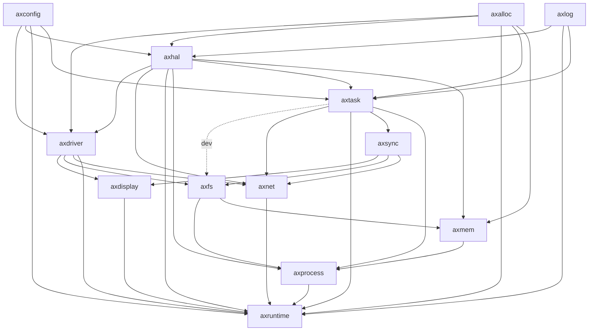

# StarryOS

## 简介

这里是StarryOS，一个基于ArceOS实现的宏内核。

> Starry意指布满星星的，寓意本OS的开发学习借鉴了许多前辈的思路，并将其汇总归一为这个内核。

在线文档详见：[Starry (azure-stars.github.io)](https://azure-stars.github.io/Starry/)

## 成员

陈嘉钰、郑友捷、王昱栋

## Usage

```shell
# 构建镜像
./build_img.sh sdcard
# 运行内核
make run
```

## 项目结构

### 整体结构图


### 模块依赖图



* crates：与OS设计无关的公共组件
* modules：与OS设计更加耦合的组件
* doc：每周汇报文档，当前位于doc分支上
* apps：unikernel架构下的用户程序，继承原有ArceOS
* scripts：makefile脚本，继承原有ArceOS
* ulib：用户库，继承原有ArceOS


## 测例切换和执行

执行如下指令可以生成sdcard文件镜像

```shell
$ ./build_img.sh sdcard
```

如果想要切换到其他测例，如切换到gcc，请在保证testcases/gcc文件夹下对应文件夹内容满足需求之后，执行如下指令
```shell
$ ./build_img.sh gcc
```


通过修改指令可以切换生成的文件镜像中包含的测例。相应测例存放在`testcases/`文件夹下，如执行`./build_img.sh libc-static`可以生成libc静态测例。


## 文档

内核文档存放在`doc/Starry决赛设计文档.pdf`。

另外，可以通过静态部署网页[Starry (azure-stars.github.io)](https://azure-stars.github.io/Starry/)查看更好排版的文档。
