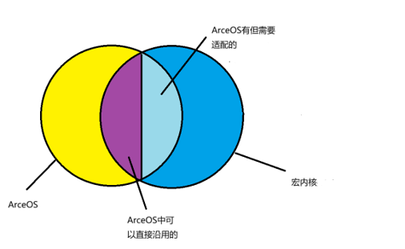
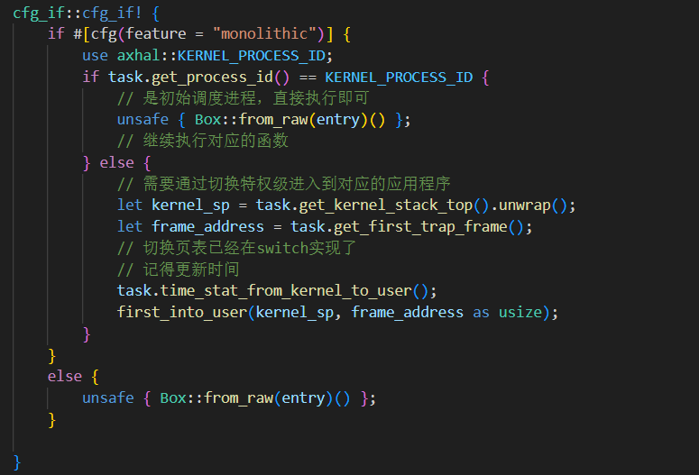
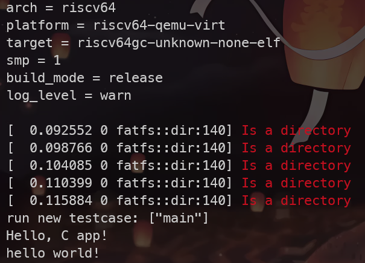

# StarryOS 的 syscall 层模块化

## 训练目标

本次训练的目标是将 ArceOS 宏内核化成果之一的 Starry 内核的 syscall 层进行进一步的模块化划分，从而做到更好地与 Unikernel 架构兼容，同时支持自选功能启动。


## Starry 的 Unikernel 兼容

### 模块划分

将ArceOS与宏内核的关系划分如下：

* ArceOS中可直接沿用：log、driver以及一系列解耦的crate
* ArceOS中需要调整适配：任务调度、特权级转化等
* ArceOS中需要添加：地址空间、进程、信号、文件系统、用户库等内容



### 使用 feature 区分

我们通过使用 Rust 支持的条件编译特性 feature 来进行两种架构不同运行流的兼容：

feature 的使用基本有两种情况：

1. 通过 feature 添加成员域或者额外处理语句
2. 通过 feature 选择不同的分支语句

一个使用例子如下：

依据 ArceOS 良好的模块化特性，我们能够仅在顶层模块的少数语句中加入条件编译区分就实现了区分两种架构不同执行流的目的。


之后便是对已有的 ArceOS 测例进行调试的过程，调试的相关信息放在了[Starry/doc/OS-Train-Repo/Week3.md at main · Azure-stars/Starry (github.com)](https://github.com/Azure-stars/Starry/blob/main/doc/OS-Train-Repo/Week3.md)


## 自选架构启动

底层架构处理好了之后，需要考虑的是用户如何方便地选择不同的架构启动。


以 C 语言为例，我们希望通过代码链接到不同的库来启动不同架构的内容。


* Unikernel：晏巨广学长致力 ArceOS 的 musl-libc 支持，将 C 代码链接到 axlibc 上之后，应用程序可以直接调用 Unikernel 接口。


* 宏内核：应用程序和用户库编译为 ELF 文件之后加载到文件镜像，通过汇编指令跳转到 axhal 层，由内核转发到 syscall 层来处理。

由于额外实现一个与 ArceOS 接口解耦、用于和用户程序进行编译的库没有太大意义，所以我采用了用户程序直接和本地自带的 libc 用户库编译的方式。

对编译方式进行修改：当指定`STRUCT=Monolithic`时，采用宏内核启动，此时会对指定的源代码进行如下操作：

1. 通过外部编译器，如 riscv-musl-gcc 编译器对源代码进行编译
2. 将得到的可执行文件打包到文件镜像中
3. 启动宏内核，读取外部的可执行文件，开始运行


当采用宏内核运行 `helloworld`程序时，执行指令如下：

```shell
$ make A=apps/c/helloworld STRUCT=Monolithic run 
```

有如下运行结果：




## Syscall 层的进一步细分

### 背景

原有的 syscall 层包含了内核的几乎所有可选功能，当选用宏内核启动的时候需要对所有可选功能进行实现，这会导致编译与启动均消耗较多时间

我们计划根据指定运行的应用程序选择对应的可选功能启动，即定制化内核。


### 实现方式

根据应用程序运行所用到的 syscall 功能来决定启动哪些内核的可选功能。

当前的处理方式是按照所需要的syscall所属的模块，来批量提供这个模块中的所有syscall（如只要求open，可能会同时提供同类的open、write、close）

将当前的模块划分为如下部分：

* syscall_utils：提供一些通用的接口和系统调用用到的结构体定义
* syscall_task：主管任务模块，包括进程管理、调度、互斥资源管理等
* syscall_fs：文件系统对外封装，包括打开、关闭、读写文件等Linux相关语义支持
* syscall_mem：内存管理模块封装，包括动态分配堆内存、修改页面权限等操作
* syscall_net：网络控制模块，提供 socket 等网络相关结构的支持
* syscall_entry：系统调用入口，通过不同的 feature 启动不同的模块，并且加入对应的底层模块

每一个 syscall 模块下面还有各自的可选功能，比如 syscall_task 模块还带有信号、futex等可选功能。

通过选用不同的功能 feature，将定制的模块加入到内核镜像中一起启动。通过测试可以发现选用不同的 feature 时内核镜像大小确实有明显的区别，因此确实做到了模块的定制化插入。


## 从源代码到内核的自动化启动

* 背景：在完成了 syscall 层的模块化之后，仍然需要通过手动修改 cargo.toml 或者编译指令的方式来进行可选启动，思考是否存在根据给定的应用程序的代码自动启动的方式。

* 实现方式：通过工具分析应用程序可能用到的 syscall，根据 syscall 来选择需要引入的 syscall 功能
* 分析工具选择：静态分析工具rust-objdump
* 分析方法：利用 rust-objdump 来解析即将运行的应用程序镜像得到汇编代码，获取所有系统调用入口对应的系统调用号，从而得到一个 syscall list，传给内核转化为对应需要启动的功能

* 执行效果：执行如下指令：

  ```shell
  $ make A=apps/c/helloworld STRUCT=Monolithic LOG=off run
  ```

  会自动生成一个 `features.txt` 传递给 内核，用于选择对应的 feature 和 syscall 功能启动。

  查看内核编译指令，确实是按照对应的 feature 启动了，并且没有加入额外的无关 feature。


## 总结

本次训练是在操作系统比赛的基础上对 Starry 的进一步维护，优化了其内部结构，也做到了设计初期想要做到的双架构兼容，并且额外实现了自动化定制内核的功能，可以为将来基于 ArceOS 的宏内核开发以及操作系统比赛提供参考。