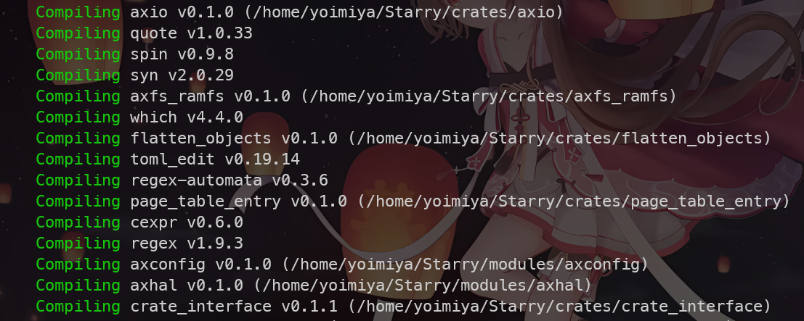
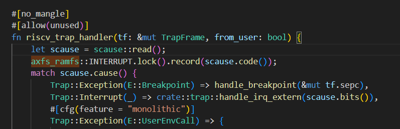

# Week 3

## 继承上周工作

继续添加 feature 内容，主要工作在对 axtask 模块的添加，需要保证原有内容能够和 ArceOS 源程序进行兼容。。

## 在 Starry 代码基础上运行原有的 ArceOS 应用

原本 Starry 代码是基于 ArceOS 开发的，也始终保持着和 ArceOS 上游的同步。但是由于比赛时期较赶，且缺少规范的 CI-CD，并没有保证 Starry 代码可以始终通过原有 ArceOS 测例。但是现在为了做到两种架构的实时兼容，需要先保证能够通过各自的测例。


* 尝试通过 ArceOS 原有的 Hello World 测例

在尝试通过 Hello World 测例时，由于之前开发的时候对 Starry 更改的绝大多数内容都使用了条件编译，因此并不需要修改过多内容。

1. 首先尝试直接编译运行，看看能不能跑。。

   

   发现报错：

   ````shell
   error: no global memory allocator found but one is required; link to std or add `#[global_allocator]` to a static item that implements the GlobalAlloc trait
   ````

   

   根据报错，应该是少了全局分配器。但是运行 ArceOS 原有代码时，发现并不需要实现全局分配器也可以编译出这个测例，所以应该是 Starry 在某一个地方引入了一个需要用到堆分配内存的代码，但没有做好兼容。

   

2. 对比 ArceOS 代码检查了一段时间，找不到问题，感觉文件量太大不好对比。

   

3. 后面思考：`global allocator`是用到堆内存分配机制，在不引入特殊语句的情况下，我们一般只会通过`extern crate alloc`引入`alloc`和与它相关的数据结构，才能做到访问、分配堆内存。

   因此尝试全局搜索所有引入了`alloc`的模块，逐个注释掉这些模块对`alloc`的直接引用，进行排查。

   仍然报错。。

   

4. 但是这个思路应该是对的，于是我根据所有引入了 `alloc` 的模块，看看编译时他们是否被引入，从而确定`alloc`是否被间接引用了。

   

   最后发现问题出在`axfs_ramfs`上，它实现了 ramfs 相关的文件系统信息。在 HelloWorld 测例中它不应该被引入，但是编译时发现它出现在了被编译清单上。

   

   

   继续检查，发现`axhal`模块引用了这个 crate，最后查明是 trap 处理时使用到了这个 crate 下的一个文件。

   

   这个文件是为了统计中断发生的次数，是当时决赛临时添加的一个文件，没有做好兼容导致出现了问题。

   将这个文件加上条件编译，同时设置`axfs_ramfs`为可选引入模块，从而解决了问题。

* task/yield 测例

  需要对 axtask 中一系列结构体成员与其对应的方法加上对应的条件编译语句。为了简约起见，为`TaskInner`新加了一个`impl`，集中存放为宏内核实现加上的内容。

* net/bwbench 测例

  没有串口输出，需要打开 `LOG=info` 开关才可以看到对应输出，部分输出截取如下：

  ```shell
  [  1.066117 0 axnet::smoltcp_impl::bench:35] Transmit: 0.773GBytes, Bandwidth: 6.184Gbits/sec.
  [  2.065980 0 axnet::smoltcp_impl::bench:35] Transmit: 0.840GBytes, Bandwidth: 6.720Gbits/sec.
  [  3.065980 0 axnet::smoltcp_impl::bench:35] Transmit: 0.744GBytes, Bandwidth: 5.956Gbits/sec.
  [  4.066010 0 axnet::smoltcp_impl::bench:35] Transmit: 0.768GBytes, Bandwidth: 6.150Gbits/sec.
  [  5.066014 0 axnet::smoltcp_impl::bench:35] Transmit: 0.745GBytes, Bandwidth: 5.962Gbits/sec.
  [  6.066012 0 axnet::smoltcp_impl::bench:35] Transmit: 0.742GBytes, Bandwidth: 5.937Gbits/sec.
  [  7.066013 0 axnet::smoltcp_impl::bench:35] Transmit: 0.741GBytes, Bandwidth: 5.930Gbits/sec.
  [  8.066012 0 axnet::smoltcp_impl::bench:35] Transmit: 0.747GBytes, Bandwidth: 5.978Gbits/sec.
  [  9.066032 0 axnet::smoltcp_impl::bench:35] Transmit: 0.744GBytes, Bandwidth: 5.955Gbits/sec.
  ```


## 对 syscall 层的抽象

我的选题定为了 宏内核和 Unikernel 的兼容启动、对 syscall 层的抽象，想要通过 抽象出 syscall 层来实现两种机构的兼容启动，使得 syscall 层发挥参数检查等安全性作用。


通过 week 2 的工作，我发现原先的用户库其实可以用来提供 syscall 层的抽象的工作。也就是说，整个用户库提供了对 Linux 系统调用的包装。当用户选择通过宏内核启动时，便可以使得调用的函数通过用户库进行处理，从而达到了参数检查等目的。


因此，week 2-3 的工作更多是做好底层模块对不同架构的兼容，从而支持用户通过选用不同库调用来走不同的架构处理。

## 用户快捷选择架构启动

底层架构处理好了之后，需要考虑的是用户如何方便地选择不同的架构启动。

传统的 Unikernel 启动是将用户程序和内核同时打包在一起进行编译，而对于宏内核而言，需要先将外部程序打包为一个文件镜像，内核启动之后从文件镜像中读取对应的程序进行加载、启动。


> 思考：是否可以将内核和应用程序代码打包在一起通过宏内核启动，这样可以和原来的 ArceOS 共享一个编译、启动流程。


考虑到宏内核加载应用的时候需要分析对应的 ELF 文件，建构起对应的地址空间，如果采用上述的思考方法，会需要对当前的地址空间建构方式进行较大程度的改动。因此还是采用原先外部编译并且打包在文件镜像的方式。


对编译方式进行修改：

当指定`STRUCT=Monolithic`时，采用宏内核启动，此时会对指定的源代码进行如下操作：

1. 通过外部编译器，如 riscv-musl-gcc 编译器对源代码进行编译
2. 将得到的可执行文件打包到文件镜像中
3. 启动宏内核，读取外部的可执行文件，开始运行


成果：

当采用宏内核运行 `helloworld`程序时，结果如下：

```shell
$ make A=apps/c/helloworld STRUCT=Monolithic run 
```


有如下运行结果：


