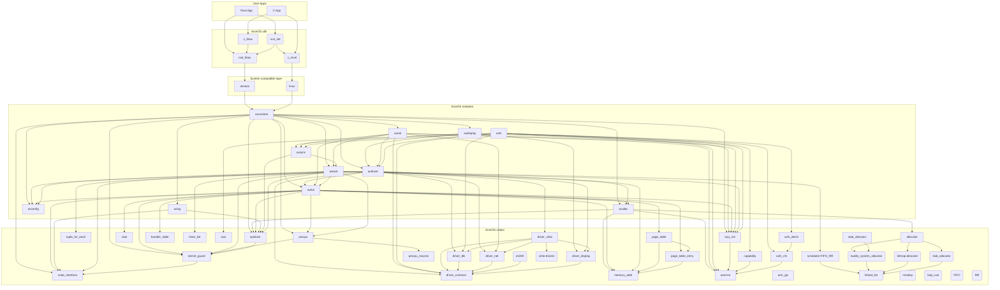

# ArceOS Architecture Overview

## Rustdoc

* https://rcore-os.github.io/arceos/

## ArceOS Modules

* [axalloc](../modules/axalloc): ArceOS global memory allocator.
* [axconfig](../modules/axconfig): Platform-specific constants and parameters for ArceOS.
* [axdisplay](../modules/axdisplay): ArceOS graphics module.
* [axdriver](../modules/axdriver): ArceOS device drivers.
* [axfs](../modules/axfs): ArceOS filesystem module.
* [axhal](../modules/axhal): ArceOS hardware abstraction layer, provides unified APIs for platform-specific operations.
* [axlog](../modules/axlog): Macros for multi-level formatted logging used by ArceOS.
* [axnet](../modules/axnet): ArceOS network module.
* [axruntime](../modules/axruntime): Runtime library of ArceOS.
* [axsync](../modules/axsync): ArceOS synchronization primitives.
* [axtask](../modules/axtask): ArceOS task management module.

## Crates

* [allocator](../crates/allocator): Various allocator algorithms in a unified interface.
* [arm_gic](../crates/arm_gic): ARM Generic Interrupt Controller (GIC) register definitions and basic operations.
* [axerrno](../crates/axerrno): Error code definition used by ArceOS.
* [axfs_devfs](../crates/axfs_devfs): Device filesystem used by ArceOS.
* [axfs_vfs](../crates/axfs_vfs): Virtual filesystem interfaces used by ArceOS.
* [axio](../crates/axio): `std::io`-like I/O traits for `no_std` environment.
* [capability](../crates/capability): Provide basic capability-based security.
* [crate_interface](../crates/crate_interface): Provides a way to define an interface (trait) in a crate, but can implement or use it in any crate. 
* [driver_block](../crates/driver_block): Common traits and types for block storage drivers.
* [driver_common](../crates/driver_common): Device driver interfaces used by ArceOS.
* [driver_display](../crates/driver_display): Common traits and types for graphics device drivers.
* [driver_net](../crates/driver_net): Common traits and types for network device (NIC) drivers.
* [driver_pci](../crates/driver_pci): Structures and functions for PCI bus operations.
* [driver_virtio](../crates/driver_virtio): Wrappers of some devices in the `virtio-drivers` crate, that implement traits in the `driver_common` series crates.
* [flatten_objects](../crates/flatten_objects): A container that stores numbered objects. Each object can be assigned with a unique ID.
* [handler_table](../crates/handler_table): A lock-free table of event handlers. 
* [kernel_guard](../crates/kernel_guard): RAII wrappers to create a critical section with local IRQs or preemption disabled. 
* [lazy_init](../crates/lazy_init): A wrapper for lazy initialized values without concurrency safety but more efficient.
* [linked_list](../crates/linked_list): Linked lists that supports arbitrary removal in constant time.
* [memory_addr](../crates/memory_addr): Wrappers and helper functions for physical and virtual addresses. 
* [page_table](../crates/page_table): Generic page table structures for various hardware architectures.
* [page_table_entry](../crates/page_table_entry): Page table entry definition for various hardware architectures.
* [percpu](../crates/percpu): Define and access per-CPU data structures.
* [percpu_macros](../crates/percpu_macros): Macros to define and access a per-CPU data structure.
* [ratio](../crates/ratio): The type of ratios and related operations.
* [scheduler](../crates/scheduler): Various scheduler algorithms in a unified interface.
* [slab_allocator](../crates/slab_allocator): Slab allocator for `no_std` systems. Uses multiple slabs with blocks of different sizes and a linked list for blocks larger than 4096 bytes.
* [spinlock](../crates/spinlock): `no_std` spin lock implementation that can disable kernel local IRQs or preemption while locking.
* [timer_list](../crates/timer_list): A list of timed events that will be triggered sequentially when the timer expires.
* [tuple_for_each](../crates/tuple_for_each): Provides macros and methods to iterate over the fields of a tuple struct.

## Applications (Rust)

| App | Extra modules | Enabled features | Description |
|-|-|-|-|
| [helloworld](../apps/helloworld/) | | | A minimal app that just prints a string |
| [exception](../apps/exception/) | | paging | Exception handling test |
| [memtest](../apps/memtest/) | axalloc | alloc, paging | Dynamic memory allocation test |
| [display](../apps/display/) | axalloc, axdisplay | alloc, paging, display | Graphic/GUI test |
| [yield](../apps/task/yield/) | axalloc, axtask | alloc, paging, multitask, sched_fifo | Multi-threaded yielding test |
| [parallel](../apps/task/parallel/) | axalloc, axtask | alloc, paging, multitask, sched_fifo, irq | Parallel computing test (to test synchronization & mutex) |
| [sleep](../apps/task/sleep/) | axalloc, axtask | alloc, paging, multitask, sched_fifo, irq | Thread sleeping test |
| [priority](../apps/task/priority/) | axalloc, axtask | alloc, paging, multitask, sched_cfs | Thread priority test |
| [shell](../apps/fs/shell/) | axalloc, axdriver, axfs | alloc, paging, fs | A simple shell that responds to filesystem operations |
| [httpclient](../apps/net/httpclient/) | axalloc, axdriver, axnet | alloc, paging, net | A simple client that sends an HTTP request and then prints the response |
| [echoserver](../apps/net/echoserver/) | axalloc, axdriver, axnet, axtask | alloc, paging, net, multitask | A multi-threaded TCP server that reverses messages sent by the client  |
| [httpserver](../apps/net/httpserver/) | axalloc, axdriver, axnet, axtask | alloc, paging, net, multitask | A multi-threaded HTTP server that serves a static web page |
| [udpserver](../apps/net/udpserver/) | axalloc, axdriver, axnet | alloc, paging, net | A simple echo server using UDP protocol |

## Applications (C)
| App | Extra modules | Enabled features | Description |
|-|-|-|-|
| [helloworld](../apps/c/helloworld/) | | | A minimal C app that just prints a string |
| [memtest](../apps/c/memtest/) | axalloc | alloc, paging | Dynamic memory allocation test in C |
| [sqlite3](../apps/c/sqlite3/) | axalloc, axdriver, axfs | alloc, paging, fp_simd, fs | Porting of [SQLite3](https://sqlite.org/index.html) |
| [iperf](../apps/c/iperf/) | axalloc, axdriver, axfs, axnet | alloc, paging, fp_simd, fs, net, select | Porting of [iPerf3](https://iperf.fr/) |
| [redis](../apps/c/redis/) | axalloc, axdriver, axtask, axfs, axnet | alloc, paging, fp_simd, irq, multitask, fs, net, pipe, epoll | Porting of [Redis](https://redis.io/) |

## Dependencies

