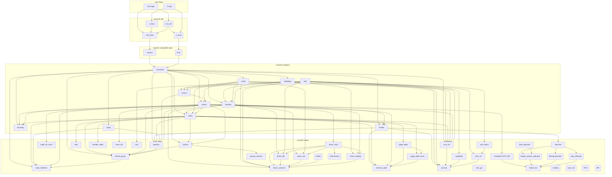

# ArceOS Architecture Overview

The key design principle of ArceOS is to divide components based on their **relevance to the OS design concept**, in order to reduce component coupling and improving reusability.

## Crates

Crates are **OS-agnostic** components that can be reused in other OS or system software projects with almost no modification, providing the most reusability. For example, the basic data structures, algorithms, and utilities.

See [arceos-crates](https://github.com/arceos-org/arceos-crates) for crates used by ArceOS.

## Modules

Modules are **OS-related** components that are tightly bound to the design principles of a specific OS and have relatively poor reusability. It may need to be redesigned when it is ported to another OS.

* [axalloc](../modules/axalloc): ArceOS global memory allocator.
* [axconfig](../modules/axconfig): Platform-specific constants and parameters for ArceOS.
* [axdisplay](../modules/axdisplay): ArceOS graphics module.
* [axdriver](../modules/axdriver): ArceOS device drivers.
* [axfs](../modules/axfs): ArceOS filesystem module.
* [axhal](../modules/axhal): ArceOS hardware abstraction layer, provides unified APIs for platform-specific operations.
* [axlog](../modules/axlog): Macros for multi-level formatted logging used by ArceOS.
* [axnet](../modules/axnet): ArceOS network module.
* [axruntime](../modules/axruntime): Runtime library of ArceOS.
* [axsync](../modules/axsync): ArceOS synchronization primitives.
* [axtask](../modules/axtask): ArceOS task management module.

## Applications (Rust)

| App | Extra modules | Enabled features | Description |
|-|-|-|-|
| [helloworld](../apps/helloworld/) | | | A minimal app that just prints a string |
| [exception](../apps/exception/) | | paging | Exception handling test |
| [memtest](../apps/memtest/) | axalloc | alloc, paging | Dynamic memory allocation test |
| [display](../apps/display/) | axalloc, axdisplay | alloc, paging, display | Graphic/GUI test |
| [yield](../apps/task/yield/) | axalloc, axtask | alloc, paging, multitask, sched_fifo | Multi-threaded yielding test |
| [parallel](../apps/task/parallel/) | axalloc, axtask | alloc, paging, multitask, sched_fifo, irq | Parallel computing test (to test synchronization & mutex) |
| [sleep](../apps/task/sleep/) | axalloc, axtask | alloc, paging, multitask, sched_fifo, irq | Thread sleeping test |
| [priority](../apps/task/priority/) | axalloc, axtask | alloc, paging, multitask, sched_cfs | Thread priority test |
| [shell](../apps/fs/shell/) | axalloc, axdriver, axfs | alloc, paging, fs | A simple shell that responds to filesystem operations |
| [httpclient](../apps/net/httpclient/) | axalloc, axdriver, axnet | alloc, paging, net | A simple client that sends an HTTP request and then prints the response |
| [echoserver](../apps/net/echoserver/) | axalloc, axdriver, axnet, axtask | alloc, paging, net, multitask | A multi-threaded TCP server that reverses messages sent by the client  |
| [httpserver](../apps/net/httpserver/) | axalloc, axdriver, axnet, axtask | alloc, paging, net, multitask | A multi-threaded HTTP server that serves a static web page |
| [udpserver](../apps/net/udpserver/) | axalloc, axdriver, axnet | alloc, paging, net | A simple echo server using UDP protocol |

## Applications (C)
| App | Extra modules | Enabled features | Description |
|-|-|-|-|
| [helloworld](../apps/c/helloworld/) | | | A minimal C app that just prints a string |
| [memtest](../apps/c/memtest/) | axalloc | alloc, paging | Dynamic memory allocation test in C |
| [sqlite3](../apps/c/sqlite3/) | axalloc, axdriver, axfs | alloc, paging, fp_simd, fs | Porting of [SQLite3](https://sqlite.org/index.html) |
| [iperf](../apps/c/iperf/) | axalloc, axdriver, axfs, axnet | alloc, paging, fp_simd, fs, net, select | Porting of [iPerf3](https://iperf.fr/) |
| [redis](../apps/c/redis/) | axalloc, axdriver, axtask, axfs, axnet | alloc, paging, fp_simd, irq, multitask, fs, net, pipe, epoll | Porting of [Redis](https://redis.io/) |

## Rustdoc

* https://arceos-org.github.io/arceos/

## Dependencies

