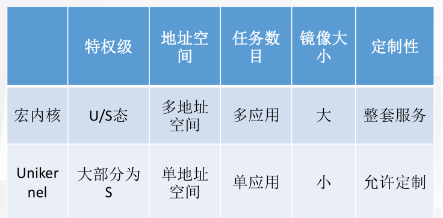

 Starry的工作是为一个面向Unikernel设计的OS添加宏内核支持，因此相比于其他从0开始的
内核，Starry需要考虑更多兼容工作，也要求我们对Unikernel和ArceOS有足够的了解。


### 前期知识了解

首先，我们了解到ArceOS是以Unikernel架构运行的。因此我们查阅了Unikernel和宏内核相关的资料，并且总结出两者之间的一些简单的区别如下：




另外，我们也详细阅读了ArceOS的代码，总结出从ArceOS到宏内核需要完善的内容：


通过阅读ArceOS与其他宏内核如zCore、rCore的代码实现，将ArceOS与宏内核的关系划分如下：

* ArceOS中可直接沿用：log、driver以及一系列解耦的crate
* ArceOS中需要调整适配：任务调度、特权级转化等
* ArceOS中需要添加：地址空间、进程、信号、文件系统、用户库等内容


### 开发内容

依据前期知识的总结，我们在原有ArceOS的基础上做出了如下改动：


在原有ArceOS代码的基础上

* 新增了4个模块：分别为
  * axmem：添加多地址空间
  * axprocess：添加进程管理
  * axsignal：添加信号模块
  * axfs：添加适用于宏内核的文件系统接口
* 改动适配了5个模块：分别为
  * axhal：主要为关于宏内核的trap处理，如syscall、缺页异常等
  * axtask：主要为task信息的补充，如计时器信息
  * axdriver：主要为ramdisk的补充，为比赛加载测例服务
  * axruntime：主要为内核初始化流程中添加宏内核启动相关服务
  * axnet：主要为Linux相关的syscall添加相对应的接口
* 新增了一个用户库：封装Linux相关的系统调用，处理相应的syscall
* 共涉及代码约12000行


### 开发重点

#### 进程实现

为了保证Starry可以较好地去适配Unikernel架构，在比赛初期我们就进程结构与线程是否分离这个问题进行了讨论。


在Linux中，进程和线程合并在一起，统一由pthread控制块进行管理，某种程度上简化了结构。但我们的Starry需要适配Unikernel，在Unikernel中是单应用程序，没有多进程的概念。因此作为兼容Linux应用和Unikernel的Starry OS，进程如何定义便有了较为重要的意义。


我们先讨论了两种做法的优点：

* 合并优点：符合Linux结构，更加直观
* 分离优点：适配Unikernel实现，更加兼容ArceOS


为了得到更好的比较结果，我们**分头行动，根据两种不同的定义方式实现了两个内核**。经过比较之后，我们决定将进程和线程合并，更好地去适配ArceOS。


#### 与ArceOS的兼容

为了保证和ArceOS代码功能上的兼容，在开发过程中需要一定程度地保留ArceOS原有代码，同时不能影响自己新的功能，防止出现冲突。


为了解决这个问题，我们用到了三种工具：

* 条件编译

  条件编译贯穿了Starry实现过程，通过指定不同的feature来定制不同的内核实现。同时，也可以用条件编译来在保留ArceOS原有功能的同时，添加上Starry的分支功能，指定不同的feature保证两者可以得到兼容。

  ```rust
  cfg_if::cfg_if! {
      if #[cfg(feature = "monolithic")] {
          axprocess::process::init_kernel_process();
      }
      else {
          #[cfg(feature = "multitask")]
          axtask::init_scheduler();
      }
  }
  ```

* 封装trait

  封装trait是Rust提供不同实现兼容的一种常见方式。不同结构通过用不同方式实现同一个trait，可以得到不同的处理方式和功能，从而达到了兼容并存的效果。如文件系统的一系列读写Trait便起到了这个功能。

* crate_interface包

  crate_interface包是由ArceOS实现的一个包，效果类似于trait。它允许用户在底层通过`def_interface`定义某些函数接口，并在上层通过`impl_interface`实现对应函数的具体内容。通过调用多个`impl_interface`便可以做到同一个接口的多种实现方式。

  crate_interface与trait的一个不同之处在于，crate_interface的实现只能有一个，也就是说如果存在`impl_interface`，那么可能需要用到条件编译等手段使得仅有唯一一个`impl_interface`被实际编译到镜像中。

  

