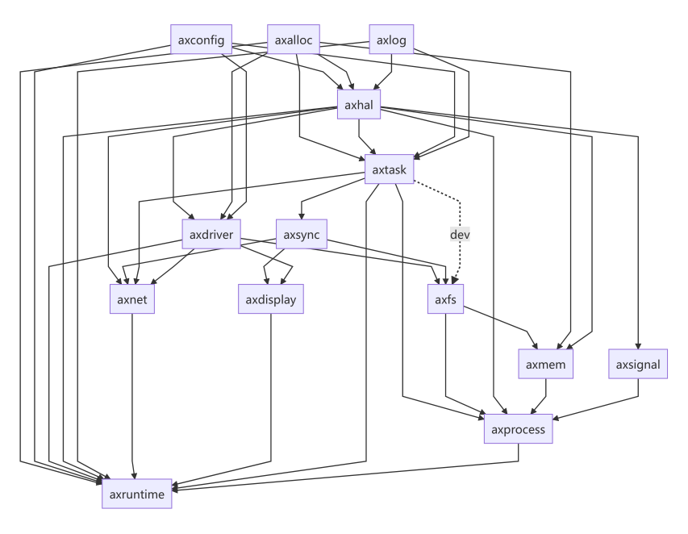

### Starry结构说明

* crates：与OS设计无关的公共组件
* modules：与OS设计更加耦合的组件，各个模块功能简要介绍如下：
  * axalloc：实现全局分配器
  * axconfig：定义内核参数
  * axdisplay：简单的图形化实现
  * axdriver：设备驱动管理
  * axfs：文件系统支持
  * axhal：硬件抽象层，定义了一系列的平台API，如trap入口等
  * axlog：log输出层
  * axnet：网络模块
  * axruntime：运行库，定义了内核的启动逻辑
  * axsync：实现同步模块
  * axmem：地址空间模块
  * axprocess：进程模块，也实现了动态加载
  * axsignal：信号模块
  * axtask：定义了任务与调度序列的操作

* apps：unikernel架构下的用户程序，继承原有ArceOS
* ulib：用户库，继承原有ArceOS，并添加了starry_libax部分作为Linux兼容层。

1. 为了实现宏内核架构体系，需要对原有Arceos的部分核心模块（如axtask）进行修改。为了防止合并时冲突过多，因此在对应模块下建立`monolithic*`为前缀的文件夹，存放为宏内核架构实现的内容。同时使用条件编译来选择是宏内核架构还是unikernel架构。
2. 为了实现linux APP兼容，需要实现一系列面向linux的系统调用。我们将系统调用的具体实现部分放在`starry_libax`部分，即以用户库的形式形成一个linux兼容层。通过调用上述模块提供的一系列接口，实现对应的linux 系统调用，并暴露给外界。这个系统兼容层与原有的`libax`进行对应，分别提供不同的接口与服务。

3. 模块部分放置可以为宏内核与unikernel尽可能共享的内容，通过**条件编译**等方式做到尽可能地为不同架构下的兼容层所调用。

### 结构图对比

原先Arceos结构图：

重构后StarryOS架构图：

Starry的模块依赖图如下：

### 结构优势

1. 用相同的代码组件，利用条件编译等方式可以组建出不同架构的OS内核，从而可以达到使用不同的启动参数来启动不同架构的内核，大大提高内核的泛用性。
2. 在利用unikernel可插拔的特性的基础上，可以使得实现某一个功能的crate和整体OS进一步解耦，从而利于更新换代。
3. 解耦的特性利于开发模式的分工，不同开发人员可以负责不同的module或者crate内容，只要实现了对应的接口便可以较好地适配本内核，从而方便其他开发人员参与其中不断完善。

