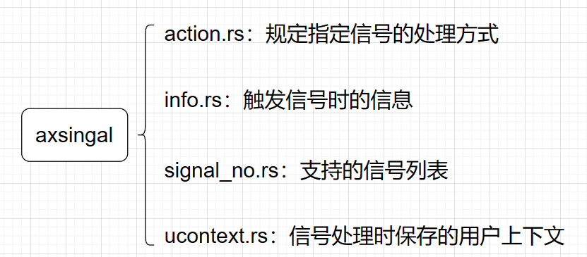

axsignal是starry的信号模块，负责实现进程间、任务间等通信机制。当前实现的原理主要借鉴于Linux的信号机制。相关功能划分如下：



其中各部分的额外补充说明如下：

### action

action.rs指定了处理某一信号时的具体操作方式。操作方式的指定是通过定义`SigAction`结构体实现的，相关内容如下：

```rust
pub struct SigAction {
    /// 信号处理函数的地址
    /// 1. 如果是上述特殊值 SIG_DFL 或 SIG_IGN，则按描述处理
    /// 2. 若flags没有指定SA_SIGINFO，则函数原型为 fn(sig: SignalNo) -> ()，对应C语言原型为 void (*sa_handler)(int)
    /// 3. 若flags指定了SA_SIGINFO，则函数原型为 fn(sig: SignalNo, info: &SigInfo, ucontext: &mut UContext) -> ()，
    /// 对应C语言原型为 void (*sa_sigaction)(int, siginfo_t *, void *)。
    ///
    /// 其中，SigInfo和SignalNo的定义见siginfo.rs和signal_no.rs。
    /// UContext即是处理信号时内核保存的用户态上下文，它存储在用户地址空间，会在调用sig_return时被恢复，定义见ucontext.rs。
    pub sa_handler: usize,
    /// 信号处理的flags
    pub sa_flags: SigActionFlags,
    /// 信号处理的跳板页地址，存储了sig_return的函数处理地址
    /// 仅在SA_RESTORER标志被设置时有效
    pub restorer: usize,
    /// 该信号处理函数的信号掩码
    pub sa_mask: usize,
}
```

其中值得说明的是`restorer`。想要了解这个`restorer`就需要了解Linux规定的信号处理机制流程：


> 上图引用自rCore教学文档[信号 - rCore-Tutorial-Book-v3 3.6.0-alpha.1 文档 (rcore-os.cn)](http://rcore-os.cn/rCore-Tutorial-Book-v3/chapter7/4signal.html)

根据上图可知，当进入信号处理阶段之后，若指定了信号处理例程，那么内核会返回用户态，跳转到信号处理函数对应入口进行信号处理。

传统的C语言函数中，函数执行结束时，内核会将ra寄存器的值赋给pc，即pc跳转到ra指定的地址上。

而对于信号处理函数，自然也需要一个返回地址，即我们刚才提到的`restorer`字段。

当信号处理函数执行完毕，会出现以下两种情况：

1. 用户手动指定了返回地址`restorer`：此时由于我们的信号处理函数编译之后，会在结束时自动跳转到ra上，因此我们只需要在信号处理函数开始前，将`restorer`字段赋给ra寄存器即可。之后信号处理函数执行完毕之后就会跳转到指定地址。
2. 用户未手动调用返回地址`restorer`：此时内核需要手动帮助用户执行`sig_return`系统调用，其功能是告知内核信号已经处理完毕，方便内核恢复因为处理信号而被打断的trap上下文。而手动处理的方式即是将`restorer`字段设置为一个非法的特殊字段：`SIGNAL_RETURN_TRAP`。当用户态下的信号处理函数执行完毕时，它会自动跳转到ra寄存器指定的地址，即跳转到`SIGNAL_RETURN_TRAP`，从而触发`InstructionPageFault`。此时内核捕获到trap之后，就可以根据触发page fault的地址判断是否触发了`sig_return`。若是，则手动调用`sig_return`系统调用即可。

因此，通过对`restorer`的合理使用，我们可以比较巧妙地实现信号处理的返回。