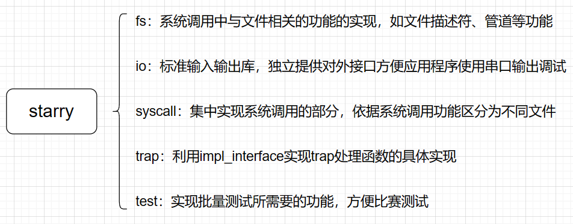

根据starry的模块化设计思路，用户库是在给定模块的基础上进行统合、提供对外统一接口的代码部分。而宏内核架构下对外提供的接口以Linux的系统调用形式进行呈现。因此starry_libax部分主要便是对系统调用的封装实现以及批量测试的实现。

各部分的额外补充说明如下

### syscall

关于syscall模块各自文件功能额外说明如下：

* epoll：实现poll相关的系统调用的功能，如epoll/ppoll/poll等系统调用，借鉴于[maturin/modules/epoll at master · scPointer/maturin (github.com)](https://github.com/scPointer/maturin/tree/master/modules/epoll)

* futex：实现任务互斥锁部分，它是用户态多任务协同开发的重点，因此需要谨慎考虑其实现。

  futex的原理是以一个指定的变量作为futex变量，多个任务在等待获取这个变量的执行权限。但是否会出现多任务同时操作同一个变量的冲突问题不由内核考虑，而是由用户自行考虑并且实现，而内核只需要实现futex相关的操作对应的语义即可。

  关于futex的核心操作有两个：wait和wake。以下分别介绍这两种操作的处理方式：

  * wait：当一个任务调用futex的wait操作时，会指定一个futex变量的地址，此时代表着这个任务需要等待该futex的权限。那么这个任务会被加入到该futex变量的等待序列之中。之后任务会按照指定的休眠时间进行休眠，直到被唤醒。
  * wake：当某一个任务完成了对某一个futex变量的操作之后，会调用futex的wake操作，此时代表着释放了该futex变量。内核需要从该futex变量的等待序列中找到一个仍然在休眠的任务，并且手动唤醒它，接管futex变量的权限。

  当一个任务wait for一个futex变量时，其被唤醒的方式有三种：

  1. 原有的futex变量被释放，该任务获得了控制权
  2. 任务休眠时间到期
  3. 原有futex变量地址上存储的值被改变

  依据上述三种情况，即可实现futex系统调用的相关处理方式。

### fs

fs模块是为了支持文件相关的系统调用而实现的功能，包括文件描述符、链接、挂载等功能。之所以将该模块放在这个部分而不是放在axprocess或者axfs中，是因为文件描述符等内容是与Linux系统调用耦合度较高的内容，是系统调用的特定设置，在其他如微内核的架构中也存在着类似文件系统的功能，但不一定要具化到文件描述符。因此axfs中存放的是文件系统的统一实现，而如文件描述符等较贴近Linux的内容则放在Linux兼容层用户库starry_libax中实现，从而更加贴近模块化内核的设计思路。