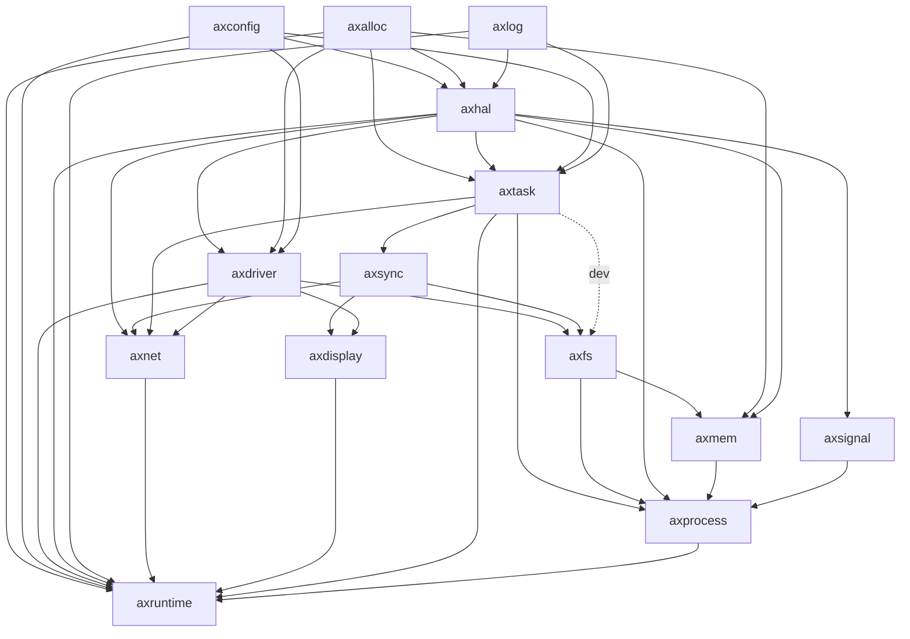
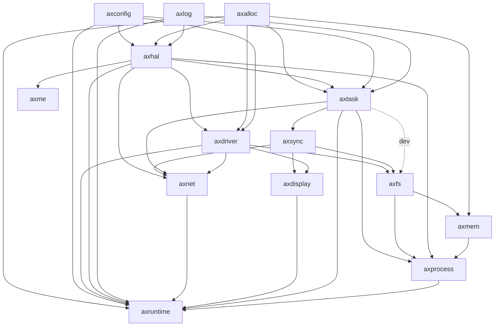

# Starry 设计文档

> 陈嘉钰、郑友捷、王昱栋


Starry是一个可以在`qemu`上运行的多核模块化OS（对于`sifive-fu740`的支持还在工作中）


## 背景

Starry是在`ArceOs`[rcore-os/arceos: An experimental modular OS written in Rust.](https://github.com/rcore-os/arceos)基础上进行开发的、以宏内核架构运行Linux应用的内核。原有的ArceOS设计架构为`Unikernel`，后续计划在原有代码结构的基础上设计宏内核架构和微内核架构，而Starry即是ArceOS宏内核架构化的一个成果。


## 目前测例支持

当前测例支持如下：

* musl-libc：静态链接与动态链接均已支持，实现的特性有动态库加载、线程、信号、futex等
* lua：已经支持
* busybox：已经支持大部分指令，通过了比赛的测例
* lmbench：已经支持，可以使用lmbench测算内核性能
* iperf/netperf：支持大部分测例，可以实现网络的基本功能
* UnixBench：已经支持，可以用来测算内核在文件读取、数据基本操作等方面的性能
* libc-bench：已经支持


## 使用方式

详见主页面的README.md

相关依赖库均已本地化在`vendor`文件夹中


## 架构设计介绍

### ArceOS介绍

我们的Starry是基于ArceOS生成的，因此需要简单介绍一下ArceOS实现的内容。

ArceOS采用模块化组件化的设计思维，通过使用内核组件 + 组件化的OS框架 来得到 不同形态的OS kernel。

* 提供了一套组件化的操作系统框架
* 提供各种内核组件的实现，各种内核组件可在没有OS kernel的情况下独立运行
  * 如filesystem, network stack等内核组件可以在裸机或用户态以库的形式运行
  * 各种设备驱动等内核组件可以在裸机上运行
* 理想情况下可以通过选择组件构成unikernel/宏内核/微内核
* 实际上在我们开始实验时它还只支持unikernel
  * 只运行一个用户程序
  * 用户程序与内核链接为同一镜像
  * 不区分地址空间与特权级
  * 安全性由底层 hypervisor 保证

### Starry结构说明

* crates：与OS设计无关的公共组件
* modules：与OS设计更加耦合的组件，各个模块功能简要介绍如下：
  * axalloc：实现全局分配器
  * axconfig：定义内核参数
  * axdisplay：简单的图形化实现
  * axdriver：设备驱动管理
  * axfs：文件系统支持
  * axhal：硬件抽象层，定义了一系列的平台API，如trap入口等
  * axlog：log输出层
  * axnet：网络模块
  * axruntime：运行库，定义了内核的启动逻辑
  * axsync：实现同步模块
  * axmem：地址空间模块
  * axprocess：进程模块，也实现了动态加载
  * axsignal：信号模块
  * axtask：定义了任务与调度序列的操作

* apps：unikernel架构下的用户程序，继承原有ArceOS
* ulib：用户库，继承原有ArceOS，并添加了starry_libax部分作为Linux兼容层。

1. 为了实现宏内核架构体系，需要对原有Arceos的部分核心模块（如axtask）进行修改。为了防止合并时冲突过多，因此在对应模块下建立`monolithic*`为前缀的文件夹，存放为宏内核架构实现的内容。同时使用条件编译来选择是宏内核架构还是unikernel架构。
2. 为了实现linux APP兼容，需要实现一系列面向linux的系统调用。我们将系统调用的具体实现部分放在`starry_libax`部分，即以用户库的形式形成一个linux兼容层。通过调用上述模块提供的一系列接口，实现对应的linux 系统调用，并暴露给外界。这个系统兼容层与原有的`libax`进行对应，分别提供不同的接口与服务。

3. 模块部分放置可以为宏内核与unikernel尽可能共享的内容，通过**条件编译**等方式做到尽可能地为不同架构下的兼容层所调用。


### 结构图对比

原先Arceos结构图：


重构后StarryOS架构图：


Starry的模块依赖图如下：




### 结构优势

1. 用相同的代码组件，利用条件编译等方式可以组建出不同架构的OS内核，从而可以达到使用不同的启动参数来启动不同架构的内核，大大提高内核的泛用性。
2. 在利用unikernel可插拔的特性的基础上，可以使得实现某一个功能的crate和整体OS进一步解耦，从而利于更新换代。
3. 解耦的特性利于开发模式的分工，不同开发人员可以负责不同的module或者crate内容，只要实现了对应的接口便可以较好地适配本内核，从而方便其他开发人员参与其中不断完善。


## 设计思路

从unikernel架构的ArceOS转变为宏内核的Starry，需要仔细考虑两者之间的不同，并且在原有代码的基础上去进行调整改造。

两者较为重要的不同有以下几点：

* unikernel不区分特权级，全过程不会进入U态，大部分情况下在S态，而宏内核有区分用户态和内核态，不同特权级对代码的安全性做出了一定的保障
* unikernel不区分地址空间
* unikernel没有进程的概念，只能运行一个应用，应用可以通过spawn生成不同任务，不同任务之间的关系始终是平等的（调度任务除外）

而在这些差异的基础上，我们做出了如下设计：

### 模块划分

依据模块化内核的设计思想，我们期望我们的内核能够在尽可能保留原有unikernel的基础上同时兼容宏内核功能，因此我们在arceos的基础上新增了如下模块：

* axmem：引入地址空间
* axtask/monolithic_task：修改原有task模块，添加了更多任务状态，从而使得任务可以作为线程的形式被进程调度
* axsignal：信号模块
* axprocess：引入进程概念，支持多进程多线程运行，添加了很多与Linux系统调用相关的内容
* starry_libax：Linux系统调用用户库，包装了作为Linux兼容层的众多对外接口。

### 进程引入

为了运行Linux相关的应用，我们需要让不同任务之间存在父子等关系，因此我们引入了进程的概念。在标准的Linux中，进程和线程统一用pthread结构体代替，但我们为了保证原有arceos的任务调度结构不受过大影响，因此选择将进程和线程进行分离，进程保存在独立的结构体`Process`中。

依据模块化的思想，我们可以将进程视为一个容器，存储了**各类运行时资源，包括虚存、文件描述符、
线程、信号等**。
在该种设计理念下，进程仅是对上述资源的一个统一与包装。因此可以通过添加 feature 等方式将进程作为一个可插拔模块，使得内核在宏内核架构与微内核架构中随时进行切换。

进程结构设计如下：

```rust
pub struct ProcessInner {
    /// 父进程的进程号
    pub parent: u64,
    /// 子进程
    pub children: Vec<Arc<Process>>,
    /// 子任务
    pub tasks: Vec<AxTaskRef>,
    /// 地址空间，由于存在地址空间共享，因此设计为Arc类型
    pub memory_set: Arc<SpinNoIrq<MemorySet>>,
    /// 用户堆基址，任何时候堆顶都不能比这个值小，理论上讲是一个常量
    pub heap_bottom: usize,
    /// 当前用户堆的堆顶，不能小于基址，不能大于基址加堆的最大大小
    pub heap_top: usize,
    /// 进程状态
    pub is_zombie: bool,
    /// 退出状态码
    pub exit_code: i32,
    /// 文件管理器，存储如文件描述符等内容
    #[cfg(feature = "fs")]
    pub fd_manager: FdManager,
    /// 进程工作目录
    pub cwd: String,
    #[cfg(feature = "signal")]
    /// 信号处理模块    
    /// 第一维代表线程号，第二维代表线程对应的信号处理模块
    pub signal_module: BTreeMap<u64, SignalModule>,

    /// robust list存储模块
    /// 用来存储线程对共享变量的使用地址
    /// 具体使用交给了用户空间
    pub robust_list: BTreeMap<u64, FutexRobustList>,
}
```

任务结构如下：

```rust
/// The inner task structure.
pub struct TaskInner {
    id: TaskId,
    name: String,
    is_idle: bool,
    is_init: bool,
	/// 任务的入口函数，仅在内核态下有效
    entry: Option<*mut dyn FnOnce()>,
    state: AtomicU8,

    in_wait_queue: AtomicBool,
    #[cfg(feature = "irq")]
    in_timer_list: AtomicBool,

    #[cfg(feature = "preempt")]
    need_resched: AtomicBool,
    #[cfg(feature = "preempt")]
    pub preempt_disable_count: AtomicUsize,

    exit_code: AtomicI32,
    wait_for_exit: WaitQueue,
	/// 内核栈，对于unikernel不需要
    #[cfg(feature = "monolithic")]
    kstack: Option<TaskStack>,

    ctx: UnsafeCell<TaskContext>,

    #[cfg(feature = "monolithic")]
    // 对应进程ID
    process_id: AtomicU64,

    #[cfg(feature = "monolithic")]
    /// 是否是所属进程下的主线程
    is_leader: AtomicBool,

    #[cfg(feature = "monolithic")]
    // 所属页表ID，在宏内核下默认会开启分页，是只读的所以不用原子量
    page_table_token: usize,

    #[cfg(feature = "monolithic")]
    /// 初始化的trap上下文
    pub trap_frame: UnsafeCell<TrapFrame>,
    // 时间统计
    #[cfg(feature = "monolithic")]
    time: UnsafeCell<TimeStat>,

    #[allow(unused)]
    #[cfg(feature = "monolithic")]
    /// 子线程初始化的时候，存放tid的地址
    set_child_tid: AtomicU64,

    #[cfg(feature = "monolithic")]
    /// 子线程初始化时，将这个地址清空；子线程退出时，触发这里的 futex。
    /// 在创建时包含 CLONE_CHILD_SETTID 时才非0，但可以被 sys_set_tid_address 修改
    clear_child_tid: AtomicU64,

    #[cfg(feature = "monolithic")]
    /// 退出时是否向父进程发送SIG_CHILD
    pub send_sigchld_when_exit: bool,
}
```


该种设计的优势如下：

* 保留了 ArceOS 的结构，可以较为方便地与其他同学开发结果进行结合
* 耦合度低，因此可以使内核较为方便地在不同模式间进行切换

在该种设计架构下，接受外来系统调用时，需要将部分对线程进行操作的系统调用转发给进程。进程收
到该系统调用之后，再对当前进程下正在运行的线程进行相应的操作。实例为 yield ， exit 等。


在生成新的任务时，由于是通过Linux的clone调用生成新的任务，因此可以根据clone的参数判断生成的是新的进程还是线程，从而确定线程所属的进程是哪一个，进程与线程之间形成父子关系，而同一进程下的线程形成兄弟关系，从而可以更加方便地进行管理。


### 地址空间引入

#### 任务切换

引入了进程之后，由于进程是资源容器集合，因此地址空间相关的存储结构也存放在这里，不同进程之间可以共享或者独享地址空间，因此在切换任务时，只需要额外判断当前所属进程的地址空间的token是否发生改变，就可以完成多地址空间的引入。

#### 特权级切换

目前内核和用户态使用的是同一个地址空间，可以避免trap时更改页表，减少时空损耗。


### 特权级切换

在Starry中，各种测例运行在用户态下，从内核态进入到用户态的方式有两个：用户程序初始化进入和trap返回。

#### 初始化进入

对于用户程序初始化进入部分，即是在原有ArceOS基础上添加了额外的判断：

判断的原则如下：若要执行的任务的入口函数在内核态，则直接调用即可。否则需要通过手写汇编代码保存寄存器，以类似trap返回的机制调用sret进入用户态执行对应的函数。

```rust
extern "C" fn task_entry() {
    // release the lock that was implicitly held across the reschedule
    unsafe { crate::RUN_QUEUE.force_unlock() };
    axhal::arch::enable_irqs();
    let task: CurrentTask = crate::current();
    if let Some(entry) = task.entry {
        if task.get_process_id() == KERNEL_PROCESS_ID {
            // 对于unikernel，这里是应用程序的入口，由于都在内核态所以可以直接调用函数
            // 对于宏内核，这是初始调度进程，也在内核态，直接执行即可
            unsafe { Box::from_raw(entry)() };
        } else {
            // 需要通过切换特权级进入到对应的应用程序
            let kernel_sp = task.get_kernel_stack_top().unwrap();

            let frame_address = task.get_first_trap_frame();
            // 切换页表已经在switch实现了
            first_into_user(kernel_sp, frame_address as usize);
        }
    }
    // only for kernel task
    crate::exit(0);
}

/// 初始化主进程的trap上下文
#[no_mangle]
fn first_into_user(kernel_sp: usize, frame_base: usize) -> ! {
    let trap_frame_size = core::mem::size_of::<TrapFrame>();
    let kernel_base = kernel_sp - trap_frame_size;
    // 在保证将寄存器都存储好之后，再开启中断
    // 否则此时会因为写入csr寄存器过程中出现中断，导致出现异常
    axhal::arch::disable_irqs();
    // 在内核态中，tp寄存器存储的是当前任务的CPU ID
    // 而当从内核态进入到用户态时，会将tp寄存器的值先存储在内核栈上，即把该任务对应的CPU ID存储在内核栈上
    // 然后将tp寄存器的值改为对应线程的tls指针的值
    // 因此在用户态中，tp寄存器存储的值是线程的tls指针的值
    // 而当从用户态进入到内核态时，会先将内核栈上的值读取到某一个中间寄存器t0中，然后将tp的值存入内核栈
    // 然后再将t0的值赋给tp，因此此时tp的值是当前任务的CPU ID
    // 对应实现在axhal/src/arch/riscv/trap.S中
    unsafe {
        asm::sfence_vma_all();
        core::arch::asm!(
            r"
            mv      sp, {frame_base}
            .short  0x2432                      // fld fs0,264(sp)
            .short  0x24d2                      // fld fs1,272(sp)
            LDR     gp, sp, 2                   // load user gp and tp
            LDR     t0, sp, 3
            mv      t1, {kernel_base}
            STR     tp, t1, 3                   // save supervisor tp，注意是存储到内核栈上而不是sp中，此时存储的应该是当前运行的CPU的ID
            mv      tp, t0                      // tp：本来存储的是CPU ID，在这个时候变成了对应线程的TLS 指针
            csrw    sscratch, {kernel_sp}       // put supervisor sp to scratch
            LDR     t0, sp, 31
            LDR     t1, sp, 32
            csrw    sepc, t0
            csrw    sstatus, t1
            POP_GENERAL_REGS
            LDR     sp, sp, 1
            sret
        ",
            frame_base = in(reg) frame_base,
            kernel_sp = in(reg) kernel_sp,
            kernel_base = in(reg) kernel_base,
        );
    };
    core::panic!("already in user mode!")
}

```


#### trap切换

trap切换对应的汇编代码在`axhal/src/arch/riscv`，值得关注的是其嵌套trap的处理。在第一次进入trap时，是从用户态进入到内核态，此时会将内核栈的地址赋给sp，将用户栈的地址存在内核栈上，并将sscratch清零。若发生内核嵌套trap，则此时sscratch的值为0，与sp交换之后，sp为0，即发生了内核嵌套trap。

因此可以通过交换之后sp是否为0来判断是否发生了内核嵌套trap。


## 模块介绍

接下来将会按照分模块的思路介绍starry使用到的各个模块与其相关的作用，体现starry模块化的设计思想。

### 内核底层模块--axhal

axhal模块是内核的硬件兼容实现，规定了内核在**不同的指令架构、不同的机器平台上**的不同实现逻辑。

axhal包含的功能概览如下：


其中各部分额外补充说明如下：

#### arch

原有的arceos提供了对riscv、x86、aarch三种指令架构的支持，而在比赛中仅要求实现riscv64架构下的内核，因此starry仅在riscv64架构下对arceos的实现进行了改进。

原有的arceos中，无论是来自内核的trap还是来自用户的trap都会统一指向名为`trap_vector_base`的汇编函数。在第一次进入trap时，是从用户态进入到内核态，此时会将内核栈的地址赋给sp，将用户栈的地址存在内核栈上，并将sscratch清零。若发生内核嵌套trap，则此时sscratch的值为0，与sp交换之后，sp为0，即发生了内核嵌套trap。因此可以通过交换之后sp是否为0来判断是否发生了内核嵌套trap。


但这种处理方式存在一个小问题，即若在第一次进入用户态时，若在修改了sp之后、进入用户态之前发生了trpa，此时内核会认为是来自用户态的trap，但事实上这个trap来自于内核态。为了减少对arceos原有判定逻辑的修改，因此starry进行了一个特判。若发生trap时sepc作为有符号数值小于0，说明处于高地址，此时trap来自于内核态，否则来自于用户态。


另外，在进入用户态前，需要修改sstatus寄存器，此时需要关闭内核时钟中断使能。而在trap入内核态时，需要打开内核时钟中断使能，从而方便进行任务调度、时钟统计等工作，这些工作都需要在trap入口函数完成。


#### mem.rs

在mem.rs中，实现了关于地址管理等方面的功能，定义了内核态下的虚拟地址和实际物理地址之间的映射：即物理地址恒定比虚拟地址低`0xFFFFFFC000000000`大小的内容。


#### cpu.rs

该文件规定了多核运行下的CPU运行关系图，可以通过`this_cpu_id`函数来获取当前任务所在的CPU。通过宏包装的形式，通过percpu来实现多核下的一些调度关系。 


#### linker.lds.S

该汇编文件中指定了整个内核镜像的地址段构成，其段分布与常见的内核地址段分布类似，但是需要注意的是，对于每一个cpu，需要为其分配一个独立的内核空间，包括内核栈等内容，从而使得不同的CPU之间的内容不会相互冲突。

对应代码如下：

```assembly
percpu_start = .;
.percpu 0x0 : AT(percpu_start) ALIGN(4K) {
__percpu_offset_start = .;
*(.percpu .percpu.*)
__percpu_offset_end = .;
. = ALIGN(4K);
__percpu_size_aligned = .;

. = __percpu_offset_start + __percpu_size_aligned * %SMP%;
}
. = percpu_start + SIZEOF(.percpu);
percpu_end = .;

```


### 设备驱动模块--axdriver


### 内存管理模块--axmem


### 网络模块--axnet


### 信号模块--axsignal

axsignal是starry的信号模块，负责实现进程间、任务间等通信机制。当前实现的原理主要借鉴于Linux的信号机制。相关功能划分如下：


其中各部分的额外补充说明如下：

#### action

action.rs指定了处理某一信号时的具体操作方式。操作方式的指定是通过定义`SigAction`结构体实现的，相关内容如下：

```rust
pub struct SigAction {
    /// 信号处理函数的地址
    /// 1. 如果是上述特殊值 SIG_DFL 或 SIG_IGN，则按描述处理
    /// 2. 若flags没有指定SA_SIGINFO，则函数原型为 fn(sig: SignalNo) -> ()，对应C语言原型为 void (*sa_handler)(int)
    /// 3. 若flags指定了SA_SIGINFO，则函数原型为 fn(sig: SignalNo, info: &SigInfo, ucontext: &mut UContext) -> ()，
    /// 对应C语言原型为 void (*sa_sigaction)(int, siginfo_t *, void *)。
    ///
    /// 其中，SigInfo和SignalNo的定义见siginfo.rs和signal_no.rs。
    /// UContext即是处理信号时内核保存的用户态上下文，它存储在用户地址空间，会在调用sig_return时被恢复，定义见ucontext.rs。
    pub sa_handler: usize,
    /// 信号处理的flags
    pub sa_flags: SigActionFlags,
    /// 信号处理的跳板页地址，存储了sig_return的函数处理地址
    /// 仅在SA_RESTORER标志被设置时有效
    pub restorer: usize,
    /// 该信号处理函数的信号掩码
    pub sa_mask: usize,
}
```

其中值得说明的是`restorer`。想要了解这个`restorer`就需要了解Linux规定的信号处理机制流程：


> 上图引用自rCore教学文档[信号 - rCore-Tutorial-Book-v3 3.6.0-alpha.1 文档 (rcore-os.cn)](http://rcore-os.cn/rCore-Tutorial-Book-v3/chapter7/4signal.html)

根据上图可知，当进入信号处理阶段之后，若指定了信号处理例程，那么内核会返回用户态，跳转到信号处理函数对应入口进行信号处理。

传统的C语言函数中，函数执行结束时，内核会将ra寄存器的值赋给pc，即pc跳转到ra指定的地址上。

而对于信号处理函数，自然也需要一个返回地址，即我们刚才提到的`restorer`字段。

当信号处理函数执行完毕，会出现以下两种情况：

1. 用户手动指定了返回地址`restorer`：此时由于我们的信号处理函数编译之后，会在结束时自动跳转到ra上，因此我们只需要在信号处理函数开始前，将`restorer`字段赋给ra寄存器即可。之后信号处理函数执行完毕之后就会跳转到指定地址。
2. 用户未手动调用返回地址`restorer`：此时内核需要手动帮助用户执行`sig_return`系统调用，其功能是告知内核信号已经处理完毕，方便内核恢复因为处理信号而被打断的trap上下文。而手动处理的方式即是将`restorer`字段设置为一个非法的特殊字段：`SIGNAL_RETURN_TRAP`。当用户态下的信号处理函数执行完毕时，它会自动跳转到ra寄存器指定的地址，即跳转到`SIGNAL_RETURN_TRAP`，从而触发`InstructionPageFault`。此时内核捕获到trap之后，就可以根据触发page fault的地址判断是否触发了`sig_return`。若是，则手动调用`sig_return`系统调用即可。

因此，通过对`restorer`的合理使用，我们可以比较巧妙地实现信号处理的返回。


### 任务调度模块--axtask

任务调度是内核实现过程中非常重要的环节。为了保证和上游arceos仓库较好的进行匹配，因此starry的任务调度机制基本参照了arceos的调度机制，并在此基础上进行了适配宏内核的调整。

为了实现宏内核架构体系，需要对原有Arceos的部分核心模块（如axtask）进行修改。为了防止合并时冲突过多，因此在对应模块下建立`monolithic_task`文件夹，存放为宏内核架构实现的内容。同时使用条件编译来选择是宏内核架构还是unikernel架构。

以下为Starry实现的任务调度模块的相关功能划分：


对功能的额外补充说明如下：

#### task

任务单元是内核运行过程中非常重要的组成部分，任务调度模块的组成如下：

```rust
pub struct TaskInner {
    id: TaskId,
    name: String,
    is_idle: bool,
    is_init: bool,

    entry: Option<*mut dyn FnOnce()>,
    state: AtomicU8,

    in_wait_queue: AtomicBool,
    #[cfg(feature = "irq")]
    in_timer_list: AtomicBool,

    #[cfg(feature = "preempt")]
    need_resched: AtomicBool,
    #[cfg(feature = "preempt")]
    pub preempt_disable_count: AtomicUsize,

    exit_code: AtomicI32,
    wait_for_exit: WaitQueue,

    #[cfg(feature = "monolithic")]
    kstack: Option<TaskStack>,

    ctx: UnsafeCell<TaskContext>,

    #[cfg(feature = "monolithic")]
    // 对应进程ID
    process_id: AtomicU64,

    #[cfg(feature = "monolithic")]
    /// 是否是所属进程下的主线程
    is_leader: AtomicBool,

    #[cfg(feature = "monolithic")]
    // 所属页表ID，在宏内核下默认会开启分页，是只读的所以不用原子量
    page_table_token: usize,

    #[cfg(feature = "monolithic")]
    /// 初始化的trap上下文
    pub trap_frame: UnsafeCell<TrapFrame>,
    
    // 时间统计
    #[cfg(feature = "monolithic")]
    time: UnsafeCell<TimeStat>,

    #[allow(unused)]
    #[cfg(feature = "monolithic")]
    /// 子线程初始化的时候，存放tid的地址
    set_child_tid: AtomicU64,

    #[cfg(feature = "monolithic")]
    /// 子线程初始化时，将这个地址清空；子线程退出时，触发这里的 futex。
    /// 在创建时包含 CLONE_CHILD_SETTID 时才非0，但可以被 sys_set_tid_address 修改
    clear_child_tid: AtomicU64,

    #[cfg(feature = "monolithic")]
    /// 退出时是否向父进程发送SIG_CHILD
    pub send_sigchld_when_exit: Bool,
}
```

可以看出，任务结构体中的某些字段包含着多核安全性，因为虽然一个任务仅会在一个CPU核上运行，但是不同CPU可能会同时访问同一个任务的某一个字段，导致出现多核冲突，因此需要为对应字段加上原子性。


另外，task字段也提供了某一个任务第一次执行的实现。它需要根据是否为宏内核架构分别进行实现。

* Arceos实现：在Arceos下，代码始终在内核态下运行，所以可以直接跳转到任务入口函数执行。因此会把入口函数的地址直接记录在task的entry字段上，并且在第一次执行任务时直接跳转到entry字段的地址即可。
* Starry实现：在Starry下，任务会进入到用户态运行，此时需要把任务初始化的trap上下文放置到内核栈上，并且进行sret跳转。


#### run_queue

任务调度是任务模块实现的重点。接下来简要介绍以下starry的任务启动和调度流程。


当前任务调度机制是fifo队列法，启动和调度方式如下：

* 单核情况

  对应代码在`modules/axtask/src/monolithic_task/run_queue.rs/init`函数中：

  ```rust
  pub(crate) fn init() {
      const IDLE_TASK_STACK_SIZE: usize = 0x20000;
      let idle_task = TaskInner::new(
          || crate::run_idle(),
          "idle".into(),
          IDLE_TASK_STACK_SIZE,
          KERNEL_PROCESS_ID,
          0,
          false,
      );
      IDLE_TASK.with_current(|i: &mut LazyInit<Arc<scheduler::FifoTask<TaskInner>>>| {
          i.init_by(idle_task.clone())
      });
  
      let main_task = TaskInner::new_init("main".into());
      main_task.set_state(TaskState::Running);
  
      RUN_QUEUE.init_by(AxRunQueue::new());
      unsafe { CurrentTask::init_current(main_task) }
  }
  ```

  共包含三个任务：

  * idle_task：拥有独立的trap上下文和任务上下文，任务上下文指向的入口是`run_idle`函数。

  * gc_task：在执行`AxRunQueue::new()`函数时生成，负责回收已经退出的任务。

  * main_task：内核运行时执行的任务，它的任务上下文为空，在被切换时会把当前的ra等信息写入任务上下文，从而可以在恢复时继续执行内核相关代码。

  当执行完init函数之后，CPU指向main_task，pc不变，继续执行当前代码，直到来到`modules/axruntime/src/lib.rs/rust_main`函数的`unsafe{main();}`入口，从而跳转到Arceos指定的用户程序（**注意：虽然是用户程序，但是运行在arceos框架下，还处于内核态**），开始加载测例。默认`make run`会运行`apps/syscall/busybox`程序。若测例程序会通过`clone`等方式生成新的任务，那么新任务会被加入到任务调度队列等待被调度。

  * 若调度队列中还有任务等待被调度，那么就会切换到对应任务。此时若调度的任务是gc，则gc会检测是否还有任务退出。若有任务已经退出等待回收，则gc会回收这些任务。若没有则阻塞gc本身，切换到其他任务。

    gc的实现方式如下：

    ```rust
    fn gc_entry() {
        loop {
            // Drop all exited tasks and recycle resources.
            while !EXITED_TASKS.lock().is_empty() {
                // Do not do the slow drops in the critical section.
                let task = EXITED_TASKS.lock().pop_front();
                if let Some(task) = task {
                    // If the task reference is not taken after `spawn()`, it will be
                    // dropped here. Otherwise, it will be dropped after the reference
                    // is dropped (usually by `join()`).
                    // info!("drop task: {}", task.id().as_u64());
                    drop(task);
                }
            }
            WAIT_FOR_EXIT.wait();
        }
    }
    ```

  * 若调度队列中没有下一个任务时，就会切换到idle_task，此时会执行`run_idle`函数，即不断执行`yield_task`函数，直到有新的任务加入调度队列，则切换到对应任务。

    run_idle函数实现方式如下：

    ```rust
    pub fn run_idle() -> ! {
        loop {
            yield_now();
            debug!("idle task: waiting for IRQs...");
            #[cfg(feature = "irq")]
            axhal::arch::wait_for_irqs();
        }
    }
    ```


* 多核启动

  我们只考虑任务调度相关，则多核情况下，其他核初始化的函数在`modules/axtask/src/monolithic_task/run_queue.rs/init_secondary`中，会新建一个`idle_task`，但是它的功能类似于单核启动下的`main_task`，即初始化时没有任务上下文，但是可以在被切换之后保留内核的任务执行流。

  初始化完毕之后，每一个非主核指向一个`idle_task`，此时他们会继续执行内核中的初始化代码，最后在`modules/axruntime/src/mp.rs`的`rust_main_secondary`函数中执行`run_idle`函数，即不断地`yield`自己，直到有新的任务加入调度队列。

  当测例对应的用户态任务执行`clone`系统调用，生成新的任务加入到调度队列时，此时就会随机分配一个CPU核获得该任务并且进行执行。这就是多核启动的原理。


#### stat

stat实现了任务的时间记录功能和计时器功能。

记录任务运行时间是通过计算和更新时间戳进行的，每一个stat结构体都拥有如下结构：

```rust
/// 用户态经过的时间，单位为纳秒
utime_ns: usize,
/// 内核态经过的时间，单位为纳秒
stime_ns: usize,
/// 进入用户态时标记当前时间戳，用于统计用户态时间
user_tick: usize,
/// 进入内核态时标记当前时间戳，用于统计内核态时间
kernel_tick: usize,
```

更新时间戳的时间点共有四个：

* 从用户态进入内核态
* 从内核态进入用户态
* 切换到本任务
* 本任务被切换走

相关更新运行时间的代码如下：

```rust
/// 从用户态进入内核态，记录当前时间戳，统计用户态时间
pub fn into_kernel_mode(&mut self, tid: isize) {
    let now_time_ns = current_time_nanos() as usize;
    let delta = now_time_ns - self.user_tick;
    self.utime_ns += delta;
    self.kernel_tick = now_time_ns;
}
/// 从内核态进入用户态，记录当前时间戳，统计内核态时间
pub fn into_user_mode(&mut self, tid: isize) {
    // 获取当前时间，单位为纳秒
    let now_time_ns = current_time_nanos() as usize;
    let delta = now_time_ns - self.kernel_tick;
    self.stime_ns += delta;
    self.user_tick = now_time_ns;
}
/// 内核态下，当前任务被切换掉，统计内核态时间
pub fn swtich_from(&mut self, tid: isize) {
    // 获取当前时间，单位为纳秒
    let now_time_ns = current_time_nanos() as usize;
    let delta = now_time_ns - self.kernel_tick;
    self.stime_ns += delta;
}
/// 内核态下，切换到当前任务，更新内核态时间戳
pub fn switch_to(&mut self, tid: isize) {
    // 获取当前时间，单位为纳秒
    let now_time_ns = current_time_nanos() as usize;
    let delta = now_time_ns - self.kernel_tick;
    // 更新时间戳，方便当该任务被切换时统计内核经过的时间
    self.kernel_tick = now_time_ns;
}
```

### 文件系统模块--axfs

介绍文件系统时，不仅需要介绍axfs这个模块，还需要介绍其依赖的crate以及调用这个模块的package，他们共同构成了文件系统的上下层，使得文件系统可以正常发挥作用。

文件系统主要由四个部分组成，分别是外部依赖fatfs、crates/axfs_vfs、modules/axfs以及作为用户库的starry_libax/src/fs。


各自部分的额外补充说明如下

#### fatfs

fatfs作为外部库，提供了一个基础的fat32文件系统。

#### crates/axfs_vfs

axfs_vfs提供了对文件和目录的抽象，为本os实现的任何文件系统都需要实现它的定义的VfsOps特征，同时对应文件系统的file/directory结构体需要实现它的VfsNodeOps特征。

#### modules/axfs

在modules/axfs中：

1. axfs::fatfs作为中介连接了文件系统、vfs和块设备三个模块，它封装了外部的fat32提供的文件系统和file/directory，并为它们实现axfs_vfs中的对应特征，同时调用了axfs::dev对硬件进行操作；
2. axfs::fops封装了ax_vfs中的各种VfsNode操作，向上提供给axfs::api模块暴露给外部；
3. axfs::monolithic_fs是将文件系统适配到宏内核的核心，它提供了文件系统信息Kstat、文件输入输出操作FileIO、文件-虚存映射FileExt等结构体和特征的抽象。


#### starry_libax/fs

在starry_libax中所做的工作主要有：

1. 定义文件夹、文件、管道等结构体，并为它们实现monolithic_fs中定义的一些特征，以文件为例：

   ```rust
   /// 文件描述符
   pub struct FileDesc {
       /// 文件路径
       pub path: String,
       /// 文件
       pub file: Arc<Mutex<File>>,
       /// 文件打开的标志位
       pub flags: OpenFlags,
       /// 文件信息
       pub stat: Mutex<FileMetaData>,
   }
   
   /// 文件在os中运行时的可变信息
   pub struct FileMetaData {
       /// 最后一次访问时间
       pub atime: TimeSecs,
       /// 最后一次改变(modify)内容的时间
       pub mtime: TimeSecs,
       /// 最后一次改变(change)属性的时间
       pub ctime: TimeSecs,
   }
   impl Read for FileDesc {
       ..
   }
   
   impl Write for FileDesc {
       ..
   }
   
   impl Seek for FileDesc {
       ..
   }
   
   impl FileExt for FileDesc {
       ..
   }
   /// 为FileDesc实现FileIO trait
   impl FileIO for FileDesc {
   	..
   }
   ```

2. 实现文件链接、文件系统挂载、目录项遍历等功能。

   需要注意的是，fat32文件系统不支持硬连接，我们做的工作实际上是在内存里模拟硬连接的过程。在目前的实现里，每个对于文件的访问传入的“文件路径”实际上都是一个虚拟的路径，只是作为KEY存入模拟硬连接的BTreeMap里，映射到它在文件镜像中的实际位置，包括恒等映射。

   > 由于硬连接的一些特性，这种模拟在某些情境下会出现一些问题。
   >
   > 例如，假设A路径是位于硬盘上的A文件的实际路径，B路径则是后创建的一个指向A文件的硬连接，删除A后因为有B存在，实际上只会减少A文件的硬连接数，不会删除实际文件A。这时再创建一个新的A文件时便会报错。
   >
   > 针对这个问题，我们采用过的一个解决办法是对每个实际的文件维护一个记录指向它的硬连接的列表，删除实际路径时，弹出出列表首项并将实际文件移动到对应路径，然后从BTreeMap中删除该项，让它成为新的实际路径。

3. 实现所需的各类文件系统相关的系统调用。

### 进程控制模块--axprocess

进程部分是宏内核实现的核心部分，它作为一个资源容器收纳了任务、信号、内存、文件系统等模块的功能，并且进行统筹管理。

进程模块的相关功能划分如下


进程模块更多是对已有实现模块的一个总结， 因此该部分的额外说明并不会特别多，仅是起一个总结的作用。

额外补充如下

#### process

process部分实现了进程控制块的主体部分，其进程控制块定义如下：

```rust
pub struct ProcessInner {
    /// 父进程的进程号
    pub parent: u64,
    /// 子进程
    pub children: Vec<Arc<Process>>,
    /// 子任务
    pub tasks: Vec<AxTaskRef>,
    /// 地址空间，由于存在地址空间共享，因此设计为Arc类型
    pub memory_set: Arc<SpinNoIrq<MemorySet>>,
    /// 用户堆基址，任何时候堆顶都不能比这个值小，理论上讲是一个常量
    pub heap_bottom: usize,
    /// 当前用户堆的堆顶，不能小于基址，不能大于基址加堆的最大大小
    pub heap_top: usize,
    /// 进程状态
    pub is_zombie: bool,
    /// 退出状态码
    pub exit_code: i32,
    #[cfg(feature = "fs")]
    pub fd_manager: FdManager,
    /// 进程工作目录
    pub cwd: String,
    #[cfg(feature = "signal")]
    /// 信号处理模块    
    /// 第一维代表线程号，第二维代表线程对应的信号处理模块
    pub signal_module: BTreeMap<u64, SignalModule>,

    /// robust list存储模块
    /// 用来存储线程对共享变量的使用地址
    /// 具体使用交给了用户空间
    pub robust_list: BTreeMap<u64, FutexRobustList>,
}
```

可以看出进程控制块内融合了包括文件、信号、互斥锁、内存地址空间等一系列内容，通过feature条件编译的方式可以方便地对模块进行可插拔编译，符合模块化的内核设计思想。

#### futex

在进程部分定义了与互斥锁相关的数据结构`FUTEX_WAIT_TASK`，其是一个从地址到任务指针的map映射，存储了每一个futex变量对应的正在等待的任务序列。

之所以将该数据结构定义在axprocess模块，是因为需要在进程退出时，清空`FUTEX_WAIT_TASK`中存储的进程Arc指针，从而保证对象能够完整被释放。

`futex`的完整实现在`starry/syscall/futex`中。

### 内核运行时模块--axruntime

axruntime作为内核运行时模块，统筹了其他所有的内核模块。根据内核模块依赖图可知，runtimer模块是最上层的模块，它更多的是调用其他模块对外提供的接口来启动内核，并没有过多的新增功能，因此我们仅在这部分简单阐述Starry内核的启动流程。

详细代码参见`axruntime/src/lib.rs:107`，其启动流程如下：

1. 实现alloc trait，从而实现全局分配器
2. 建立内核地址空间，划分地址段
3. 初始化平台配置，包括多核CPU定义的初始化
4. 建立内核进程，初始化建立idle task和gc task，启动任务调度序列
5. 启动外置驱动，包括fs、display、net
6. 若有多核则启动多核入口函数
7. 初始化时钟中断处理函数
8. 运行主核的主函数，即运行指定的应用程序

比赛时需要有几点注意的地方：

1. 为遵循比赛需求，starry需要读取外部测例镜像。但由于SD卡镜像读取驱动较为复杂，因此比赛中默认将已有的SD卡镜像通过网络传输的方式传递到实际板子的`0x90000000`物理地址处。因此设置内核地址空间时，需要将这段空置出来。当前Starry默认启动的物理内存占用为[0x8000_0000,0x8800_0000)与[0xa000_0000, 0xc000_0000)。对应的特殊处理在`axhal/src/platform/qemu_virt_riscv/mem.rs`中。
2. 实际上板时，由于fu740不存在virt-io设备，因此需要注意不能直接将虚拟设备进行初始化，否则可能出现问题。

### 宏内核用户库--starry

根据starry的模块化设计思路，用户库是在给定模块的基础上进行统合、提供对外统一接口的代码部分。而宏内核架构下对外提供的接口以Linux的系统调用形式进行呈现。因此starry_libax部分主要便是对系统调用的封装实现以及批量测试的实现。


各部分的额外补充说明如下

#### syscall

关于syscall模块各自文件功能额外说明如下：

* epoll：实现poll相关的系统调用的功能，如epoll/ppoll/poll等系统调用，借鉴于[maturin/modules/epoll at master · scPointer/maturin (github.com)](https://github.com/scPointer/maturin/tree/master/modules/epoll)

* futex：实现任务互斥锁部分，它是用户态多任务协同开发的重点，因此需要谨慎考虑其实现。

  futex的原理是以一个指定的变量作为futex变量，多个任务在等待获取这个变量的执行权限。但是否会出现多任务同时操作同一个变量的冲突问题不由内核考虑，而是由用户自行考虑并且实现，而内核只需要实现futex相关的操作对应的语义即可。

  关于futex的核心操作有两个：wait和wake。以下分别介绍这两种操作的处理方式：

  * wait：当一个任务调用futex的wait操作时，会指定一个futex变量的地址，此时代表着这个任务需要等待该futex的权限。那么这个任务会被加入到该futex变量的等待序列之中。之后任务会按照指定的休眠时间进行休眠，直到被唤醒。
  * wake：当某一个任务完成了对某一个futex变量的操作之后，会调用futex的wake操作，此时代表着释放了该futex变量。内核需要从该futex变量的等待序列中找到一个仍然在休眠的任务，并且手动唤醒它，接管futex变量的权限。

  当一个任务wait for一个futex变量时，其被唤醒的方式有三种：

  1. 原有的futex变量被释放，该任务获得了控制权
  2. 任务休眠时间到期
  3. 原有futex变量地址上存储的值被改变

  依据上述三种情况，即可实现futex系统调用的相关处理方式。

#### fs

fs模块是为了支持文件相关的系统调用而实现的功能，包括文件描述符、链接、挂载等功能。之所以将该模块放在这个部分而不是放在axprocess或者axfs中，是因为文件描述符等内容是与Linux系统调用耦合度较高的内容，是系统调用的特定设置，在其他如微内核的架构中也存在着类似文件系统的功能，但不一定要具化到文件描述符。因此axfs中存放的是文件系统的统一实现，而如文件描述符等较贴近Linux的内容则放在Linux兼容层用户库starry_libax中实现，从而更加贴近模块化内核的设计思路。


## 实现重点

### 依赖问题

由于ArceOS自身的unikernel架构，不同模块需要保持一定的依赖关系，从而可以方便地通过条件编译等操作来解耦某些模块，使用某些指定的模块来启动内核，从而增强OS的泛用性。

#### 查看项目的依赖关系

项目的依赖关系可以通过对应的toml配置文件进行查看。如下列为axmem模块的toml：

```toml
# modules/axmem/Cargo.toml
[dependencies]
log = "0.4"
axhal = { path = "../axhal", features = ["paging"] }
axalloc = { path = "../axalloc" }
axconfig = { path = "../axconfig" }
axerrno = { path = "../../crates/axerrno" }
axfs = { path = "../axfs" }
axio = { path = "../../crates/axio" }
spinlock = { path = "../../crates/spinlock" }
xmas-elf = { path = "../../extern_crates/xmas-elf-0.9.0" }
riscv = { path = "../../extern_crates/riscv-0.10.1" }
page_table_entry = { path = "../../crates/page_table_entry" }
```

以上就可以看出axmem依赖了axhal/axfs/axconfig等模块。

#### 循环依赖问题

而Starry虽然是宏内核架构，但仍然保持了这一泛用特性，但这也为我们开发带来了一些问题，即循环依赖问题。

> 由于ArceOS的模块化设计，不同的modules之间会形成以module为单位的依赖关系，相较于以文件为
> 单位的依赖关系而言更容易产生循环依赖的问题。
>
> 一个例子：假如一个项目中有A、B、C三个文件，A依赖B、B依赖C，不会有任何问题；但如果三
> 个文件被解耦到两个不同的项目 M和N中，M中有A和C，N中有B，那么M和N之间就会发生相互依
> 赖。
> 这种情况在我们的开发过程中并不少见。


当前Starry的模块依赖图如下：



如axhal需要定义trap入口，而trap实现需要很多模块的支持如axmem的地址空间等，此时就可能出现循环依赖的情况，即axhal依赖于axmem，而axmem依赖于axhal。

为了解决这个问题，有以下几种方法：

1. 优化结构设计，即尽可能将实现的功能进行划分，如地址空间内容独立出来放在axmem，而不是和进程控制一起放在axprocess。

2. 通过ArceOS提供的模块crate_interface中的call_interface和def_interface，在底层模块定义好相关的函数之后，交给上层模块去实现。

   如在axhal中定义了TrapHandler如下：

   ```rust
   #[def_interface]
   pub trait TrapHandler {
       /// Handles interrupt requests for the given IRQ number.
       fn handle_irq(irq_num: usize);
       // more e.g.: handle_page_fault();
       // 需要分离用户态使用
       #[cfg(feature = "monolithic")]
       fn handle_syscall(syscall_id: usize, args: [usize; 6]) -> isize;
   
       #[cfg(feature = "paging")]
       fn handle_page_fault(addr: VirtAddr, flags: MappingFlags, tf: &mut TrapFrame);
   
       #[cfg(feature = "paging")]
       fn handle_access_fault(addr: VirtAddr, flags: MappingFlags);
   
       /// 处理当前进程的信号
       #[cfg(feature = "signal")]
       fn handle_signal();
   
       /// 为了lmbench特判，即在出现未能处理的情况，不panic，而是退出当前进程
       #[cfg(feature = "monolithic")]
       fn exit();
   }
   ```

   而在starry_libax/trap.rs完成了对TrapHandler的实现：

   ```rust
   #[crate_interface::impl_interface]
   impl axhal::trap::TrapHandler for TrapHandlerImpl {
       fn handle_irq(irq_num: usize) {
            /// ..
       }
       fn handle_syscall(syscall_id: usize, args: [usize; 6]) -> isize {
            /// ..
       }
   
       #[cfg(feature = "paging")]
       fn handle_page_fault(addr: VirtAddr, flags: MappingFlags, tf: &mut TrapFrame) {
            /// ..
       }
   
       fn handle_access_fault(addr: VirtAddr, flags: MappingFlags) {
            /// ..
       }
   
       #[cfg(feature = "signal")]
       fn handle_signal() {
            /// ..
       }
   
       fn exit() {
            /// ..
       }
   }
   ```

   而在`axruntime/src/trap.rs`中定义了ArceOS原有的unikernel架构下的trap实现：

   ```rust
   /// 仅用作非宏内核下的trap入口
   
   struct TrapHandlerImpl;
   
   #[crate_interface::impl_interface]
   impl axhal::trap::TrapHandler for TrapHandlerImpl {
       fn handle_irq(_irq_num: usize) {
           #[cfg(feature = "irq")]
           {
               let guard = kernel_guard::NoPreempt::new();
               axhal::irq::dispatch_irq(_irq_num);
               drop(guard); // rescheduling may occur when preemption is re-enabled.
           }
       }
   }
   ```

   

   通过不同的TrapHandler的实现，可以实现宏内核和unikernel架构下不同trap实现的支持。


### 兼容问题

为了保证Starry在未来的泛用性，我们在比赛开发过程中便有意识地去注意不同架构下的实现兼容，并采用条件编译等方式进行区分。如process部分的结构体的定义为：

```rust
pub struct ProcessInner {
    /// 父进程的进程号
    pub parent: u64,
    /// 子进程
    pub children: Vec<Arc<Process>>,
    /// 子任务
    pub tasks: Vec<AxTaskRef>,
    /// 地址空间，由于存在地址空间共享，因此设计为Arc类型
    pub memory_set: Arc<SpinNoIrq<MemorySet>>,
    /// 用户堆基址，任何时候堆顶都不能比这个值小，理论上讲是一个常量
    pub heap_bottom: usize,
    /// 当前用户堆的堆顶，不能小于基址，不能大于基址加堆的最大大小
    pub heap_top: usize,
    /// 进程状态
    pub is_zombie: bool,
    /// 退出状态码
    pub exit_code: i32,
    // /// 文件描述符表
    // pub fd_table: Vec<Option<Arc<SpinNoIrq<dyn FileIO>>>>,
    // /// 文件描述符上限，由prlimit设置
    // pub fd_limit: usize,
    #[cfg(feature = "fs")]
    pub fd_manager: FdManager,
    /// 进程工作目录
    pub cwd: String,
    #[cfg(feature = "signal")]
    /// 信号处理模块    
    /// 第一维代表线程号，第二维代表线程对应的信号处理模块
    pub signal_module: BTreeMap<u64, SignalModule>,

    /// robust list存储模块
    /// 用来存储线程对共享变量的使用地址
    /// 具体使用交给了用户空间
    pub robust_list: BTreeMap<u64, FutexRobustList>,
}
```

其额外限定了fs和signal的feature，规定了信号模块和文件系统模块的条件编译，可以根据编译参数来决定内核是否支持fs和信号模块。


## 问题与解决

### 操作CSR寄存器时关闭时钟中断

由于要运行多个测例，每一个测例都是单独的可执行文件，而当测例量加大时，会经常性出现准备开始运行某个测例的时候卡死或者循环发生内核trap的现象，错误的内容是随机的，可能呈现为store fault、卡死甚至unknown trap等内容。


通过gdb调试，定位了第一次发生错误的地址均在下列函数中：

```rust
#[no_mangle]
// #[cfg(feature = "user")]
fn first_into_user(kernel_sp: usize, frame_base: usize) -> ! {
    let trap_frame_size = core::mem::size_of::<TrapFrame>();
    let kernel_base = kernel_sp - trap_frame_size;
    unsafe {
        asm::sfence_vma_all();
        core::arch::asm!(
            r"
            mv      sp, {frame_base}
            .short  0x2432                      // fld fs0,264(sp)
            .short  0x24d2                      // fld fs1,272(sp)
            LDR     gp, sp, 2                   // load user gp and tp
            LDR     t0, sp, 3
            mv      t1, {kernel_base}
            STR     tp, t1, 3                   // save supervisor tp，注意是存储到内核栈上而不是sp中，此时存储的应该是当前运行的CPU的ID
            mv      tp, t0                      // tp：本来存储的是CPU ID，在这个时候变成了对应线程的TLS 指针
            csrw    sscratch, {kernel_sp}       // put supervisor sp to scratch
            LDR     t0, sp, 31
            LDR     t1, sp, 32
            csrw    sepc, t0
            csrw    sstatus, t1
            POP_GENERAL_REGS
            LDR     sp, sp, 1
            sret
        ",
            frame_base = in(reg) frame_base,
            kernel_sp = in(reg) kernel_sp,
            kernel_base = in(reg) kernel_base,
        );
    };
    core::panic!("already in user mode!")
}
```

继续定位gdb汇编代码，将错误地址进一步确定为：

```rust
csrw    sstatus, t1
```

当执行这一条汇编代码，会出现不可预测的错误。

考虑到sstatus的功能，其可以控制时钟中断、特权级等一系列的内容，通过查阅资料了解到当使用sstatus屏蔽内核中时钟中断时，并非是阻止了中断发出，而是阻止对中断进行处理，一旦内核中时钟中断屏蔽关闭，原先积累的时钟中断会被用来处理。sstatus是控制中断的关键寄存器，查阅资料得知，riscv要求在修改sstatus信息的时候需要保证时钟中断使能关闭，否则会产生不可预料的行为。

因此在调用`first_into_user`函数前需要手动调用`axhal::arch::enable_irqs()`关闭中断使能。	


### 读取长度不足

当读取`strings.lua`测例时，常会有报错：`strings.lua:1: unexpected symbol`。但其他lua测例运行结果正常且正确。

strings.lua内容如下：

```lua
local str = "Jelly Think"

result = 0

-- string.len可以获得字符串的长度

if string.len(str) ~= 11 then
	result = -1
end

-- string.rep返回字符串重复n次的结果

str = "ab"

if string.rep(str, 2) ~= "abab" then
	result = -1
end

-- string.lower将字符串小写变成大写形式，并返回一个改变以后的副本

str = "Jelly Think"

if string.lower(str) ~= "jelly think" then
	result = -1
end

-- string.upper将字符串大写变成小写形式，并返回一个改变以后的副本

if string.upper(str) == "JELLY THINK" then
	result = -1
end

return result
```


考虑是否是文件编码问题：将strings.lua测例内容复制到其他lua文件，运行对应文件，报错不变。将其他lua文件内容复制到strings.lua，运行strings.lua，结果正常，因此排除了编码问题。

再考虑内核是否成功读入文件，输出`read`系统调用内容，发现read系统调用确实正确读入并返回了文件长度591。

考虑到strings.lua测试内容由多个断言形成，考虑逐个断言逐个断言验证，但发现一旦删除了strings.lua的部分内容之后，运行结果就正常了。即当缩短了strings.lua的长度之后，结果正常。

考虑输出read系统调用中读入的buf的内容，发现读入的892位buf中，前512位buf被修改为了0，后面的buf仍然正常。而当限制buf长度为512时，此时前512位buf读取结果正常。

arceos原先在fat32节点的读取函数定义如下：

```rust
fn read_at(&self, offset: u64, buf: &mut [u8]) -> VfsResult<usize> {
    let mut file = self.0.lock();
    file.seek(SeekFrom::Start(offset)).map_err(as_vfs_err)?; // TODO: more efficient
    file.read(buf).map_err(as_vfs_err)
}
```

依据上述debug结果，发现starry的文件系统驱动中fat32的块大小定义为512。查询read语义知，每一次实际读取长度不一定等于传入的buf长度，因此不可以直接通过传入buf来实现文件的读入，而需要进行循环判断：

```rust
n read_at(&self, offset: u64, buf: &mut [u8]) -> VfsResult<usize> {
    let mut file = self.0.lock();
    file.seek(SeekFrom::Start(offset)).map_err(as_vfs_err)?; // TODO: more efficient
    // file.read(buf).map_err(as_vfs_err)
    let buf_len = buf.len();
    let mut now_offset = 0;
    let mut probe = buf.to_vec();
    while now_offset < buf_len {
        let ans = file.read(&mut probe).map_err(as_vfs_err);
        if ans.is_err() {
            return ans;
        }
        let read_len = ans.unwrap();

        if read_len == 0 {
            break;
        }
        buf[now_offset..now_offset + read_len].copy_from_slice(&probe[..read_len]);
        now_offset += read_len;
        probe = probe[read_len..].to_vec();
    }
    Ok(now_offset)
}
```

依据上述写法，即可实现大文件的读入。


### 文件的链接与初始化

fat32文件系统自身不支持符号链接，因此需要在内核中手动维护一个链接映射。但是不同的文件名称字符串可能指向同一个文件， 因此不能单纯地将传入的文件名作为映射的键值。

比如我们建立了一个从`a.out`到`b.out`的链接，此时传入的文件名叫做`./a.out`，此时它应该被连接到`b.out`，但在链接中找不到对应程序。

为了规范化起见，starry引用了arceos提供的`canonicalize`函数，将文件名转化为统一格式的绝对路径，并以此建立文件名到链接实际文件的映射。

因此从`a.out`到`b.out`的链接，会被转化为`./a.out`到`./b.out`的链接，通过规范的字符串使得误判的情况可以被减少。

实现busybox、lua、lmbench过程中，需要用到一系列的链接，对应实现在`starry_libax/test.rs`的`fs_init`函数中。如程序会寻找`/lib/tls_get_new-dtv_dso.so`，而它会被定向到`./tls_get_new-dtv_dso.so`文件，这个过程需要我们手动建立链接。


另外，busybox等测例也需要我们手动建立一系列的文件系统与文件夹，如dev_fs与ram_fs，其中dev_fs并不允许动态增删文件内容，需要初始化时就确定好。相关的实现在`axfs/src/root.rs`的`init_rootfs`函数，需要添加`dev/shm、dev/misc`等文件夹。


### 多核情况下libc测例结果不可测

musl-libc测例中有一个测例为pthread_cancel，主要是测试线程是否可以正常被取消。但这个测例经常会运行失败，即能够成功退出，但是报错并未取消新建的线程。

查阅对应的代码如下：

```c
static void *start_single(void *arg)
{
	pthread_cleanup_push(cleanup1, arg);
	sleep(3);
	pthread_cleanup_pop(0);
	return 0;
}
int main() {
/* Cancellation cleanup handlers */
	foo[0] = 0;
	TESTR(r, pthread_create(&td, 0, start_single, foo), "failed to create thread");
	TESTR(r, pthread_cancel(td), "cancelling");
	TESTR(r, pthread_join(td, &res), "joining canceled thread");
	TESTC(res == PTHREAD_CANCELED, "canceled thread exit status");
	TESTC(foo[0] == 1, "cleanup handler failed to run");
}
```

其测试的原理是在`pthread_cleanup_push`加入线程取消时调用的处理函数。若线程成功被取消，那么`cleanup1`函数会被调用，此时会修改f00[0]为1，代表成功取消。

但测试时经常报错：`cleanup handler failed to run`，通过输出f00[0]发现其值仍然为0，即线程取消函数没有被调用。但是输出内核接受到的系统调用以及信号处理流程会发现确实发出并且处理了取消线程的信号。那么问题出在了哪里呢？


输出任务调度队列信息发现，主任务在调用了`pthread_create`之后，并没有被阻塞，反而继续调用了`pthread_cancel`函数，发出了取消线程信号，之后再被`pthread_join`函数阻塞。此时才调度到子线程，并且立即进入了信号处理函数的流程，即立即被取消。此时子线程甚至没有进入到`start_single`函数就被取消了。此时没有注册取消线程函数为`cleanup1`，因此自然不会修改f00[0]。


但是问题在于`pthread_create`的语义要求本任务会被yield，即子线程应当在创建之后被立即执行。继续debug，输出任务调度列表和对应CPU编号发现，虽然在当前CPU上主任务被yield了，但当前启动了多核，闲置的CPU立即将刚被yield的主任务接管并且继续运行。则此时主任务有概率在子线程开始之前调用cancel函数发出取消信号，从而导致线程取消函数注册失败。


将内核改为单核启动之后，问题消失。总结而言，在无法改动测例代码的情况下，跑musl-libc测例应当以单核的形式进行，多核可能会遇到各种奇怪的问题。。

### lmbench测例的结束

运行lmbench测例时发现时，程序总是会访问`0x2,0x4,0x6,0x8`等地址，导致`page fault`。gdb进行debug无果，发现**程序已经输出了预期输出**，之后会直接访问该非法地址。


询问往年参加比赛的学长，了解到去年的lmbench会在每个测例结束的时候直接让pc跳到堆栈上，从而触发I fault，通过内核捕获该信号并进行特判，从而手动调用exit结束当前的lmbench测例，进入到下一个lmbench测例。


而在今年编译得到的lmbench版本，pc不再跳转到堆栈，而是跳转到低地址如0x6，此时也是要求内核直接做出特判，结束当前任务。

查阅riscv规范得知，非法访问内存，内核处理失败之后应当发送SIGSEGV信号到对应线程，从而结束当前任务。因此修改代码如下：

```rust
#[cfg(feature = "paging")]
fn handle_page_fault(addr: VirtAddr, flags: MappingFlags, tf: &mut TrapFrame) {
    use axprocess::handle_page_fault;
    use axsignal::signal_no::SignalNo;
    use axtask::current;
    axprocess::time_stat_from_user_to_kernel();
    use crate::syscall::signal::{syscall_sigreturn, syscall_tkill};
    if addr.as_usize() == SIGNAL_RETURN_TRAP {
        // 说明是信号执行完毕，此时应当执行sig return
        tf.regs.a0 = syscall_sigreturn() as usize;
        return;
    }

    if handle_page_fault(addr, flags).is_err() {
        // 如果处理失败，则发出sigsegv信号
        let curr = current().id().as_u64() as isize;
        axlog::error!("kill task: {}", curr);
        syscall_tkill(curr, SignalNo::SIGSEGV as isize);
    }
    axprocess::time_stat_from_kernel_to_user();
}
```

这种情况不仅可以处理pc跳转到低地址的情况，也可以处理跳转到堆栈的情况，更加地规范化。


