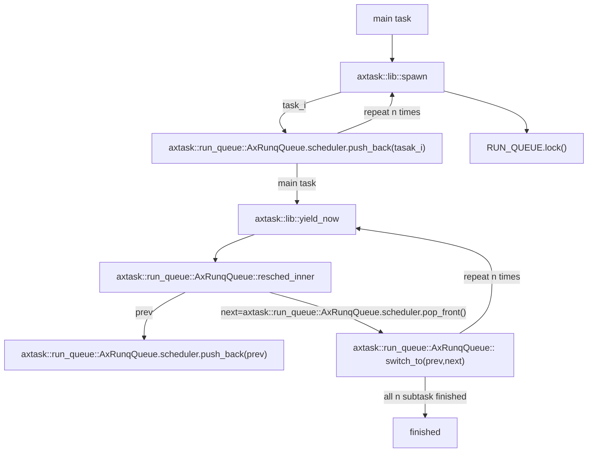

# arceos应用汇报：yield

---
# 运行环境
## 文件目录
应用程序`yield`源代码存储在目录`arceos/apps/task/yield/src/main.rs`下。

## 运行指令
假设在riscv64环境下运行，以单核形式运行，指令为：
```shell
make A=apps/task/yield ARCH=riscv64 LOG=info NET=y SMP=1 run
```
## 运行配置
不允许抢占发生，即`feature: preempt`为`false`。

---
## Output
```shell
Hello, main task!
Hello, task 0! id = TaskId(4)
Hello, task 1! id = TaskId(5)
Hello, task 2! id = TaskId(6)
Hello, task 3! id = TaskId(7)
Hello, task 4! id = TaskId(8)
Hello, task 5! id = TaskId(9)
Hello, task 6! id = TaskId(10)
Hello, task 7! id = TaskId(11)
Hello, task 8! id = TaskId(12)
Hello, task 9! id = TaskId(13)
Task yielding tests run OK!
```

---
# 程序流程
## STEP 1
* OS init
* After executed all initial actions, then arceos call main function in `yield` app.

---
## STEP2
```rust
fn main() {
    for i in 0..NUM_TASKS {
        task::spawn(move || {
            println!("Hello, task {}! id = {:?}", i, task::current().id());
            // 此时已经启动了yield
            // 因为preempt所需要的依赖libax/sched_rr并没有被包含进去
            #[cfg(not(feature = "preempt"))]
            task::yield_now();

            let order = FINISHED_TASKS.fetch_add(1, Ordering::Relaxed);
            if option_env!("SMP") == Some("1") {
                assert!(order == i); // FIFO scheduler
            }
        });
    }
    println!("Hello, main task{}!");
    while FINISHED_TASKS.load(Ordering::Relaxed) < NUM_TASKS {
        #[cfg(not(feature = "preempt"))]
        task::yield_now();
    }
    println!("Task yielding tests run OK!");
}
```

---
## 运行流程
**（大家可以对照自己电脑上的源代码了解大体逻辑。）**
1. 进入`main`函数，`main task`执行。
2. 利用`task::spawn`循环产生`NUM_TASKS`个任务，类似于线程的思想。
3. 每一个任务执行一个函数。若环境不允许抢占发生，则自身执行`yield`让出CPU。当重新运行时，获取自身运行的顺序，在单核情况下检查是否符合FIFO调度策略。
4. `main task`会在输出自身信息后，等待所有子任务完成。若未完全完成，则继续`yield`等待。


---
## Flow Chart




---
## 一些问题
1. 上述为单核运行模式，因此在代码的检测FIFO策略部分，若程序正确运行，则应当是n个子任务依此yield之后，由main task先行输出。故应当满足FIFO顺序。
2. 但若是多核运行模式，则子任务的输出不一定在main task之后。以`SMP=4`为例，一个可能输出如下:
```shell
Hello, task 0! id = TaskId(7)
Hello, main task!
Hello, task 1! id = TaskId(8)
Hello, task 2! id = TaskId(9)
Hello, task 3! id = TaskId(10)
Hello, task 4! id = TaskId(11)
Hello, task 5! id = TaskId(12)
Hello, task 6! id = TaskId(13)
Hello, task 7! id = TaskId(14)
Hello, task 8! id = TaskId(15)
Hello, task 9! id = TaskId(16)
Task yielding tests run OK!
```

---

## 关于多核输出的解释
问题在于主任务所在核与其他任务所在核的调度关系。经测试，在四核情况下，大多情况下，前两个还是main task 与 task 0，其他后续子任务顺序不变。

多核情况的流图较为复杂，因此不在此给出。


---
# acreos源码阅读：了解关于acreos特权级切换的机制：
* rcore：RustSBI运行在M态，通过切换到内核所在start代码进入S态。内核通过调用`__restore`函数转换到U态，运行应用程序。因此应用程序运行在U态，而内核运行在S态。
应用程序通过调用`ecall`触发CPU切换到S态，进入`trap_handler`。
* acreos：RustSBI运行在M态，通过切换到内核所在start代码进入S态。内核执行应用程序时也未改变`sstatus`，因此跳转到应用程序之后仍然在S态。给定的应用程序示例(如`yiele`程序)并未调用`ecall`，而是直接调用内核的函数接口，故未发生特权级切换。
> `exception`程序的`ebreak`并未导致特权级切换，只是触发了一个S态下的异常。
* 为了实现初赛要求的`syscall`，我们如果想要保证应用程序运行在U态下，需要手动添加类似rcore的`__restore`函数进行特权级切换，通过`ecall`从应用态进入内核态。

---

# acreos源码阅读：了解acreos模块组成
acreos的`crate`部分实现了许多模块，相比于rcore而言添加了更多Linux下的特性内容，下面举一些作为例子：
1. `allocator`:实现了linux内存三大分配器：引导内存分配器，伙伴分配器，slab分配器
2. `driver_*`:提供了与文件系统交互的接口实现，但看上去并未十分完善
3. `per_cpu`：多核机制下每一个CPU各自独立的缓存
4. `page_table`：多级页表机制实现，根据参数可以切换为三级页表或者四级页表，同时支持分配超大页(1GB)、大页(2MB)与一般页面(4KB)
5. `lazy_init`:类似于rust的`lazy_static`，提供静态全局定义
6. `spin_lock`：linux的自旋锁实现
7. `kernel_guard`:CPU锁实现，保证内核部分操作不会被中断或者抢占。(linux要求)

---

# 疑问
1. acreos实现了很多linux的特性内容，但比如`lazy_init`的实现与rust自带的`lazy_static`有何区别呢，能否直接使用rust自带的语法？
2. 在初赛阶段，我们是只需要根据初赛要求选取arceos的代码进行编程吗，还是说需要和arceos一样实现很多额外的、初赛不要求的特性（如多核、多种页表机制）
3. 老师期望我们的代码与arceos的结合程度有多高呢，可否引入rcore等其他内核的一些内容。
4. 内核实现的功能较多的情况下，当前我们是否需要阅读相关论文呢，还是更加侧重已有的代码实现。同时刚才提到了前面的同学读代码了解接口功能即可，对于内核实现比赛来说，需要了解更加详细的接口实现吗。
4. 以rcore为base 还是 以arceos为base：arceos

---

# 下周工作
1. 将应用程序移植到用户态中，尝试实现U态和S态的分离
2. 实现简单的一个系统调用，未涉及文件系统等内容，保证可以进行内核与应用程序的隔离。
3. 阅读文件系统接口的功能，了解ft32文件系统的接口功能。


1. arceos继续分析。
2. 找一个一等奖项目，运行起来把初赛测例通过。
3. 一等奖项目分析，重点在syscall部分。
4. arceos应用态内核态实践分离。