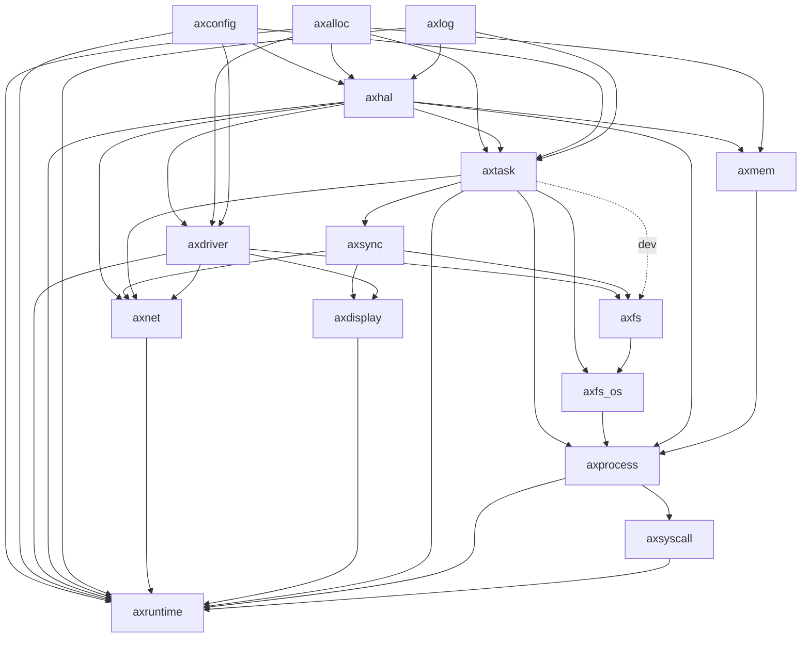

# Week 10,11 Repo

## 上两周工作内容

1. 完成了除去文件系统的系统调用之外的所有初赛系统调用，其中一部分已经通过了初赛的测例。
2. 初步确定了arceos后续开发的思想：解耦化，模块化，泛用化。


## 进程管理与内存管理

### 进程控制块结构

```rust
/// 进程的的数据结构
pub struct Process {
    /// 进程的pid和初始化的线程的tid是一样的
    pub pid: u64,
    pub inner: SpinNoIrq<ProcessInner>,
}

pub struct ProcessInner {
    /// 父进程的进程号
    pub parent: u64,
    /// 子进程
    pub children: Vec<Arc<Process>>,
    /// 子任务
    pub tasks: Vec<AxTaskRef>,
    /// 地址空间，由于存在地址空间共享，因此设计为Arc类型
    pub memory_set: Arc<SpinNoIrq<MemorySet>>,
    /// 用户堆基址，任何时候堆顶都不能比这个值小，理论上讲是一个常量
    pub heap_bottom: usize,
    /// 当前用户堆的堆顶，不能小于基址，不能大于基址加堆的最大大小
    pub heap_top: usize,
    /// 进程状态
    pub is_zombie: bool,
    /// 退出状态码
    pub exit_code: i32,
    /// 文件描述符表
    pub fd_table: Vec<Option<Arc<dyn FileIO + Send + Sync>>>,
}
```

### 任务控制块结构

```rust
pub struct TaskInner {
    id: TaskId,
    name: &'static str,
    is_idle: bool,
    is_init: bool,
    /// 所属进程
    process_id: u64,
    /// 是否是所属进程下的主线程
    is_leader: AtomicBool,
    /// 所包含的页表的token，内核的token统一为0
    page_table_token: usize,
    exit_code: AtomicI32,
    entry: Option<*mut dyn FnOnce()>,
    state: AtomicU8,

    in_wait_queue: AtomicBool,
    in_timer_list: AtomicBool,

    #[cfg(feature = "preempt")]
    need_resched: AtomicBool,
    #[cfg(feature = "preempt")]
    preempt_disable_count: AtomicUsize,
    /// 存储当前线程的TrapContext
    pub trap_frame: UnsafeCell<TrapFrame>,
    kstack: Option<TaskStack>,
    ctx: UnsafeCell<TaskContext>,
    time: UnsafeCell<TimeStat>,
}
```

### 进程与线程之间的交互处理

* 交互出现的情况：线程结束时需要回收资源，此时需要找到线程所对应的进程块。

* 问题：之前在线程控制块中存储了指向进程的指针，导致进程和线程无法解耦。

* 解决方法：线程控制块仅存储进程的ID。当前情况下，线程只会在执行exit调用时会结束，此时将exit的处理交给进程控制块来做。

  进程模块主动找到当前的线程并将其结束，并通过一个**ID与进程的哈希对应表**来找到线程对应的进程，进行相关资源的回收。


### 关于内核架构的设想

当前内核模块关系图：



* 当前如axnet，axdisplay暂时还未归纳到axprocess下，不过也许无伤大雅。
* 如果要改造为一个宏内核，应当由进程模块来统领其他资源，如task，mem，fs等，并对外提供接口。
* axsyscall是对axprocess对外接口的进一步抽象化，将其转化为系统调用的模式提供给应用程序。


## 文件系统的接入

### 模块说明

* `axfs`：对fat32文件系统的调用实现，支持从fat32文件系统中进行读写操作。
* `axfs_os`：`axfs`的进一步封装，提供了包括文件描述符等数据结构，方便内核对文件进行管理。
* `axprocess`包含了对`axfs_os`的调用，通过文件描述符等结构来完成对文件的读写操作。


### 接入后改动的地方

1. process块需要引入文件描述符表，同时应当注意多核并发下的保护。
2. 读取文件改为从文件系统读取，包括初始化用户程序以及`exec`系统调用。


### 当前demo运行

1. 生成文件镜像：

   在`arceos`根目录下运行指令生成fat32文件系统镜像：

   ```shell
   ./build_img.sh
   ```

2. 指定运行用户程序：

   在`module/axprocess/process/init_user_process`中，指定`main_task`运行的应用程序名。

3. 运行arceos内核，运行如下指令：

   ```shell
   make A=apps/helloworld ARCH=riscv64 LOG=info SMP=1 FS=y run
   ```

   其中：

   1. `A=apps/helloworld`仅是为了符合makefile的格式而写。
   2. `ARCH=riscv64`指定指令集
   3. `LOG=info`指定输出日志级别
   4. `SMP=1`指定单核启动
   5. `FS=y`指定启用文件系统

* 当前问题：本人对makefile不是很熟悉，所以启动过程看上去很简陋，期望能得到帮助改造启动指令。


## 后续工作

1. 测试其他初赛用例，保证测例通过。
2. 与老师讨论下一步：
   1. 了解更多linux系统特性，如irq
   2. 学习更多OS，如kerla，aero内核系统
   3. 尝试复赛的系统调用
   4. 泛用化思想实现