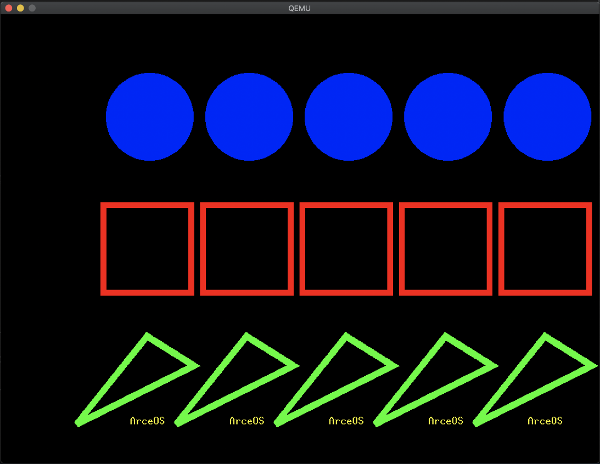
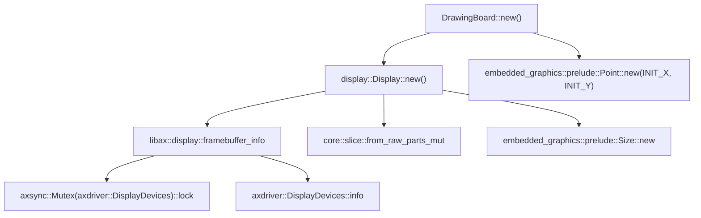
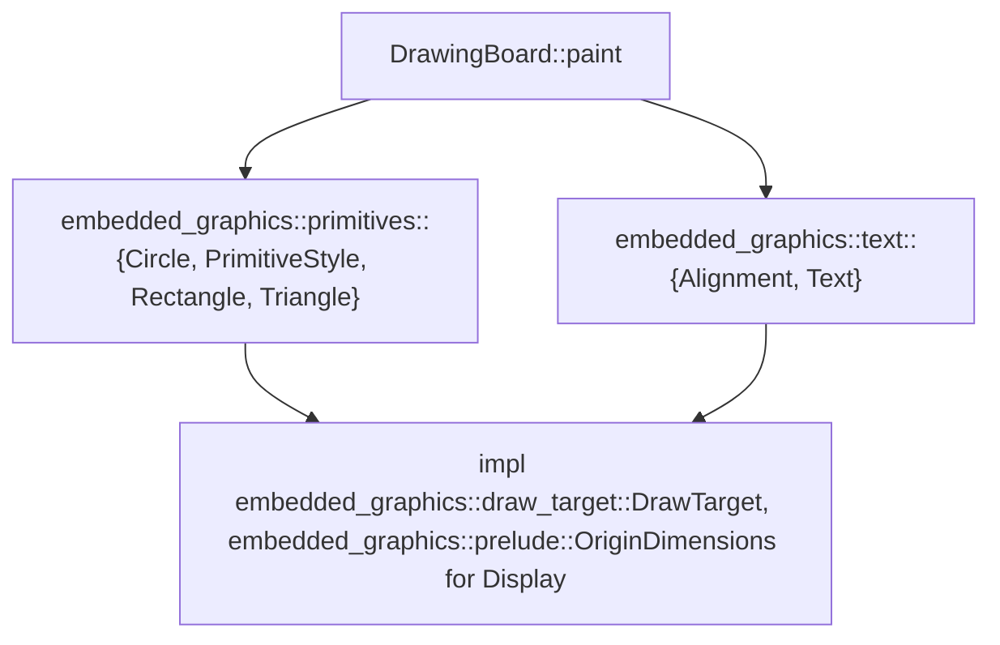

# INTRODUCTION
| App | Extra modules | Enabled features | Description |
|-|-|-|-|
| [display](../apps/display/) | embedded-graphics, axdisplay, axdriver | alloc, paging, display | Display some graphics in a new window |

# RUN

```bash
make A=apps/display GRAPHIC=y LOG=debug run
```

# RESULT

```text
...
[  0.408067 axdriver:59] Initialize device drivers...
[  0.410941 driver_virtio:50] Detected virtio MMIO device with vendor id: 0x554D4551, device type: GPU, version: Legacy
[  0.414473 virtio_drivers::device::gpu:47] Device features EDID | NOTIFY_ON_EMPTY | ANY_LAYOUT | RING_INDIRECT_DESC | RING_EVENT_IDX
[  0.418886 virtio_drivers::device::gpu:57] events_read: 0x0, num_scanouts: 0x1
[  0.423408 virtio_drivers::device::gpu:102] => RespDisplayInfo { header: CtrlHeader { hdr_type: Command(4353), flags: 0, fence_id: 0, ctx_id: 0, _padding: 0 }, rect: Rect { x: 0, y: 0, width: 1280, height: 800 }, enabled: 1, flags: 0 }
[  0.452037 axdriver::virtio:88] created a new Display device: "virtio-gpu"
[  0.455473 axdisplay:17] Initialize Display subsystem...
[  0.458124 axdisplay:19] number of Displays: 1
...
...
...
(never end)
```


# STEPS

## step1

``` rust
let mut board = DrawingBoard::new();
board.disp.clear(Rgb888::BLACK).unwrap();
```

**flow chart**


## step2
``` rust
for _ in 0..5 {
        board.latest_pos.x += RECT_SIZE as i32 + 20;
        board.paint();
        framebuffer_flush();
    }
...
impl DrawingBoard {
    ...
    fn paint(&mut self) {
        Rectangle::with_center(self.latest_pos, Size::new(RECT_SIZE, RECT_SIZE))
            .into_styled(PrimitiveStyle::with_stroke(Rgb888::RED, 10))
            .draw(&mut self.disp)
            .ok();
        Circle::new(self.latest_pos + Point::new(-70, -300), 150)
            .into_styled(PrimitiveStyle::with_fill(Rgb888::BLUE))
            .draw(&mut self.disp)
            .ok();
        Triangle::new(
            self.latest_pos + Point::new(0, 150),
            self.latest_pos + Point::new(80, 200),
            self.latest_pos + Point::new(-120, 300),
        )
        .into_styled(PrimitiveStyle::with_stroke(Rgb888::GREEN, 10))
        .draw(&mut self.disp)
        .ok();
        let text = "ArceOS";
        Text::with_alignment(
            text,
            self.latest_pos + Point::new(0, 300),
            MonoTextStyle::new(&FONT_10X20, Rgb888::YELLOW),
            Alignment::Center,
        )
        .draw(&mut self.disp)
        .ok();
    }
}
```

**flow chart**


## step3
``` rust
loop {
    core::hint::spin_loop();
}
```
