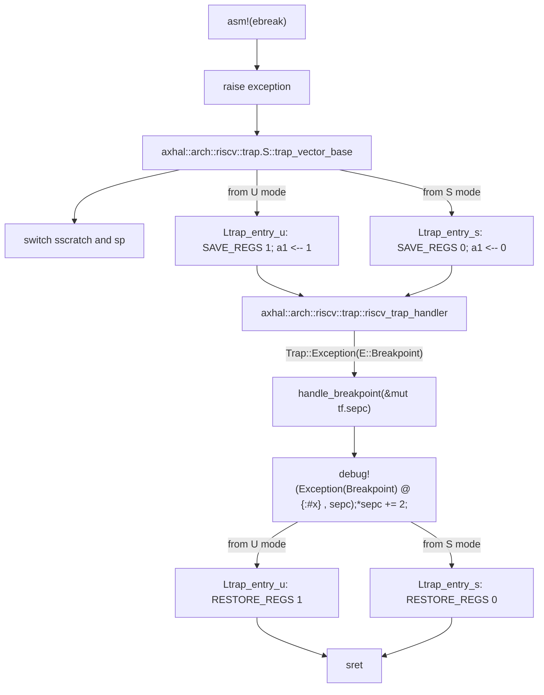

# INTRODUCTION

| App | Extra modules | Enabled features | Description |
|-|-|-|-|
| [exception](../apps/exception/) | | paging | Exception handling test |

# RUN

```console
$ make A=apps/exception LOG=debug run
...
Running exception tests...
[  0.249873 0 axhal::arch::riscv::trap:13] Exception(Breakpoint) @ 0xffffffc0802001e8
Exception tests run OK!
[  0.068358 0 axtask::api:6] main task exited: exit_code=0
[  0.069128 0 axhal::platform::qemu_virt_riscv::misc:2] Shutting down...
```

# STEPS

## step1

[init](./init.md)

After executed all initial actions, then arceos calls `main` function in `exception` app.

## step2

``` Rust
fn raise_break_exception() {
    unsafe {
        #[cfg(target_arch = "x86_64")]
        asm!("int3");
        #[cfg(target_arch = "aarch64")]
        asm!("brk #0");
        #[cfg(any(target_arch = "riscv32", target_arch = "riscv64"))]
        asm!("ebreak");
    }
}

#[no_mangle]
fn main() {
    println!("Running exception tests...");
    raise_break_exception();
    println!("Exception tests run OK!");
}
```

**flow chart**


