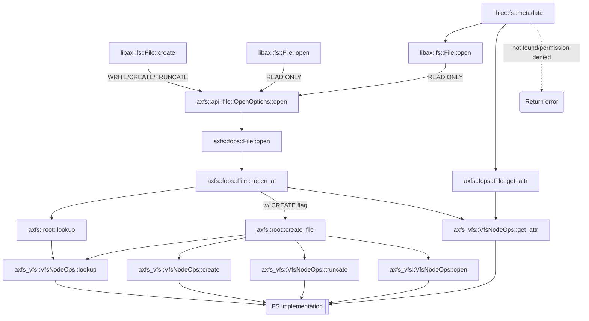
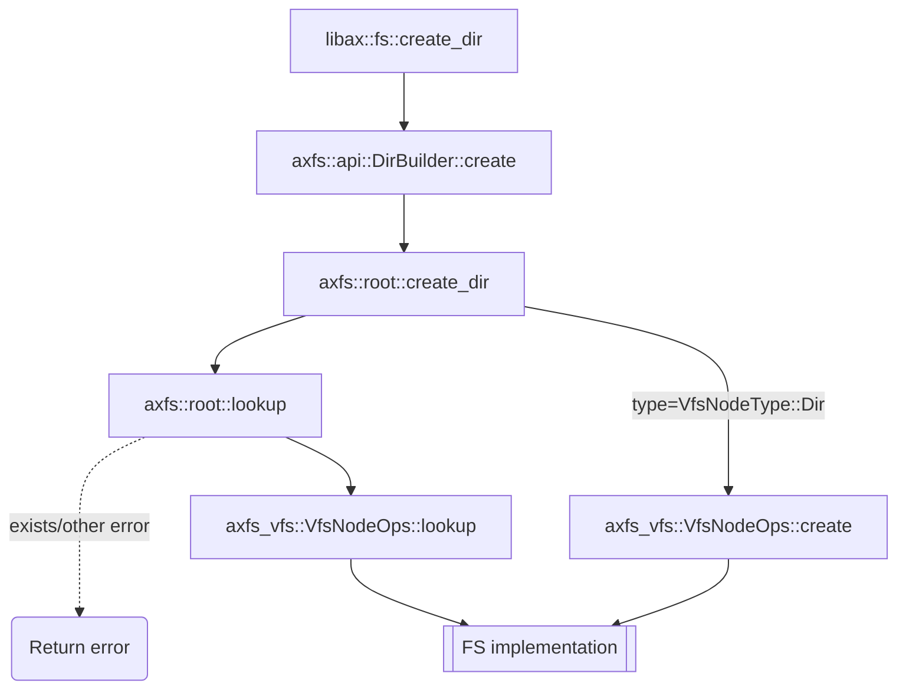
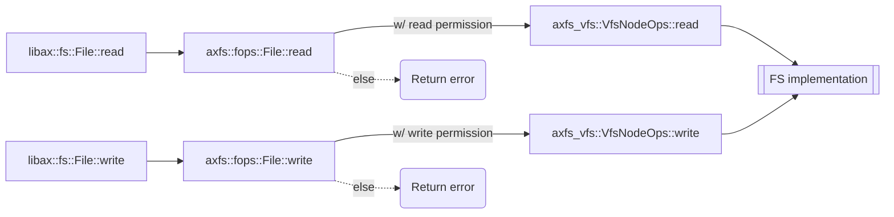
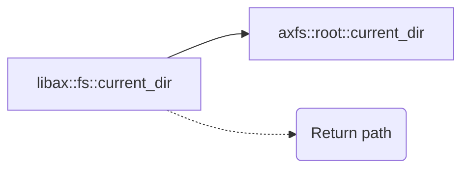
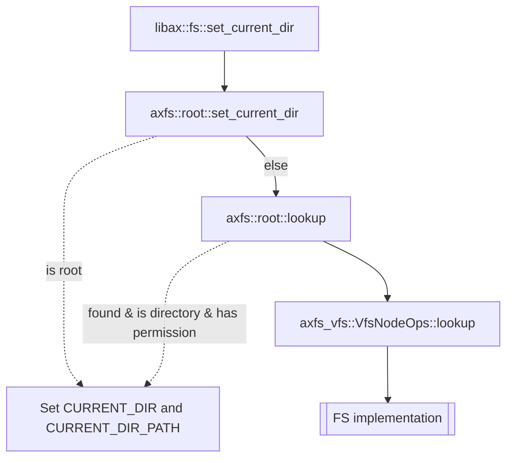
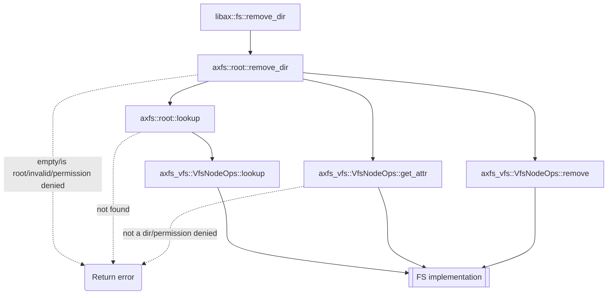
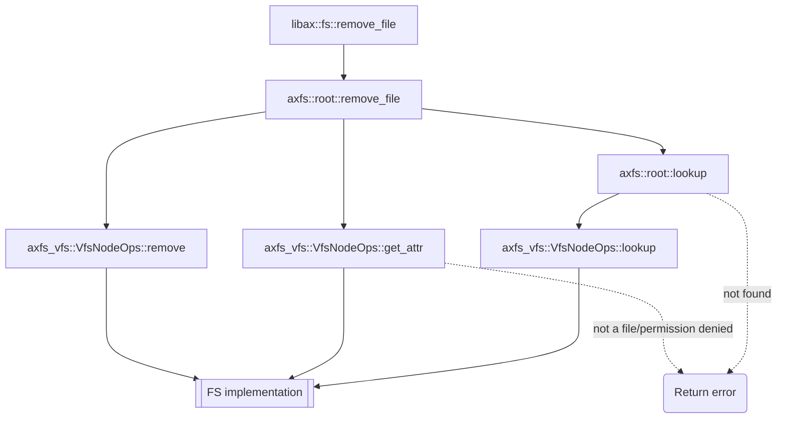

# INTRODUCTION

| App | Extra modules | Enabled features | Description |
|-|-|-|-|
| [shell](../apps/fs/shell/) | axalloc, axdriver, axfs | alloc, paging, fs | A simple shell that responds to filesystem operations |

# RUN

Before running the app, make an image of FAT32:

```shell
make disk_img
```

Run the app:

```shell
make A=apps/fs/shell ARCH=aarch64 LOG=debug BLK=y run
```

# RESULT

```
...
[  0.006204 0 axdriver:64] Initialize device drivers...
[  0.006396 0 driver_virtio:50] Detected virtio MMIO device with vendor id: 0x554D4551, device type: Block, version: Legacy
[  0.006614 0 virtio_drivers::device::blk:55] device features: SEG_MAX | GEOMETRY | BLK_SIZE | SCSI | FLUSH | TOPOLOGY | CONFIG_WCE | DISCARD | WRITE_ZEROES | NOTIFY_ON_EMPTY | RING_INDIRECT_DESC | RING_EVENT_IDX
[  0.007094 0 virtio_drivers::device::blk:64] config: 0xffff00000a003f00
[  0.007270 0 virtio_drivers::device::blk:69] found a block device of size 34000KB
[  0.007956 0 axdriver::virtio:88] created a new Block device: "virtio-blk"
[  0.008488 0 axfs:25] Initialize filesystems...
[  0.008584 0 axfs:26]   use block device: "virtio-blk"
[  0.025432 0 axalloc:57] expand heap memory: [0xffff00004012f000, 0xffff00004013f000)
[  0.025680 0 axalloc:57] expand heap memory: [0xffff00004013f000, 0xffff00004015f000)
[  0.026510 0 axfs::fs::fatfs:122] create Dir at fatfs: /dev
[  0.043112 0 axfs::fs::fatfs:102] lookup at fatfs: /dev
[  0.049562 0 fatfs::dir:140] Is a directory
[  0.057550 0 axruntime:137] Initialize interrupt handlers...
[  0.057870 0 axruntime:143] Primary CPU 0 init OK.
Available commands:
  cat
  cd
  echo
  exit
  help
  ls
  mkdir
  pwd
  rm
  uname
arceos:/$
```

# STEPS

## Step1

[init](./init.md)

After executed all initial actions, then arceos calls `main` function in `shell` app.

## Step2

The program reads one command from `stdin` each time and pass it to `cmd::run_cmd`.

```rust
fn main() {
    let mut stdin = libax::io::stdin();
    let mut stdout = libax::io::stdout();

    let mut buf = [0; MAX_CMD_LEN];
    let mut cursor = 0;
    cmd::run_cmd("help".as_bytes());
    print_prompt();

    loop {
        if stdin.read(&mut buf[cursor..cursor + 1]).ok() != Some(1) {
            continue;
        }
        if buf[cursor] == b'\x1b' {
            buf[cursor] = b'^';
        }
        match buf[cursor] {
            CR | LF => {
                println!();
                if cursor > 0 {
                    cmd::run_cmd(&buf[..cursor]);
                    cursor = 0;
                }
                print_prompt();
            }
            BS | DL => {
                if cursor > 0 {
                    stdout.write(&[BS, SPACE, BS]).unwrap();
                    cursor -= 1;
                }
            }
            0..=31 => {}
            c => {
                if cursor < MAX_CMD_LEN - 1 {
                    stdout.write(&[c]).unwrap();
                    cursor += 1;
                }
            }
        }
    }
}
```

## Step3

The commands are parsed and executed in `cmd::run_cmd`.

```rust
pub fn run_cmd(line: &[u8]) {
    let line_str = unsafe { core::str::from_utf8_unchecked(line) };
    let (cmd, args) = split_whitespace(line_str);
    if !cmd.is_empty() {
        for (name, func) in CMD_TABLE {
            if cmd == *name {
                func(args);
                return;
            }
        }
        println!("{}: command not found", cmd);
    }
}
```

**flowchart**

```mermaid
graph TD
	run_cmd["cmd::run_cmd"]

	cat["cmd::do_cat"]
	cd["cmd:do_cd"]
	echo["cmd::do_echo"]
	exit["cmd::do_exit"]
	help["cmd::do_help"]
	ls["cmd::do_ls"]
	mkdir["cmd::do_mkdir"]
	pwd["cmd::do_pwd"]
	rm["cmd::do_rm"]
	uname["cmd::do_uname"]

	run_cmd --> cat
	run_cmd --> cd
	run_cmd --> echo
	run_cmd --> exit
	run_cmd --> help
	run_cmd --> ls
	run_cmd --> mkdir
	run_cmd --> pwd
	run_cmd --> rm
	run_cmd --> uname

  stdout_w["libax::io::stdout().write()"]
	fopen["libax::fs::File::open"]
	fread["libax::fs::file::File::read"]
	fcreate["libax::fs::File::create"]
	fwrite["libax::fs::file::File::write"]
	fs_meta[libax::fs::metadata]
	fs_readdir[libax::fs::read_dir]
	fs_createdir[libax::fs::create_dir]
	fs_rmdir[libax::fs::remove_dir]
	fs_rmfile[libax::fs::remove_file]

	cat --> fopen
	cat --> fread
	cat --> stdout_w
	cd --> set_dir["libax::env::set_current_dir"]
	echo --> fcreate
	echo --> fwrite
	exit --> lib_exit["libax::task::exit"]
	ls --> get_dir["libax::env::current_dir"]
	ls --> fs_meta
	ls --> fs_readdir
	mkdir --> fs_createdir
	pwd --> get_dir
	rm --> fs_meta
	rm --> fs_rmdir
	rm --> fs_rmfile
```



For the details of the file system APIs included in the chart, see the section below.

# File system APIs

> **Notes for the flow charts below**: normal lines denote the calling stack, while dashed lines denote the returning of results.

### Create files, open files, and get metadata




### Create directories




### Read and write files



### Get current directory



### Set current directory



### Remove directory



### Remove file


