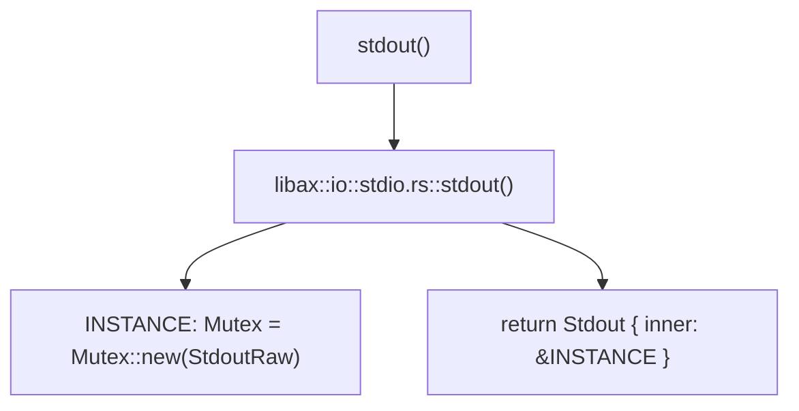
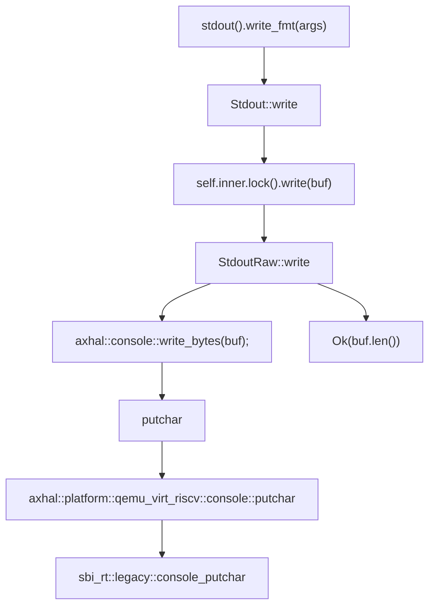

# INTRODUCTION
| App | Extra modules | Enabled features | Description |
|-|-|-|-|
| [helloworld](../apps/helloworld/) | | | A minimal app that just prints a string |

# RUN

```shell
make A=apps/helloworld SMP=4 LOG=debug run
```

# STEPS

## step1
[init](./init.md)

After executed all initial actions, then arceos calls `main` function in `helloworld` app.

## step2

```Rust
fn main() {
    libax::println!("Hello, world!");
}
```

**flow chart**

```mermaid
graph TD;
    A[main] --> B["libax::println!(Hello, world!)"];
    B --> C[libax:io::__print_impl];
    C --> D[INLINE_LOCK=Mutex::new];
    C --> _guard=INLINE_LOCK.lock;
    C --> E["stdout().write_fmt(args)"];
```

### step2.1



### step2.2


