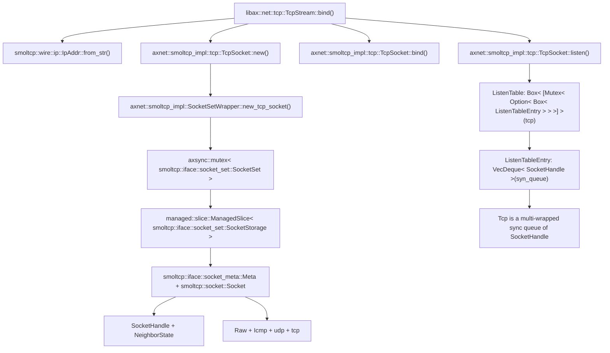
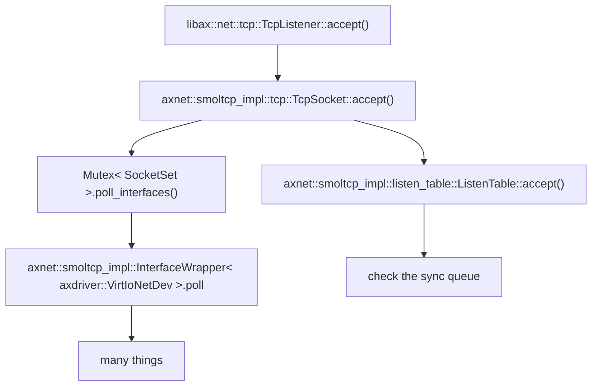
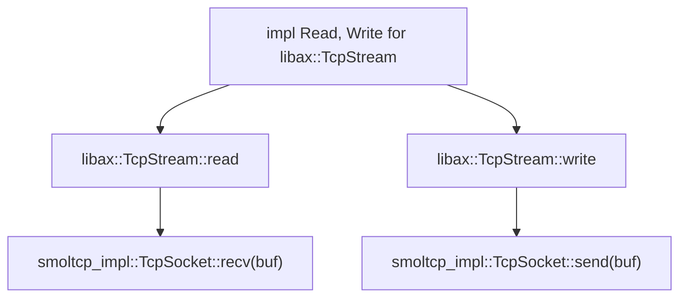

# INTRODUCTION
| App | Extra modules | Enabled features | Description |
|-|-|-|-|
| [httpserver](../apps/net/httpserver) | axalloc, axnet, axdriver, axtask | alloc, paging, net, multitask | A multi-threaded HTTP server that serves a static web page |

# RUN

```shell
make A=apps/net/httpserver SMP=4 NET=y LOG=info run
```

# RESULT

```
...
[  0.101078 axtask:75]   use FIFO scheduler.
[  0.102733 axdriver:59] Initialize device drivers...
[  0.104475 driver_virtio:50] Detected virtio MMIO device with vendor id: 0x554D4551, device type: Network, version: Legacy
[  0.107095 virtio_drivers::device::net:117] Device features CTRL_GUEST_OFFLOADS | MAC | GSO | MRG_RXBUF | STATUS | CTRL_VQ | CTRL_RX | CTRL_VLAN | CTRL_RX_EXTRA | GUEST_ANNOUNCE | CTL_MAC_ADDR | RING_INDIRECT_DESC | RING_EVENT_IDX
[  0.113234 virtio_drivers::device::net:127] Got MAC=[52, 54, 00, 12, 34, 56], status=LINK_UP
[  0.116326 axdriver::virtio:88] created a new Net device: "virtio-net"
[  0.118063 axnet:22] Initialize network subsystem...
[  0.119247 axnet:24] number of NICs: 1
[  0.120442 axnet:27]   NIC 0: "virtio-net"
[  0.121819 axalloc:57] expand heap memory: [0xffffffc080654000, 0xffffffc080a54000)
[  0.124142 axalloc:57] expand heap memory: [0xffffffc080a54000, 0xffffffc081254000)
[  0.127314 axnet::smoltcp_impl:273] created net interface "eth0":
[  0.128951 axnet::smoltcp_impl:275]   ether:    52-54-00-12-34-56
[  0.130706 axnet::smoltcp_impl:277]   ip:       10.0.2.15/24
[  0.132189 axnet::smoltcp_impl:278]   gateway:  10.0.2.2
[  0.133746 axruntime:134] Initialize interrupt handlers...
...
Hello, ArceOS HTTP server!
...
[  0.148419 0:2 axnet::smoltcp_impl:67] socket #0: created
[  0.148850 0:2 axnet::smoltcp_impl::tcp:111] socket listening on 10.0.2.15:5555
[  0.149305 0:2 axnet::smoltcp_impl:95] socket #0: destroyed
listen on: http://10.0.2.15:5555/
```

Open http://127.0.0.1:5555/ in your browser, or use command lines in another shell to view the web page:

```console
$ curl http://127.0.0.1:5555/
<html>
<head>
  <title>Hello, ArceOS</title>
</head>
<body>
  <center>
    <h1>Hello, <a href="https://github.com/rcore-os/arceos">ArceOS</a></h1>
  </center>
  <hr>
  <center>
    <i>Powered by <a href="https://github.com/rcore-os/arceos/tree/main/apps/net/httpserver">ArceOS example HTTP server</a> v0.1.0</i>
  </center>
</body>
</html>
```

# STEPS

## step 1
[init](./init.md)

After executed all initial actions, then arceos calls `main` function in `memtest` app.

## step 2
```Rust
fn http_server(mut stream: TcpStream) -> io::Result {
    ...
    stream.read(&mut buf)?;
	...
    stream.write_all(reponse.as_bytes())?;
    ...
}

fn accept_loop() -> io::Result {
    let (addr, port) = (IpAddr::from_str(LOCAL_IP).unwrap(), LOCAL_PORT);
    let mut listener = TcpListener::bind((addr, port).into())?;
    ...
    loop {
        match listener.accept() {
            Ok((stream, addr)) => {
                task::spawn(move || match http_server(stream) {
                    Err(e) => error!("client connection error: {:?}", e),
                    Ok(()) => info!("client {} closed successfully", i),
                });
            }
            Err(e) => return Err(e),
        }
        i += 1;
    }
}

#[no_mangle]
fn main() {
    println!("Hello, ArceOS HTTP server!");
    accept_loop().expect("test HTTP server failed");
}
```

### step 2.1

```Rust
let (addr, port) = (IpAddr::from_str(LOCAL_IP).unwrap(), LOCAL_PORT);
let mut listener = TcpListener::bind((addr, port).into())?;
```

**flow chart**



### step 2.2

```Rust
match listener.accept() {
    Ok((stream, addr)) => {
		...
    }
    Err(e) => return Err(e),
}
```

**flow chart**




### step 2.3

```Rust
stream.read(&mut buf)?;
stream.write_all(reponse.as_bytes())?;
```

**flow chart**



