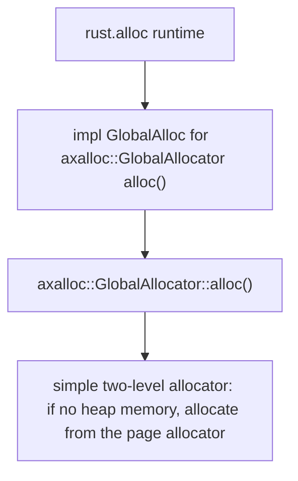

# INTRODUCTION
| App | Extra modules | Enabled features | Description |
|-|-|-|-|
| [memtest](../apps/memtest/) | axalloc | alloc, paging | Dynamic memory allocation test |

# RUN

```console
$ make A=apps/memtest SMP=4 LOG=info run
...
Running memory tests...
test_vec() OK!
test_btree_map() OK!
Memory tests run OK!
[  0.523323 3 axhal::platform::qemu_virt_riscv::misc:2] Shutting down...
...
```

# STEPS

## step1

[init](./init.md)

After executed all initial actions, then arceos calls `main` function in `memtest` app.

## step2
```Rust
fn test_vec() {
...
    let mut v = Vec::with_capacity(N);
...
}
fn test_btree_map() {
...
    let mut m = BTreeMap::new();
...
}
fn main() {
    println!("Running memory tests...");
    test_vec();
    test_btree_map();
    println!("Memory tests run OK!");
}
```

**flow chart**


