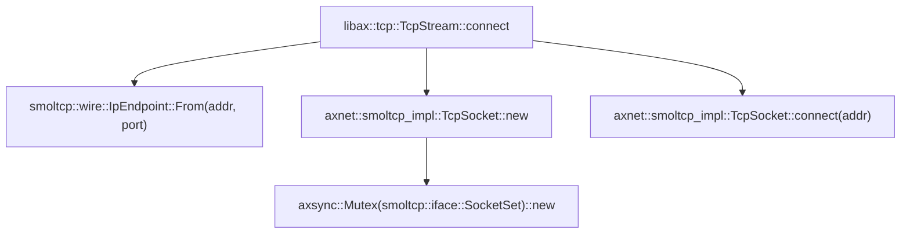
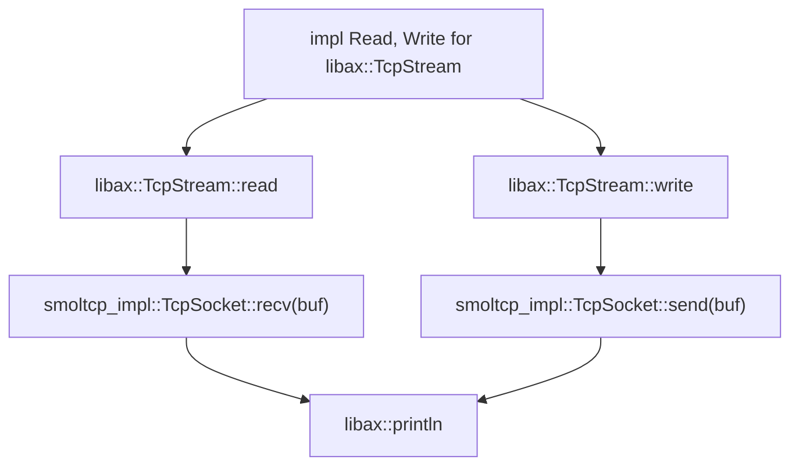

# INTRODUCTION
| App | Extra modules | Enabled features | Description |
|-|-|-|-|
| [httpclient](../apps/net/httpclient/) | axalloc, axdriver, axnet | alloc, paging, net | A simple client that sends an HTTP request and then prints the response |

# RUN
```bash
make A=apps/net/httpclient SMP=1 NET=y LOG=debug run
```

# RESULT
```text
...
[  0.065494 0 axalloc:128] initialize global allocator at: [0xffffffc080286000, 0xffffffc088000000)
[  0.068109 0 axruntime:115] Initialize kernel page table...
[  0.070549 0 axdriver:59] Initialize device drivers...
[  0.072131 0 driver_virtio:50] Detected virtio MMIO device with vendor id: 0x554D4551, device type: Network, version: Legacy
[  0.074003 0 virtio_drivers::device::net:117] Device features CTRL_GUEST_OFFLOADS | MAC | GSO | MRG_RXBUF | STATUS | CTRL_VQ | CTRL_RX | CTRL_VLAN | CTRL_RX_EXTRA | GUEST_ANNOUNCE | CTL_MAC_ADDR | RING_INDIRECT_DESC | RING_EVENT_IDX
[  0.077999 0 virtio_drivers::device::net:127] Got MAC=[52, 54, 00, 12, 34, 56], status=LINK_UP
[  0.080748 0 axalloc:57] expand heap memory: [0xffffffc080298000, 0xffffffc0802a8000)
[  0.082357 0 axalloc:57] expand heap memory: [0xffffffc0802a8000, 0xffffffc0802c8000)
[  0.083769 0 axalloc:57] expand heap memory: [0xffffffc0802c8000, 0xffffffc080308000)
[  0.085864 0 axdriver::virtio:88] created a new Net device: "virtio-net"
[  0.087057 0 axnet:22] Initialize network subsystem...
[  0.087859 0 axnet:24] number of NICs: 1
[  0.088517 0 axnet:27]   NIC 0: "virtio-net"
[  0.089360 0 axalloc:57] expand heap memory: [0xffffffc080308000, 0xffffffc080408000)
[  0.092033 0 axnet::smoltcp_impl:273] created net interface "eth0":
[  0.093315 0 axnet::smoltcp_impl:275]   ether:    52-54-00-12-34-56
[  0.094667 0 axnet::smoltcp_impl:277]   ip:       10.0.2.15/24
[  0.095947 0 axnet::smoltcp_impl:278]   gateway:  10.0.2.2
[  0.097154 0 axruntime:134] Initialize interrupt handlers...
[  0.098892 0 axruntime:140] Primary CPU 0 init OK.
Hello, simple http client!
[  0.100960 0 axnet::smoltcp_impl:67] socket #0: created
[  0.103106 0 smoltcp::iface::interface:1599] address 10.0.2.2 not in neighbor cache, sending ARP request
HTTP/1.1 200 OK
Server: nginx
Date: Sat, 08 Apr 2023 18:58:27 GMT
Content-Type: text/plain
Content-Length: 13
Connection: keep-alive
Access-Control-Allow-Origin: *
Cache-Control: no-cache, no-store, must-revalidate

183.172.74.58
[  0.585681 0 axnet::smoltcp_impl::tcp:148] socket #0: shutting down
[  0.587517 0 axnet::smoltcp_impl:95] socket #0: destroyed
...
```

# STEPS

## step1
``` rust
let (addr, port) = (IpAddr::from_str(DEST_IP).unwrap(), 80);
let mut stream = TcpStream::connect((addr, port).into())?;
```

**flow chart**


## step2
``` rust
stream.write(REQUEST.as_bytes())?;

let mut buf = [0; 1024];
let n = stream.read(&mut buf)?;
let response = core::str::from_utf8(&buf[..n]).unwrap();
println!("{}", response);
```

**flow chart**

