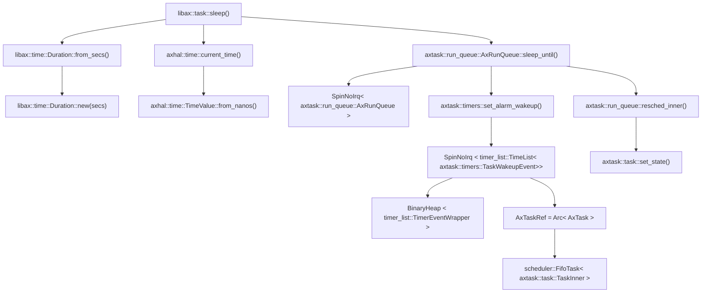
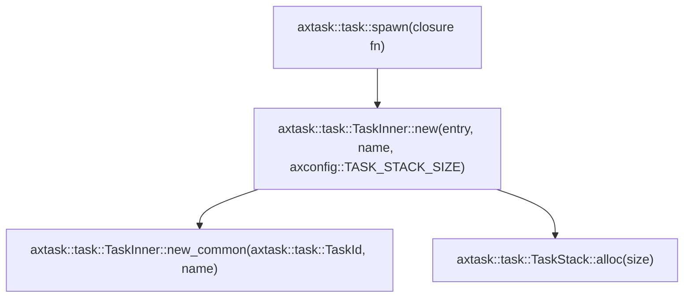
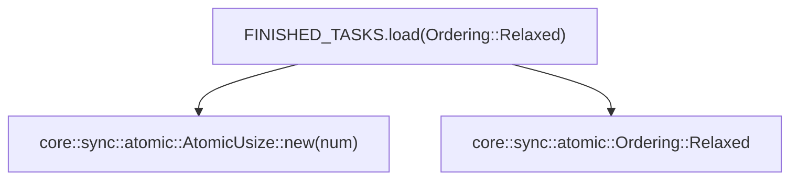

# INTRODUCTION
| App | Extra modules | Enabled features | Description |
|-|-|-|-|
| [sleep](../apps/task/sleep) |axalloc,axtask |alloc, paging, multitask, sched_fifo | Thread sleeping test |

# RUN

```
make A=apps/task/sleep SMP=4 LOG=debug run
```

# RESULT
```
...

[  0.077898 axruntime:109] Initialize global memory allocator...
[  0.080584 axalloc:128] initialize global allocator at: [0xffffffc08033c000, 0xffffffc088000000)
[  0.084562 axruntime:115] Initialize kernel page table...
[  0.088103 axtask:69] Initialize scheduling...
[  0.090130 axtask::task:113] new task: Task(1, "idle")
[  0.091833 axalloc:57] expand heap memory: [0xffffffc08034a000, 0xffffffc08035a000)

...

[  9.205714 1:2 axtask::run_queue:127] task sleep: Task(2, "main"), deadline=9.2151238s
[  9.207086 1:6 axtask:144] idle task: waiting for IRQs...
[  9.207282 2:1 axtask::run_queue:49] task yield: Task(1, "idle")
[  9.208362 2:1 axtask:144] idle task: waiting for IRQs...
[  9.209530 0:4 axtask::run_queue:114] task unblock: Task(11, "")
[  9.210129 0:4 axtask::run_queue:49] task yield: Task(4, "idle")
[  9.210775 0:11 arceos_sleep:40] task 3 actual sleep 4.0016563s seconds (1).
task 3 sleep 4 seconds (2) ...

...

Sleep tests run OK!
[ 16.228092 2:2 axtask::run_queue:80] task exit: Task(2, "main"), exit_code=0
[ 16.228823 2:2 axhal::platform::qemu_virt_riscv::misc:2] Shutting down...
```

# STEPS

## step1
[init](./init.md)
After executed all initial actions, then arceos calls `main` function in `helloworld` app.

## step2
```Rust
fn main(){
...
}
```

### step2.1
```Rust
    println!("Hello, main task!");
    let now = Instant::now();
    task::sleep(Duration::from_secs(1));
    let elapsed = now.elapsed();
    println!("main task sleep for {:?}", elapsed);
```

**flow chart**



### step2.2

```Rust
	task::spawn(|| {
        for i in 0..30 {
            info!("  tick {}", i);
            task::sleep(Duration::from_millis(500));
        }
    });
```

**flow chart**



### step2.3

```Rust
	while FINISHED_TASKS.load(Ordering::Relaxed) < NUM_TASKS {
        task::sleep(Duration::from_millis(10));
    }
```

**flow chart**


