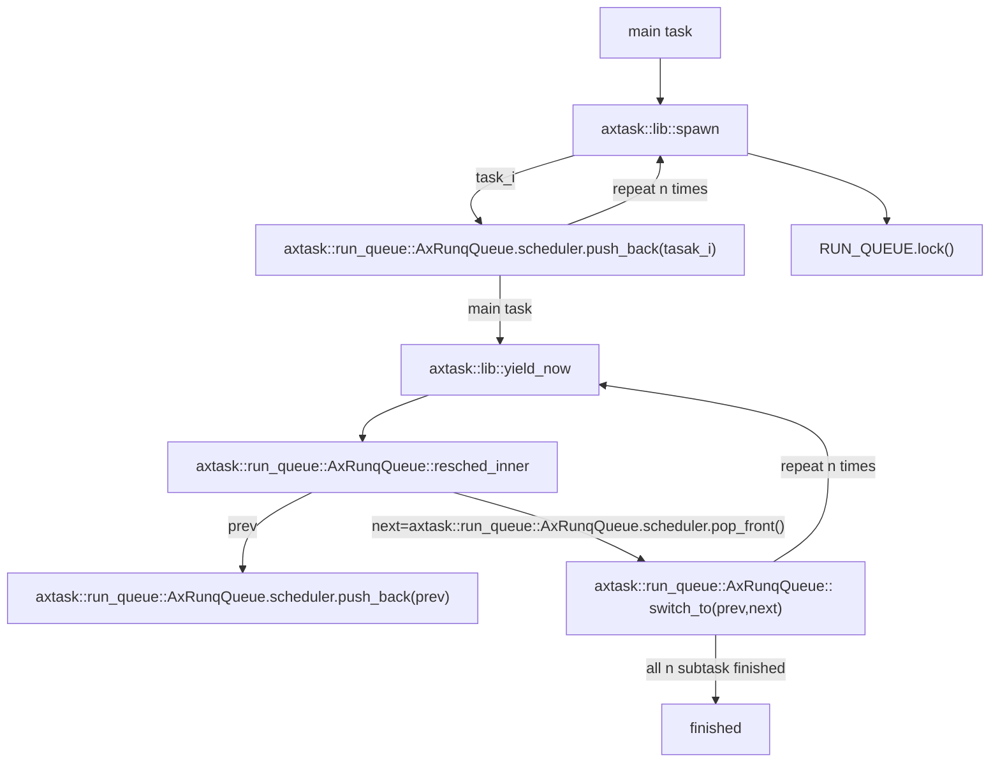

# arceos应用汇报：yield

---
# 运行环境
## 文件目录
应用程序`yield`源代码存储在目录`arceos/apps/task/yield/src/main.rs`下。

## 运行指令
假设在riscv64环境下运行，以单核形式运行，指令为：
```shell
make A=apps/task/yield ARCH=riscv64 LOG=info NET=y SMP=1 run
```
## 运行配置
不允许抢占发生，即`feature: preempt`为`false`。

---
## Output
```shell
Hello, main task!
Hello, task 0! id = TaskId(4)
Hello, task 1! id = TaskId(5)
Hello, task 2! id = TaskId(6)
Hello, task 3! id = TaskId(7)
Hello, task 4! id = TaskId(8)
Hello, task 5! id = TaskId(9)
Hello, task 6! id = TaskId(10)
Hello, task 7! id = TaskId(11)
Hello, task 8! id = TaskId(12)
Hello, task 9! id = TaskId(13)
Task yielding tests run OK!
```

---
# 程序流程
## STEP 1
* OS init
* After executed all initial actions, then arceos call main function in `yield` app.

---
## STEP2
```rust
fn main() {
    for i in 0..NUM_TASKS {
        task::spawn(move || {
            println!("Hello, task {}! id = {:?}", i, task::current().id());
            // 此时已经启动了yield
            // 因为preempt所需要的依赖libax/sched_rr并没有被包含进去
            #[cfg(not(feature = "preempt"))]
            task::yield_now();

            let order = FINISHED_TASKS.fetch_add(1, Ordering::Relaxed);
            if option_env!("SMP") == Some("1") {
                assert!(order == i); // FIFO scheduler
            }
        });
    }
    println!("Hello, main task{}!");
    while FINISHED_TASKS.load(Ordering::Relaxed) < NUM_TASKS {
        #[cfg(not(feature = "preempt"))]
        task::yield_now();
    }
    println!("Task yielding tests run OK!");
}
```

---
## 运行流程
**（大家可以对照自己电脑上的源代码了解大体逻辑。）**
1. 进入`main`函数，`main task`执行。
2. 利用`task::spawn`循环产生`NUM_TASKS`个任务，类似于线程的思想。
3. 每一个任务执行一个函数。若环境不允许抢占发生，则自身执行`yield`让出CPU。当重新运行时，获取自身运行的顺序，在单核情况下检查是否符合FIFO调度策略。
4. `main task`会在输出自身信息后，等待所有子任务完成。若未完全完成，则继续`yield`等待。


---
## Flow Chart




