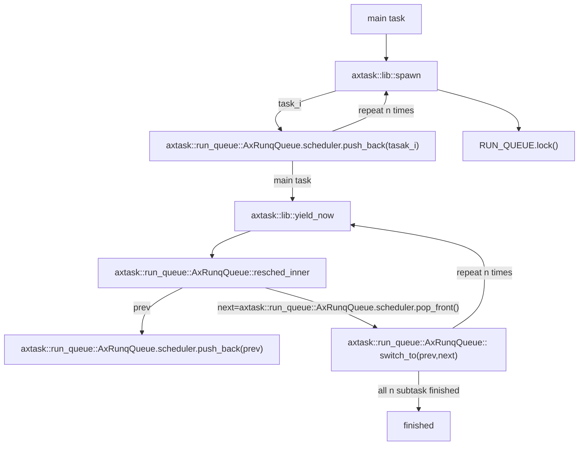

# INTRODUCTION
| App | Extra modules | Enabled features | Description |
|-|-|-|-|
| [yield](../apps/task/yield/) | axalloc, axtask | alloc, paging, multitask, sched_fifo | Multi-threaded yielding test |

# RUN

## Without preemption (FIFO scheduler)

```shell
make A=apps/task/yield ARCH=riscv64 LOG=info NET=y SMP=1 run
```

## With preemption (RR scheduler)

```shell
make A=apps/task/yield ARCH=riscv64 LOG=info NET=y SMP=1 APP_FEATURES=preempt run
```

## RESULT

```
Hello, main task!
Hello, task 0! id = TaskId(4)
Hello, task 1! id = TaskId(5)
Hello, task 2! id = TaskId(6)
Hello, task 3! id = TaskId(7)
Hello, task 4! id = TaskId(8)
Hello, task 5! id = TaskId(9)
Hello, task 6! id = TaskId(10)
Hello, task 7! id = TaskId(11)
Hello, task 8! id = TaskId(12)
Hello, task 9! id = TaskId(13)
Task yielding tests run OK!
```

# STEPS

## step1

* OS init
* After executed all initial actions, then arceos call main function in `yield` app.

## step2

* Use the `task::spawn` cycle to generate `NUM_TASKS` tasks (similar to threads).
* Each task executes a function, just print its ID.
* If preemption is disabled, the task voluntarily executes `yield` to give up the CPU.
* If SMP is not enabled, the execution order of tasks must be FIFO.
* `main task` will wait for all other tasks to complete. If not, continue to execute `yield` and wait.

```rust
fn main() {
    for i in 0..NUM_TASKS {
        task::spawn(move || {
            println!("Hello, task {}! id = {:?}", i, task::current().id());
            // 此时已经启动了yield
            // 因为preempt所需要的依赖libax/sched_rr并没有被包含进去
            #[cfg(not(feature = "preempt"))]
            task::yield_now();

            let order = FINISHED_TASKS.fetch_add(1, Ordering::Relaxed);
            if option_env!("SMP") == Some("1") {
                assert!(order == i); // FIFO scheduler
            }
        });
    }
    println!("Hello, main task{}!");
    while FINISHED_TASKS.load(Ordering::Relaxed) < NUM_TASKS {
        #[cfg(not(feature = "preempt"))]
        task::yield_now();
    }
    println!("Task yielding tests run OK!");
}
```

**flow chart**


