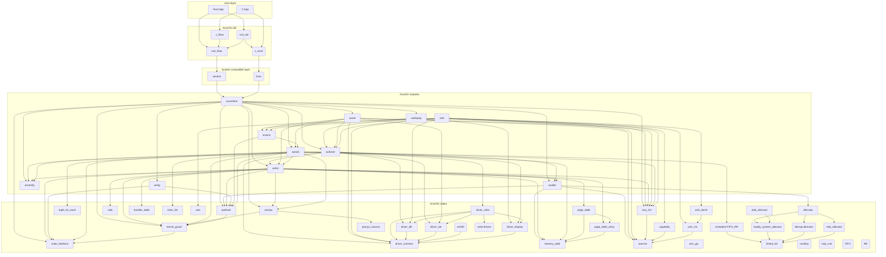

# ArceOS Architecture

## ArceOS Modules
* [axruntime](../modules/axruntime/): Bootstraping from the bare-metal environment, and initialization.
* [axhal](../modules/axhal/): Hardware abstraction layer, provides unified APIs for cross-platform.
* [axconfig](../modules/axconfig/): Platform constants and kernel parameters, such as physical memory base, kernel load addresses, stack size, etc.
* [axlog](../modules/axlog/): Multi-level log definition and printing.
* [axalloc](../modules/axalloc/): Dynamic memory allocation.
* [axdriver](../modules/axdriver/): Device driver framework.
* [axdisplay](../modules/axdisplay/): Graphic display framework.
* [axfs](../modules/axfs/): File system framework with low/high level filesystem manipulation operations.
* [axnet](../modules/axnet/): Network stack.
* [axsync](../modules/axsync/): Synchronization primitives.
* [axtask](../modules/axtask/): Task management.

## Crates
* [allocator](../crates/allocator): Memory allocation: bitmap&buddy allocator in page size,  slab allocator in byte size.
* [arm_gic](../crates/arm_gic): ARM GIC(Generic Interrupt Controller) registers & ops.
* [axerrno](../crates/axerrno): Error number in linux.
* [axio](../crates/axio): `std`-like traits, helpers, and type definitions for core I/O functionality.
* [axfs_devfs](../crates/axfs_devfs): Device file system.
* [axfs_vfs](../crates/axfs_vfs): Virtual filesystem interfaces.
* [crate_interface](../crates/crate_interface): crate interface macros for OPs between crates.
* [driver_block](../crates/driver_block): trait(read_block/write_block/flush) of BlockDriver.
* [driver_common](../crates/driver_common): trait(device_name/device_type) of BaseDriver, types of drivers.
* [driver_display](../crates/driver_display):  FrameBuffer, DisplayInfo, trait of DisplayDriver on virtio-gpu.
* [driver_net](../crates/driver_net): trait of NetBuffer & NetDriver.
* [driver_virtio](../crates/driver_virtio): config & probe for VirtioDevice(Block/Net/GPU).
* [handler_table](../crates/handler_table): Exception/Interrupt Handler Table for Hardware abstraction layer -- [axhal](../modules/axhal/).
* [kernel_guard](../crates/kernel_guard): IRQ OPs.
* [lazy_init](../crates/lazy_init): Global static variable instance OPs.
* [linked_list](../crates/linked_list): Based on linux/rust/kernel/linked_list.rs, but use [`unsafe_list::List`](../crates/linked_list/src/unsafe_list.rs) as the inner implementation..
* [memory_addr](../crates/memory_addr): PhyAddr/VirtAddr related OPs.
* [page_table](../crates/page_table): Generic page table. 
* [page_table_entry](../crates/page_table_entry): Generic page table entry.
* [percpu](../crates/percpu): Framework for per-cpu data.
* [percpu_macros](../crates/percpu_macros): Macros for per-cpu data.
* [ratio](../crates/ratio): Convert `numerator / denominator` to `mult / (1 << shift)` to avoid `u128` division.
* [scheduler](../crates/scheduler): FIFO/RR schedulers.
* [slab_allocator](../crates/slab_allocator): Memory: slab allocator.
* [spinlock](../crates/spinlock): Sync: spin lock. 
* [timer_list](../crates/timer_list): Timer event/list & OPs. 
* [tuple_for_each](../crates/tuple_for_each): tuple_for_each to traverse devices. 
## Dependencies

