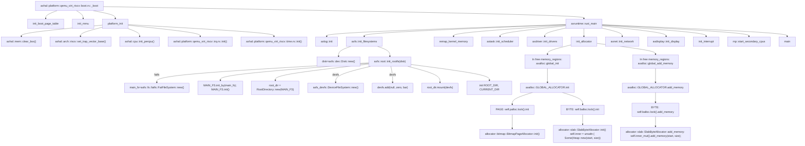

```mermaid
graph TD;
    A[axhal::platform::qemu_virt_riscv::boot.rs::_boot] --> init_boot_page_table;
    A --> init_mmu;
    A --> P[platform_init];
    A --> B[axruntime::rust_main];
    P --> P1["axhal::mem::clear_bss()"];
    P --> P2["axhal::arch::riscv::set_trap_vector_base()"];
    P --> P3["axhal::cpu::init_percpu()"];
    P --> P4["axhal::platform::qemu_virt_riscv::irq.rs::init()"];
    P --> P5["axhal::platform::qemu_virt_riscv::time.rs::init()"];
    B --> axlog::init;
    B --> D[init_allocator];
    B --> remap_kernel_memory;
    B --> axtask::init_scheduler;
    B --> axdriver::init_drivers;
    B --> Q[axfs::init_filesystems];
    B --> axnet::init_network;
    B --> axdisplay::init_display;
    B --> init_interrupt;
    B --> mp::start_secondary_cpus;
    B --> C[main];
    Q --> Q1["disk=axfs::dev::Disk::new()"];
    Q --> Q2["axfs::root::init_rootfs(disk)"];
    Q2 --fatfs--> Q21["main_fs=axfs::fs::fatfs::FatFileSystem::new()"];
    Q2 --> Q22["MAIN_FS.init_by(main_fs); MAIN_FS.init()"];
    Q2 --> Q23["root_dir = RootDirectory::new(MAIN_FS)"];
    Q2 --devfs--> Q24["axfs_devfs::DeviceFileSystem::new()"];
    Q2 --devfs--> Q25["devfs.add(null, zero, bar)"];
    Q2 -->Q26["root_dir.mount(devfs)"];
    Q2 -->Q27["init ROOT_DIR, CURRENT_DIR"];
    D --> E["In free memory_regions: axalloc::global_init"];
    D --> F["In free memory_regions:  axalloc::global_add_memory"];
    E --> G[axalloc::GLOBAL_ALLOCATOR.init];
    F --> H[axalloc::GLOBAL_ALLOCATOR.add_memory];
    G --> I["PAGE: self.palloc.lock().init"];
    G --> J["BYTE: self.balloc.lock().init"];
    H --> K["BYTE: self.balloc.lock().add_memory"];
    I --> M["allocator::bitmap::BitmapPageAllocator::init()"];
    J -->L["allocator::slab::SlabByteAllocator::init() self.inner = unsafe { Some(Heap::new(start, size))"];
    K --> N["allocator::slab::SlabByteAllocator::add_memory:  self.inner_mut().add_memory(start, size);"];

```

