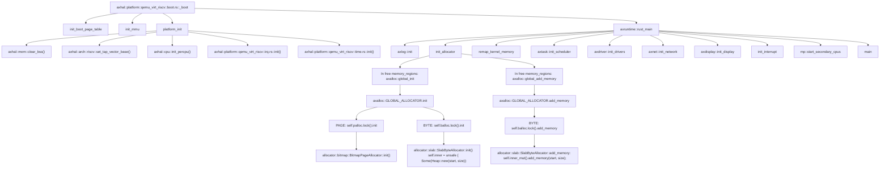

```mermaid
graph TD;
    A[axhal::platform::qemu_virt_riscv::boot.rs::_boot] --> init_boot_page_table;
    A --> init_mmu;
    A --> P[platform_init];
    A --> B[axruntime::rust_main];
    P --> P1["axhal::mem::clear_bss()"];
    P --> P2["axhal::arch::riscv::set_tap_vector_base()"];
    P --> P3["axhal::cpu::init_percpu()"];
    P --> P4["axhal::platform::qemu_virt_riscv::irq.rs::init()"];
    P --> P5["axhal::platform::qemu_virt_riscv::time.rs::init()"];
    B --> axlog::init;
    B --> D[init_allocator];
    B --> remap_kernel_memory;
    B --> axtask::init_scheduler;
    B --> axdriver::init_drivers;
    B --> axnet::init_network;
    B --> axdisplay::init_display;
    B --> init_interrupt;
    B --> mp::start_secondary_cpus;
    B --> C[main];
    D --> E["In free memory_regions: axalloc::global_init"];
    D --> F["In free memory_regions:  axalloc::global_add_memory"];
    E --> G[axalloc::GLOBAL_ALLOCATOR.init];
    F --> H[axalloc::GLOBAL_ALLOCATOR.add_memory];
    G --> I["PAGE: self.palloc.lock().init"];
    G --> J["BYTE: self.balloc.lock().init"];
    H --> K["BYTE: self.balloc.lock().add_memory"];
    I --> M["allocator::bitmap::BitmapPageAllocator::init()"];
    J -->L["allocator::slab::SlabByteAllocator::init() self.inner = unsafe { Some(Heap::new(start, size))"];
    K --> N["allocator::slab::SlabByteAllocator::add_memory:  self.inner_mut().add_memory(start, size);"];

```

