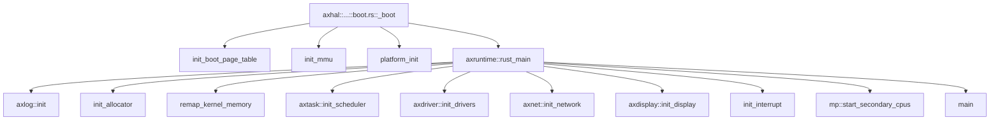

```mermaid
graph TD;
    A[axhal::...::boot.rs::_boot] --> init_boot_page_table;
    A --> init_mmu;
    A --> platform_init;
    A --> B[axruntime::rust_main];
    B --> axlog::init;
    B --> init_allocator;
    B --> remap_kernel_memory;
    B --> axtask::init_scheduler;
    B --> axdriver::init_drivers;
    B --> axnet::init_network;
    B --> axdisplay::init_display;
    B --> init_interrupt;
    B --> mp::start_secondary_cpus;
    B --> C[main];
```

