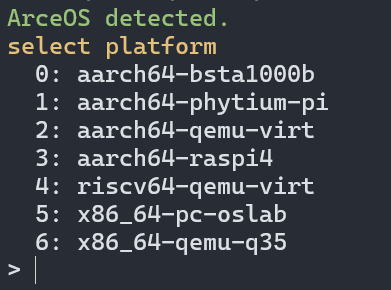
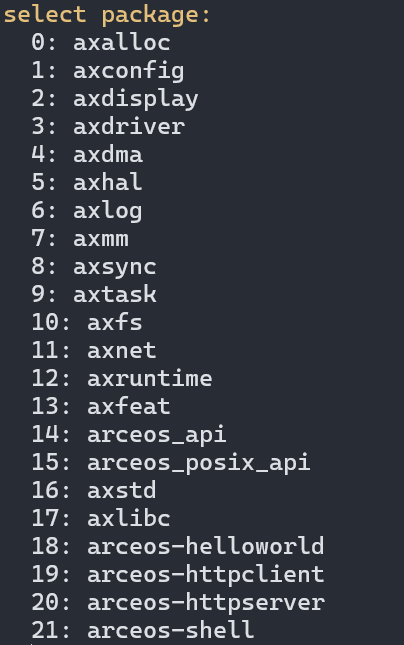

# How to run ArceOS on phytium pi

First, we need `ostool` to build and upload the image to the board. It also supports windows.

```bash
cargo install ostool
```

We also need to connect the board to the computer with serial port, and connect netwire to the board. The host pc and the board should be in the same network.

Then, we can run it easily.

```bash
# cd arceos main dir.
ostool run uboot
```



Then, press `1` and `enter` to select phytium pi.



Then, select app you want to run. Item without `arceos-*` are not app and can not run. Here we select `arceos-helloworld` for test.


We can ignore select dtb step by pressing `enter` directly. ArceOS dose not support dtb yet.

Then the cmdline will wait for you to put board power on or reset.

You can modify config in `.project.toml` to change the default behavior.

If everything goes well, you will see the following output:


