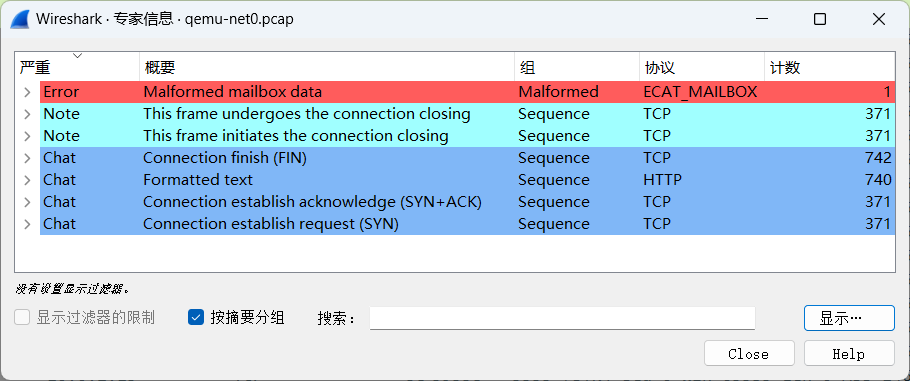
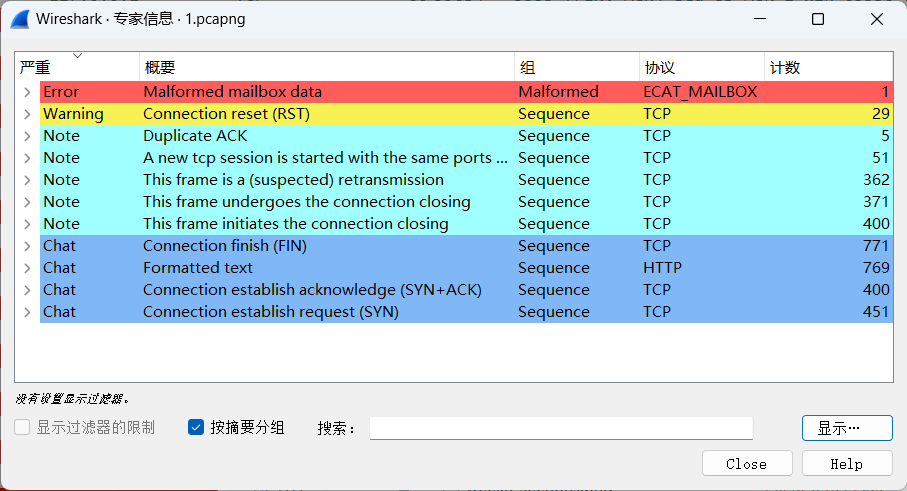
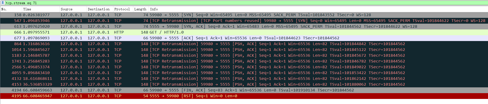

# 第十周汇报

**致理-信计01  佟海轩 2020012709**

## 本周进展

### 同步上游仓库

对上游仓库的修改进行适配，如添加 UDP 接口等（暂未做功能实现）。

### 异步模型

对上次汇报时提及的异步方式进行调研。

学习了 Rust 的 async / await 异步编程方式。

lwip 使用基于回调函数的事件驱动模型，进行异步模型的转换有一定难度，且仅在 NO_SYS 模式下需要，意义不是很大，故放弃。

### Debug

#### 较小复现

`ab -n 400 -c 100 http://127.0.0.1:5555/`

```
This is ApacheBench, Version 2.3 <$Revision: 1843412 $>
Copyright 1996 Adam Twiss, Zeus Technology Ltd, http://www.zeustech.net/
Licensed to The Apache Software Foundation, http://www.apache.org/

Benchmarking 127.0.0.1 (be patient)
Completed 100 requests
Completed 200 requests
Completed 300 requests
apr_pollset_poll: The timeout specified has expired (70007)
Total of 371 requests completed
```

尝试直接读 log，很快放弃。

#### Qemu 抓包

```
ifeq ($(MODE), debug)
  qemu_args-$(NET) += \
  -object filter-dump,id=dump0,netdev=net0,file=qemu-net0.pcap
endif
```

查看统计信息：



`ECAT_MAILBOX` 的 Error 是使用了端口 34980 导致的 Wireshark 解析问题，不是待发现的问题。

共 371 条完整的 TCP 流（也使用过滤器 `tcp.completeness != 31` 验证），和 ab 的输出信息相符合。

Qemu 抓包结果一片祥和，十分神秘。

#### Tshark 抓包

`sudo tshark -i lo -f 'port 5555' -w 1.pcapng`

Wireshark 打开后，时不时有一大片黑包（重传），最后有一大片红包（RST），似乎比 Qemu 抓包多了不少包。

检查统计信息：



恰好 29 条流意外 RST，和 371 条正常完成的流互补。

对一条 RST 流进行追踪：



（通过筛选 59980 端口，发现 Qemu 中一个对应的包都没有😓）

结合 log 中最后只到 `new client 370`，怀疑 `accept` 出现问题。


## 下周计划

- 进行系统层适配
