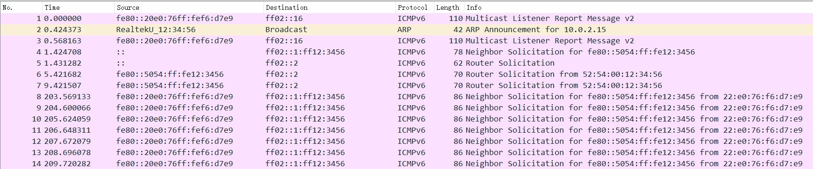

# 第十一周汇报

**致理-信计01  佟海轩 2020012709**

## 本周进展

### 更换开发平台

顺便换用了 `qemu-8.0.0`

在 qemu7.2 之后使用 user 作为 network backend 需要在 configure 时添加 `--enable-slirp`，并安装 `libslirp-dev`（参考：<https://stackoverflow.com/questions/75641274/network-backend-user-is-not-compiled-into-this-binary>）

### 配置 TAP

编写脚本：

`./scripts/net/qemu-ifup.sh`

``` bash ./scripts/net/qemu-ifup.sh
#!/usr/bin/bash

sudo ip tuntap add qemu-tap0 mode tap
sudo ip addr add 10.0.2.2/24 dev qemu-tap0
sudo ip link set up dev qemu-tap0
```

`./scripts/net/qemu-ifdown.sh`

``` bash ./scripts/net/qemu-ifdown.sh
#!/usr/bin/bash

sudo ip link del qemu-tap0
```

Makefile 中添加参数：`NETDEV ?= user`

更改 QEMU 关于 NET 的参数设置：

``` Makefile
qemu_args-$(NET) += -device virtio-net-device,netdev=net0
ifeq ($(NETDEV), user)
  qemu_args-$(NET) += \
    -netdev user,id=net0,hostfwd=tcp::5555-:5555,hostfwd=udp::5555-:5555
else ifeq ($(NETDEV), tap)
  qemu_args-$(NET) += \
    -netdev tap,id=net0,ifname=qemu-tap0,script=no,downscript=no
endif
```

这样只需要在运行 QEMU 前执行脚本 `./scripts/net/qemu-ifup.sh`，运行时指定 `NETDEV=tap`，运行后执行脚本 `./scripts/net/qemu-ifdown.sh` 即可。

使用 TAP 接入后，也可以响应 ICMP 包了：

``` plain
thx@ubuntu181:~$ ping 10.0.2.15 -I qemu-tap0 -c 5
PING 10.0.2.15 (10.0.2.15) from 10.0.2.2 qemu-tap0: 56(84) bytes of data.
64 bytes from 10.0.2.15: icmp_seq=1 ttl=64 time=1.57 ms
64 bytes from 10.0.2.15: icmp_seq=2 ttl=64 time=0.258 ms
64 bytes from 10.0.2.15: icmp_seq=3 ttl=64 time=0.181 ms
64 bytes from 10.0.2.15: icmp_seq=4 ttl=64 time=0.371 ms
64 bytes from 10.0.2.15: icmp_seq=5 ttl=64 time=0.182 ms

--- 10.0.2.15 ping statistics ---
5 packets transmitted, 5 received, 0% packet loss, time 4060ms
rtt min/avg/max/mdev = 0.181/0.512/1.570/0.533 ms
```

### 踩坑

配好 TAP 后，也想试试目前 IPv6 的支持情况。

先补全一下移植 IPv6 所需的部分：

``` diff
+   netif_create_ip6_linklocal_address(&mut ETH0.netif.lock().0, 1);
    netif_set_link_up(&mut ETH0.netif.lock().0);
    netif_set_up(&mut ETH0.netif.lock().0);
    netif_set_default(&mut ETH0.netif.lock().0);
```

``` diff
    (*netif).output = Some(etharp_output);
+   (*netif).output_ip6 = Some(ethip6_output);
    (*netif).linkoutput = Some(ethif_output);
```

然后尝试从 log 中获取 IPv6 地址，尝试 ping：

``` plain
thx@ubuntu181:~$ ping fe80::5054:ff:fe12:3456 -I qemu-tap0
ping: Warning: source address might be selected on device other than: qemu-tap0
PING fe80::5054:ff:fe12:3456(fe80::5054:ff:fe12:3456) from :: qemu-tap0: 56 data bytes
From fe80::20e0:76ff:fef6:d7e9%qemu-tap0 icmp_seq=1 Destination unreachable: Address unreachable
From fe80::20e0:76ff:fef6:d7e9%qemu-tap0 icmp_seq=2 Destination unreachable: Address unreachable
From fe80::20e0:76ff:fef6:d7e9%qemu-tap0 icmp_seq=3 Destination unreachable: Address unreachable
```

ping 不通😓。抓包看看：



结合 log，发现收到包，但未回包，甚至无 ND 查询包。log 显示调用 `netif->output_ip6()` 后并未进入 `ethif_output` 🤔。

逐层函数添加输出调试……

``` c
s8_t i;

/* Get next hop record. */
i = nd6_get_next_hop_entry(ip6addr, netif);
if (i < 0) {
  /* failed to get a next hop neighbor record. */
  return i;
}
```

输出结果显示，此处 `i` 的值为 -1，但是却并没有进入 if 语句🤔。

继续深入发现，`nd6_get_next_hop_entry` 返回 -1 的原因，也是一些 s8_t 变量为负，但是 `i >= 0` 的语句却为真导致的。

查看 `s8_t` 定义：

``` c
// crates/lwip_rust/depend/lwip/src/src/include/lwip/arch.h#L126
typedef int8_t    s8_t;
```

``` c
// ulib/c_libax/include/stdint.h#L5
typedef char int8_t;
```

不得不怀疑一下 char 是否有符号。检验一下：

``` c
LWIP_ASSERT("CHECK (-1<0) FAILED", (-1<0));
signed char i = -1;
LWIP_ASSERT("CHECK (signed char i<0) FAILED", (i<0));
char j = -1;
LWIP_ASSERT("CHECK (char j<0) FAILED", (j<0));
```

``` plain
[  0.052691 0] Assert "CHECK (char j<0) FAILED" failed at line 345 in depend/lwip/src/core/init.c
[  0.053805 0 axruntime::lang_items:5] panicked at 'lwip_abort', modules/axnet/src/lwip_impl/cbindings.rs:25:5
```

居然真是无符号😨。

查阅资料（<https://stackoverflow.com/questions/2054939/is-char-signed-or-unsigned-by-default>） 发现

[C99 N1256 draft](https://www.open-std.org/JTC1/SC22/WG14/www/docs/n1256.pdf) 6.2.5 "Types" 15. 指出：

> The three types **char**, **signed char**, and **unsigned char** are collectively called the character types. The implementation shall define char to have the same range, representation, and behavior as either **signed char** or **unsigned char**.

char 是否有符号取决于实现。

6.2.5 "Types" 4. 也给出了五种标准有符号整型：

> There are five *standard signed integer types*, designated as **signed char**, **short int**, **int**, **long int**, and **long long int**.

故只要将 `ulib/c_libax/include/stdint.h#L5` 修改一下就行：

``` diff
- typedef char int8_t;
+ typedef signed char int8_t;
```

### IPv6 支持

### 重测性能

系统版本：`Ubuntu 20.04.3 LTS`

内核版本：`5.4.0-125-generic`

CPU：`Intel(R) Xeon(R) Gold 6230 CPU @ 2.10GHz`

QEMU：`QEMU emulator version 8.0.0`

运行参数：

- `make A=apps/net/httpserver/ ARCH=riscv64 LOG=warn NET=y NETDEV=tap MODE=release run`
- `qemu-system-riscv64 -m 128M -smp 1 -machine virt -bios default -kernel apps/net/httpserver//httpserver_qemu-virt-riscv.bin -device virtio-net-device,netdev=net0 -netdev tap,id=net0,ifname=qemu-tap0,script=no,downscript=no -nographic`

测试参数：`ab -n 100000 -c 100 http://10.0.2.15:5555/`

测试结果均很稳定，netdev 为 user 时的 bug 也不再复现。

#### lwip

TLDR：**Requests per second:    5186.12 [#/sec] (mean)**

完整：

``` plain
thx@ubuntu181:~$ ab -n 100000 -c 100 http://10.0.2.15:5555/
This is ApacheBench, Version 2.3 <$Revision: 1843412 $>
Copyright 1996 Adam Twiss, Zeus Technology Ltd, http://www.zeustech.net/
Licensed to The Apache Software Foundation, http://www.apache.org/

Benchmarking 10.0.2.15 (be patient)
Completed 10000 requests
Completed 20000 requests
Completed 30000 requests
Completed 40000 requests
Completed 50000 requests
Completed 60000 requests
Completed 70000 requests
Completed 80000 requests
Completed 90000 requests
Completed 100000 requests
Finished 100000 requests


Server Software:
Server Hostname:        10.0.2.15
Server Port:            5555

Document Path:          /
Document Length:        340 bytes

Concurrency Level:      100
Time taken for tests:   19.282 seconds
Complete requests:      100000
Failed requests:        0
Total transferred:      42400000 bytes
HTML transferred:       34000000 bytes
Requests per second:    5186.12 [#/sec] (mean)
Time per request:       19.282 [ms] (mean)
Time per request:       0.193 [ms] (mean, across all concurrent requests)
Transfer rate:          2147.38 [Kbytes/sec] received

Connection Times (ms)
              min  mean[+/-sd] median   max
Connect:        0    0   0.1      0       8
Processing:     6   19   0.6     19      22
Waiting:        3   19   0.6     19      22
Total:          8   19   0.6     19      29

Percentage of the requests served within a certain time (ms)
  50%     19
  66%     19
  75%     19
  80%     19
  90%     20
  95%     20
  98%     21
  99%     21
 100%     29 (longest request)
```

#### smoltcp

TLDR：**Requests per second:    2640.59 [#/sec] (mean)**

完整：

``` plain
thx@ubuntu181:~$ ab -n 100000 -c 100 http://10.0.2.15:5555/
This is ApacheBench, Version 2.3 <$Revision: 1843412 $>
Copyright 1996 Adam Twiss, Zeus Technology Ltd, http://www.zeustech.net/
Licensed to The Apache Software Foundation, http://www.apache.org/

Benchmarking 10.0.2.15 (be patient)
Completed 10000 requests
Completed 20000 requests
Completed 30000 requests
Completed 40000 requests
Completed 50000 requests
Completed 60000 requests
Completed 70000 requests
Completed 80000 requests
Completed 90000 requests
Completed 100000 requests
Finished 100000 requests


Server Software:
Server Hostname:        10.0.2.15
Server Port:            5555

Document Path:          /
Document Length:        340 bytes

Concurrency Level:      100
Time taken for tests:   37.870 seconds
Complete requests:      100000
Failed requests:        0
Total transferred:      42400000 bytes
HTML transferred:       34000000 bytes
Requests per second:    2640.59 [#/sec] (mean)
Time per request:       37.870 [ms] (mean)
Time per request:       0.379 [ms] (mean, across all concurrent requests)
Transfer rate:          1093.37 [Kbytes/sec] received

Connection Times (ms)
              min  mean[+/-sd] median   max
Connect:        0    0   0.1      0       5
Processing:     4   38   1.5     37      47
Waiting:        2   38   1.5     37      47
Total:          9   38   1.5     37      48

Percentage of the requests served within a certain time (ms)
  50%     37
  66%     39
  75%     39
  80%     40
  90%     40
  95%     40
  98%     40
  99%     41
 100%     48 (longest request)
```

## 下周计划

- 