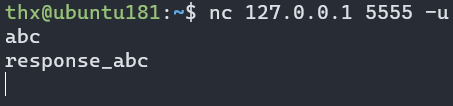
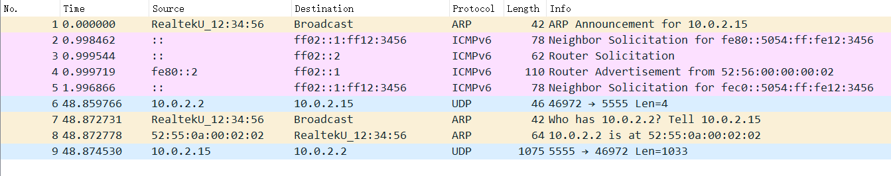
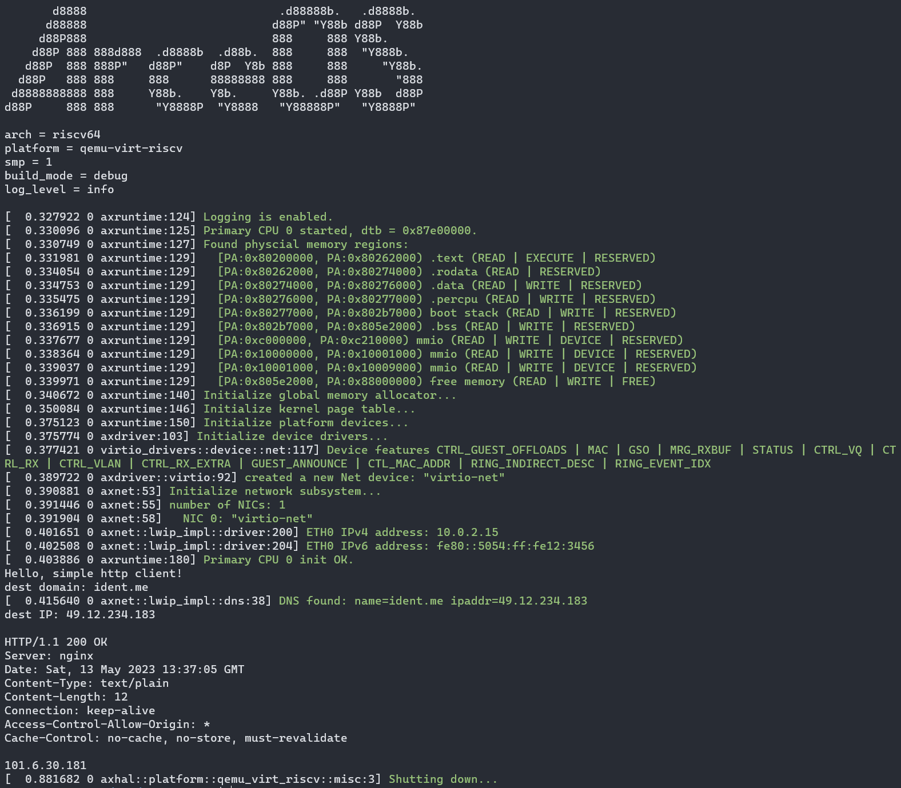
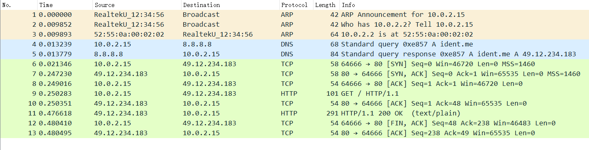
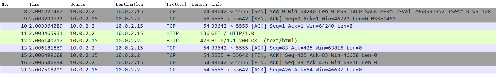
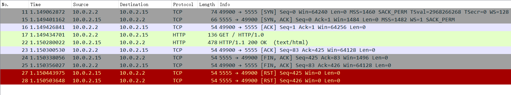
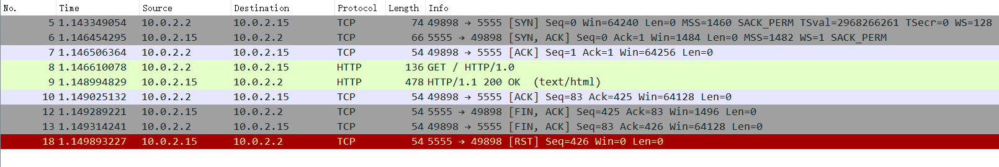
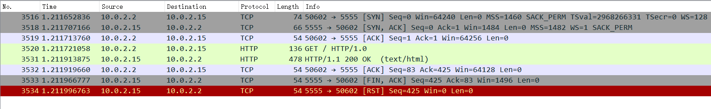

# 第十二周汇报

**致理-信计01  佟海轩 2020012709**

## 本周进展

与贾学长交流后建议先适配 UDP，以及进行 PR。由于驱动接口将发生变动，故学长建议 PR 在驱动接口变化完成后（约一周时间）进行。

故本周进行 UDP 和 DNS 适配。

### UDP 适配

学习 lwip 的 UDP raw api：

- <https://lwip.fandom.com/wiki/Raw/UDP>
- <https://www.nongnu.org/lwip/2_1_x/group__udp__raw.html>

使用 lwip 中的：

- `udp_new`
- `udp_bind`
- `udp_sendto`
- `udp_recv`
- `udp_remove`

完成 `UdpSocket`：

- [x] `UdpSocket`
  - [x] `pub fn new() -> Self`
  - [x] `pub fn local_addr(&self) -> AxResult<SocketAddr>`
  - [x] `pub fn bind(&mut self, addr: SocketAddr) -> AxResult`
  - [x] `pub fn sendto(&self, buf: &[u8], addr: SocketAddr) -> AxResult<usize>`
  - [x] `pub fn recvfrom(&self, buf: &mut [u8]) -> AxResult<(usize, SocketAddr)>`
  - [x] `pub fn shutdown(&mut self) -> AxResult`
  - [x] `fn drop(&mut self)`

适配方式与 TcpSocket 类似。

效果：

`make A=apps/net/udpserver/ ARCH=riscv64 LOG=debug NET=y MODE=debug run`





如图可以发现 udpserver 的一个小 bug / feature，接受消息时没有根据返回的 size 对 buf 切片，导致回发的消息长度很长。

### DNS 适配

学习 lwip 的 DNS raw api：

- <https://lwip.fandom.com/wiki/DNS>
- <https://www.nongnu.org/lwip/2_1_x/group__dns.html>

使用 lwip 中的：

- `dns_setserver`：设置 DNS 服务器，暂时硬编码为 8.8.8.8
- `err_t dns_gethostbyname(const char *hostname, ip_addr_t *addr, dns_found_callback found, void *callback_arg)`：非阻塞查询 DNS，结果如下
  - `ERR_OK`：命中缓存，查询结果存放在 `addr` 中
  - `ERR_INPROGRESS`：进行查询，查询完成后调用回调函数 `found`
  - `ERR_VAL`：未设定 DNS 服务器地址或其他错误
  - `ERR_ARG`：参数错误或其他错误

完成阻塞查询函数 `pub fn resolve_socket_addr(name: &str) -> AxResult<Vec<IpAddr>>`

适配方式与 TcpSocket 类似。

效果：

`make A=apps/net/httpclient/ ARCH=riscv64 LOG=info NET=y MODE=debug APP_FEATURES=dns run`





### 历史遗留问题

#### 链接脚本问题

回顾：<https://github.com/Centaurus99/arceos-lwip/blob/main/reports/week8.md#%E9%93%BE%E6%8E%A5%E8%84%9A%E6%9C%AC%E9%97%AE%E9%A2%98>

在贾学长帮助下发现，之前的问题是因为，链接脚本的 `.bss` 段内缺少 `*(COMMON)` 段，`.rodata` 段内缺少 `*(.sdata2 .sdata2.*)` 段，故如下修改即可：

``` diff
.rodata : ALIGN(4K) {
    srodata = .;
    *(.rodata .rodata.*)
    *(.srodata .srodata.*)
+   *(.sdata2 .sdata2.*)
    . = ALIGN(4K);
    erodata = .;
}
```

``` diff
.bss : ALIGN(4K) {
    boot_stack = .;
    *(.bss.stack)
    . = ALIGN(4K);
    boot_stack_top = .;

    sbss = .;
    *(.bss .bss.*)
    *(.sbss .sbss.*)
+   *(COMMON)
    . = ALIGN(4K);
    ebss = .;
}
```

#### ab 测试卡住问题

##### smoltcp 的复现

smoltcp 可以较容易复现

复现参数：

- `make A=apps/net/httpserver/ ARCH=riscv64 LOG=warn NET=y MODE=release NETDEV=tap run`
- `ab -n 1000 -c 2 http://10.0.2.15:5555/`

使用 `smoltcp` 可以在 `release` 编译下可以大概率复现。换用 `lwip` / 换用 `debug` 编译均不复现。并发 `-c` 越低，卡住概率越大。

以下以 ab 结果 999 完成 1 超时进行分析，使用 tap 网卡上的抓包结果。

抓包发现，在 qemu 内部或外部抓包结果相同，可能之前 `-netdev user` 时的问题已通过更换成 `-netdev tap` 解决，但仍有其他问题。

抓包结果显示，1000 个 HTTP 请求均已被响应，1000条 TCP 流均（基本）完整。

怀疑 ab 有一部分问题，即 TCP 流已结束，但 ab 却仍在等待。

查看 lwip 的 TCP 流，1000 条流模式相同，标准的三个包四次挥手断开连接：



查看 smoltcp 的 TCP 流，分以下三类：

1. 数量：989
   
2. 数量：8
   
3. 数量：3
   

smoltcp 均以 RST 来结束连接。

或许是 ab 有一些 bug （？）

##### lwip 的复现

恰巧复现了一次：

`make A=apps/net/httpserver/ ARCH=riscv64 LOG=warn NET=y MODE=release NETDEV=tap run`

若干次 `ab -n 10000 -c 10 http://10.0.2.15:5555/`


似乎 lwip 这边连接未完全关闭，导致 Port Reuse 时使用了之前一个流的 ack 记录。

Port Reuse 发生次数很多，但极低概率发生这种情况。

debug 难度较高，以后有空再尝试。

## 下周计划

待讨论
