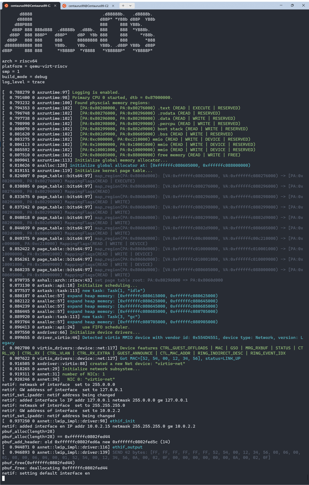
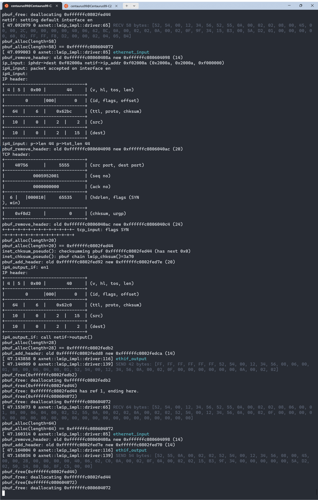
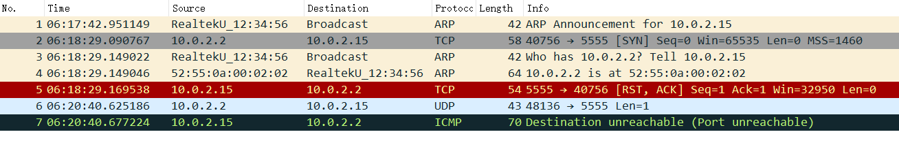
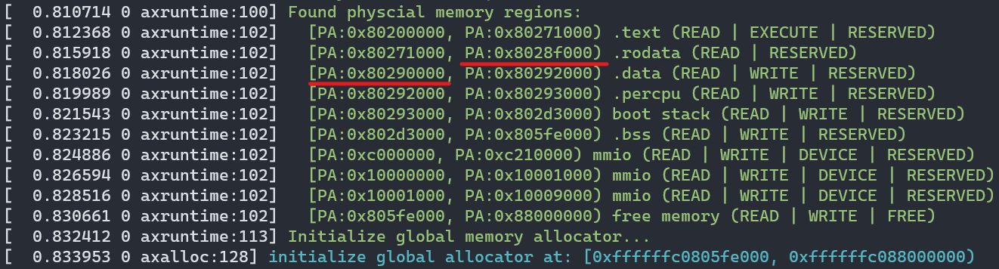

# 第八周汇报

**致理-信计01  佟海轩 2020012709**

## 本周进展

### 分析 lwip 

#### netif 数据结构

- `lwip` 对于网卡的抽象数据结构
- 多网卡组织为 `netif` 的链表，名为 `netif_list`
- 通过 `netif_add` 函数将网卡挂载到 `netif_list` 链表上，需要提供IP地址、子网掩码、默认网关、初始化网卡回调函数 `myif_init`、收包回调函数等参数。在挂载前，`myif_init` 会被调用。

#### 内存管理

- `lwip` 可以自行管理内存。它的内存管理策略有两种：内存堆和内存池。

#### pbuf 数据结构

存储数据区域指针、长度、pbuf 类型、引用数量等信息的结构，可以组织成链表形式。

##### pbuf 类型

- `PBUF_RAM`：内存堆中分配，数据区域紧跟在 pbuf 结构体地址后（会预留 layer 的头部空间），协议栈中最常用
- `PBUF_POOL`：内存池中分配，数据区域紧跟在 pbuf 结构体地址后（会预留 layer 的头部空间），收包时用
- `PBUF_ROM`：内存池中分配，分配时不包含数据区域，数据区位于 ROM
- `PBUF_RAM`：内存池中分配，分配时不包含数据区域，数据区位于 RAM

### 移植 lwip 分析

先主要完成驱动的适配，以类似裸机的形式运行。

#### 需要移植的头文件

- [x] `lwipopts.h`：协议栈的各种参数，先将 `NO_SYS` 设为 1 以裸机形式运行
- [x] `arch/cc.h`：编译器与体系结构相关的设置

- [x] `arch/sys_arch.h`：用于适配系统的相关设置

#### 需要实现的函数

- [x] `err_t myif_init(struct netif *netif)`：网卡初始化函数，作为 `netif_add` 的参数，在添加网卡时初始化
- [x] `err_t myif_link_output(struct netif *netif, struct pbuf *p)`：链路层发包函数，作为 `netif->linkoutput`
- [x] `err_t myif_output(struct netif *netif, struct pbuf *p, ip_addr_t *ipaddr)`：网络层发包函数，作为 `netif->output`。该函数被 `ip_output` 调用，函数内最终会使用 `myif_link_output` 进行发包。若支持 ARP，则该函数可以直接设为 `etharp_output`。
- [x] `myif_input()`：收包函数。当网卡收到包的时候，通过这个函数调用 `netif->input`，将包送入协议栈。对于以太网网卡，`netif->input` 将被设为 `ethernet_input`，故调用 `netif->input` 时需要传递含有数据链路层头部信息的以太网帧。
- [ ] `u32_t sys_now(void)`：获取当前时钟，用于实现定时器。
- [x] `main()`：裸机运行的主函数，依次初始化协议栈（`lwip_init()`），添加网卡（`netif_add()`，添加时会初始化），然后进入循环，不断检查收包（收到则调用 `myif_input()`），检查定时器（`sys_check_timeouts()`）

#### netif 初始化时需要设置的字段

- `state`：可选，自定义数据，可用来指向驱动中对网卡的包装结构的地址
- `hwaddr_len`：链路层地址长度
- `hwaddr[]`：链路层地址
- `mtu`：MTU
- `name[2]`：网卡名，如 `en`
- `num`：可选数字，网卡名相同时通过该数字区分
- `output`：设为 `etharp_output`
- `link_output`：设为 `myif_link_output`
- `input`：设为 `ethernet_input`
- `flags`：网卡 flag

### 移植 lwip 实操

#### 引入 lwip 模块

在 `crate` 中创建模块 `lwip_rust`，目录组织如下：

- `custom/`：移植需要的文件
- `depend/`：以 git submodule 的形式导入的 lwip 库
- `src/`：包装为 rust 模块
- `build.rs`：编译和生成接口脚本，参考 <https://github.com/eycorsican/leaf/blob/b0779107921683204a65bb1d41edc07a52688613/leaf/build.rs>
- `wrapper.h`：所有需要生成接口的头文件

#### 编译与链接

##### 编译

- 使用 crate `cc`，在 `build.rs` 里将 lwip 编译为静态库 `liblwip.a`

    ```rust
    let mut base_config = cc::Build::new();
    ```

- 头文件目录分别为 lwip 的 include 目录、用于移植的头文件目录、`c_libax` 中的 `libc`（主要使用到一些类型和宏的定义）：

    ```rust
    base_config
        .include("depend/lwip/src/include")
        .include("custom")
        .include("../../ulib/c_libax/include");
    ```

- 然后将所有需要的源文件导入：

    ```rust
    base_config.file("depend/lwip/src/core/xxx.c");
    ```

- 然后需手动在 `build.rs` 中指定

    ```rust
    base_config
        .flag("-march=rv64gc")
        .flag("-mabi=lp64d")
        .flag("-mcmodel=medany");
    ```
    
    否则会导致  `cannot link object files with different floating-point ABI from /tmp/rustcjJ6QUD/symbols.o` 。
    
- 最后定义编译参数并编译：

    ```rust
    base_config
        .warnings(false)
        .flag("-static")
        .flag("-no-pie")
        .flag("-fno-builtin")
        .flag("-ffreestanding")
        .flag("-nostdinc")
        .compile("liblwip.a");
    ```

##### 生成 Rust 接口

- 先指明需要链接的库：

  ```rust
  println!("cargo:rustc-link-lib=lwip");
  println!("cargo:include=depend/lwip/src/include/");
  ```

- 然后使用 crate `bindgen` 生成接口，`wrapper.h` 中包含了所有需要生成接口的头文件：

  ```rust
  let bindings = bindgen::Builder::default()
      .use_core()
      .header("wrapper.h")
      .clang_arg("-I./depend/lwip/src/include")
      .clang_arg("-I./custom")
      .clang_arg("-Wno-everything")
      .layout_tests(false)
      .parse_callbacks(Box::new(bindgen::CargoCallbacks))
      .generate()
      .expect("Unable to generate bindings");
  ```

- 最后输出 `bindings.rs` 到 `src/` 中供 `lib.rs` 使用：

  ```rust
  let out_path = PathBuf::from("src");
  bindings
      .write_to_file(out_path.join("bindings.rs"))
      .expect("Couldn't write bindings!");
  ```

#### 适配 axnet

创建 `lwip_impl`，实现以下内容：

- [ ] `IpAddr`
- [ ] `Ipv4Addr`
- [ ] `SocketAddr`
- [ ] `TcpSocket`
  - [ ] `pub fn new() -> Self`
  - [ ] `pub fn local_addr(&self) -> AxResult<SocketAddr>`
  - [ ] `pub fn peer_addr(&self) -> AxResult<SocketAddr>`
  - [ ] `pub fn connect(&mut self, _addr: SocketAddr) -> AxResult`
  - [ ] `pub fn bind(&mut self, _addr: SocketAddr) -> AxResult`
  - [ ] `pub fn listen(&mut self) -> AxResult`
  - [ ] `pub fn accept(&mut self) -> AxResult<TcpSocket>`
  - [ ] `pub fn shutdown(&self) -> AxResult`
  - [ ] `pub fn recv(&self, _buf: &mut [u8]) -> AxResult<usize>`
  - [ ] `pub fn send(&self, _buf: &[u8]) -> AxResult<usize>`
  - [ ] `fn drop(&mut self) {}`
- [x] `pub(crate) fn init(_net_devs: NetDevices)`

未实现的置为空或 `ax_err!(Unsupported, "LWIP Unsupported")` 即可通过编译。

#### 添加调试信息输出

使用 `printf-compat` crate，在 `lwip_impl` 中实现供 lwip 输出调试信息的 printf 函数：

```rust
use alloc::string::String;
use axlog::ax_print;
use core::ffi::{c_int, c_uchar};

#[no_mangle]
unsafe extern "C" fn lwip_print(str: *const c_uchar, mut args: ...) -> c_int {
    use printf_compat::{format, output};
    let mut s = String::new();
    let bytes_written = format(str, args.as_va_list(), output::fmt_write(&mut s));
    ax_print!("{}", s);
    bytes_written
}

#[no_mangle]
extern "C" fn lwip_abort() {
    panic!("lwip_abort");
}
```

在 `cc.h` 中补充 printf 所需的宏和用于自定义输出的宏：

```c
#define lwip_NO_INTTYPES_H 1
#define U8_F               "hhu"
#define S8_F               "hhd"
#define X8_F               "hhx"
#define U16_F              "hu"
#define S16_F              "hd"
#define X16_F              "hx"
#define U32_F              "u"
#define S32_F              "d"
#define X32_F              "x"
#define SZT_F              "zu"

extern int lwip_print(const char *fmt, ...);
extern void lwip_abort();

#define LWIP_PLATFORM_DIAG(x) \
    do {                      \
        lwip_print x;         \
    } while (0)

#define LWIP_PLATFORM_ASSERT(x)                                                       \
    do {                                                                              \
        lwip_print("Assert \"%s\" failed at line %d in %s\n", x, __LINE__, __FILE__); \
        lwip_abort();                                                                 \
    } while (0)
```

效果：


#### 适配网卡驱动

##### 网卡初始化函数

```rust
extern "C" fn ethif_init(netif: *mut netif) -> err_t {
    debug!("ethif_init");
    unsafe {
        (*netif).name[0] = 'e' as i8;
        (*netif).name[1] = 'n' as i8;
        (*netif).num = 0;

        (*netif).output = Some(etharp_output);
        (*netif).output_ip6 = Some(ethip6_output);
        (*netif).linkoutput = Some(ethif_output);

        (*netif).mtu = 1500;
        (*netif).flags = 0;
        (*netif).flags = (NETIF_FLAG_BROADCAST | NETIF_FLAG_ETHARP | NETIF_FLAG_ETHERNET) as u8;
    }
    err_enum_t_ERR_OK as err_t
}
```

##### 网卡收发包

学习 `smoltcp_impl` 对 `NetDevices` 的使用。

于是先实现两个包装：

```rust
struct DeviceWrapper<D: NetDriverOps> {
    inner: RefCell<D>,
    rx_buf_queue: VecDeque<D::RxBuffer>,
}

struct InterfaceWrapper<D: NetDriverOps> {
    dev: Mutex<DeviceWrapper<D>>,
    netif: Mutex<NetifWrapper>,
}
```

`DeviceWrapper` 复用 `smoltcp_impl` 的实现，然后对 `InterfaceWrapper` 实现 `poll` 函数，用于处理收包，复制到 `pbuf` 中并调用 `netif->input`：

```rust
impl<D: NetDriverOps> InterfaceWrapper<D> {
    fn poll(&self) {
        self.dev.lock().poll();
        loop {
            let buf_receive = self.dev.lock().receive();
            if let Some(buf) = buf_receive {
                trace!("RECV {} bytes: {:02X?}", buf.packet_len(), buf.packet());

                // Copy buf to pbuf
                let len = buf.packet_len();
                let p = unsafe { pbuf_alloc(pbuf_layer_PBUF_RAW, len as u16, pbuf_type_PBUF_POOL) };
                if p.is_null() {
                    warn!("pbuf_alloc failed");
                    continue;
                }
                let payload = unsafe { (*p).payload };
                let payload = unsafe { core::slice::from_raw_parts_mut(payload as *mut u8, len) };
                payload.copy_from_slice(buf.packet());
                let res = self.dev.lock().inner.borrow_mut().recycle_rx_buffer(buf);
                match res {
                    Ok(_) => (),
                    Err(err) => {
                        warn!("recycle_rx_buffer failed: {:?}", err);
                    }
                }

                debug!("ethernet_input");
                let mut netif = self.netif.lock();
                unsafe {
                    netif.0.input.unwrap()(p, &mut netif.0);
                }
            } else {
                break;
            }
        }
    }
}
```

`netif` 的发包函数，将 `pbuf` 复制为 `TxBuffer` 然后发包：

```rust
extern "C" fn ethif_output(netif: *mut netif, p: *mut pbuf) -> err_t {
    debug!("ethif_output");
    let ethif = unsafe {
        &mut *((*netif).state as *mut _ as *mut InterfaceWrapper<axdriver::VirtIoNetDev>)
    };
    let dev_wrapper = ethif.dev.lock();
    let mut dev = dev_wrapper.inner.borrow_mut();

    if dev.can_send() {
        let tot_len = unsafe { (*p).tot_len };
        let mut tx_buf = dev.new_tx_buffer(tot_len.into()).unwrap();

        // Copy pbuf chain to tx_buf
        let mut offset = 0;
        let mut q = p;
        while !q.is_null() {
            let len = unsafe { (*q).len } as usize;
            let payload = unsafe { (*q).payload };
            let payload = unsafe { core::slice::from_raw_parts(payload as *const u8, len) };
            tx_buf.packet_mut()[offset..offset + len].copy_from_slice(payload);
            offset += len;
            q = unsafe { (*q).next };
        }

        trace!(
            "SEND {} bytes: {:02X?}",
            tx_buf.packet_len(),
            tx_buf.packet()
        );
        dev.send(tx_buf).unwrap();
        err_enum_t_ERR_OK as err_t
    } else {
        err_enum_t_ERR_WOULDBLOCK as err_t
    }
}
```

##### 测试用的主函数

主函数中先对网卡进行包装和设置 mac 地址：

```rust
let mut ipaddr: ip4_addr_t = ip4_addr_gen(10, 0, 2, 15); // QEMU user networking default IP
let mut netmask: ip4_addr_t = ip4_addr_gen(255, 255, 255, 0);
let mut gw: ip4_addr_t = ip4_addr_gen(10, 0, 2, 2); // QEMU user networking gateway

let dev = net_devs.0;
let mut netif: netif = unsafe { core::mem::zeroed() };
netif.hwaddr_len = 6;
netif.hwaddr = dev.mac_address().0;

unsafe {
    ETH0.init_by(InterfaceWrapper {
        dev: Mutex::new(DeviceWrapper::new(dev)),
        netif: Mutex::new(NetifWrapper(netif)),
    });
}
```

然后初始化协议栈，添加网卡并初始化：

```rust
unsafe {
    lwip_init();
    netif_add(
        &mut ETH0.netif.lock().0,
        &mut ipaddr,
        &mut netmask,
        &mut gw,
        &mut ETH0 as *mut _ as *mut c_void,
        Some(ethif_init),
        Some(ethernet_input),
    );
    netif_set_link_up(&mut ETH0.netif.lock().0);
    netif_set_up(&mut ETH0.netif.lock().0);
    netif_set_default(&mut ETH0.netif.lock().0);
}
```

最后循环收包：

```rust
loop {
    unsafe {
        ETH0.poll();
    }
    // sys_check_timeouts();
}
```

#### 添加 lwiperf 应用

lwip 用 raw API 实现了一些应用，添加一个小应用 `lwiperf` 试试。

在 `wrapper.h` 和 `build.rs` 里添加上对应的头文件和源文件，即可在 axnet 中调用 `lwiperf` 的函数。

```rust
let ipaddr: ip_addr_t = ip_addr_t {
    u_addr: ip_addr__bindgen_ty_1 { ip4: ipaddr },
    type_: lwip_ip_addr_type_IPADDR_TYPE_V4 as u8,
};
unsafe {
    lwiperf_start_tcp_server(&ipaddr, 5555, None, core::ptr::null_mut());
}
```

### 目前移植的效果

#### 运行与调试信息

运行，并用 `nc` 发 TCP 和 UDP 包简单测试一下

- `nc 127.0.0.1 5555`
- `nc 127.0.0.1 5555 -u`

初始化：



收发 TCP 包：



收 UDP 包（图略）

抓包结果：



#### iperf 测试

`make A=apps/net/lwip_test/ ARCH=riscv64 LOG=info NET=y MODE=??? run`

`iperf -c 127.0.0.1 -p 5555 -e`

##### MODE=debug

```
------------------------------------------------------------
Client connecting to 127.0.0.1, TCP port 5555 with pid 17732
Write buffer size:  128 KByte
TCP window size: 2.50 MByte (default)
------------------------------------------------------------
[  3] local 127.0.0.1 port 41878 connected with 127.0.0.1 port 5555 (ct=0.03 ms)
[ ID] Interval            Transfer    Bandwidth       Write/Err  Rtry     Cwnd/RTT        NetPwr
[  3] 0.0000-10.0507 sec   117 MBytes  97.3 Mbits/sec  933/0          0       -1K/19 us  640384.86
```

##### MODE=release

```
------------------------------------------------------------
Client connecting to 127.0.0.1, TCP port 5555 with pid 17081
Write buffer size:  128 KByte
TCP window size: 2.50 MByte (default)
------------------------------------------------------------
[  3] local 127.0.0.1 port 58100 connected with 127.0.0.1 port 5555 (ct=0.07 ms)
[ ID] Interval            Transfer    Bandwidth       Write/Err  Rtry     Cwnd/RTT        NetPwr
[  3] 0.0000-10.0216 sec   472 MBytes   395 Mbits/sec  3776/0          0       -1K/17 us  2905054.76
```

### 踩坑

调试：`make A=apps/net/lwip_test/ ARCH=riscv64 LOG=trace NET=y MODE=debug debug`

#### 链接脚本问题

初始化 lwip 时出现 `Unhandled trap Exception(StorePageFault) @ 0xffffffc080206ce2`，gdb 跟踪调试发现访问了未在页表中的内存，进一步发现是在 lwip 访问 static 变量时出现。objdump 发现 `.bss` 段并未全部被包含在对应页表项中，于是怀疑 `axhal/linker.lds.S` 链接脚本中的 ebss 计算有问题。

从

```
.bss : ALIGN(4K) {
    boot_stack = .;
    *(.bss.stack)
    . = ALIGN(4K);
    boot_stack_top = .;

    sbss = .;
    *(.bss .bss.*)
    *(.sbss .sbss.*)
    . = ALIGN(4K);
    ebss = .;
}
```

改为

```
.bss : ALIGN(4K) {
    boot_stack = .;
    *(.bss.stack)
    . = ALIGN(4K);
    boot_stack_top = .;

    sbss = .;
    *(.bss .bss.*)
    *(.sbss .sbss.*)
}
. = ALIGN(4K);
ebss = .;
```

即可。

同理 `.text`、`.rodata`、`.data` 段也都有同样的问题（没改的时候还遇到了 `.rodata` 段的越界问题）。

实际上这个问题也可以通过观察段之间出现不连续的情况发现：



#### cargo 构建问题

在 no_std 情况下使用 `printf-compat` crate 需要指定 `default-features = false`，然后也需要保证它的依赖 也都不启用 std 的 feature。然而它的依赖 `memchr` 在构建模块 `bindgen` 中被使用，于是被开启了 std feature，导致 cargo build 出错。

问题同：<https://github.com/rust-lang/cargo/issues/5730>

该问题实际上已被解决，可以在 build 参数中添加 `-Z features=build_dep`（<https://github.com/rust-lang/cargo/issues/7915>），或者在 `[workspace]` 中指定 `resolver = "2"`（<https://doc.rust-lang.org/cargo/reference/features.html#feature-resolver-version-2>），即可将 `dependencies` 和 `build-dependencies` 的 features 分开。

## 下周计划

- 
