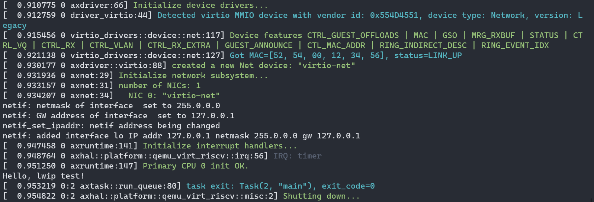
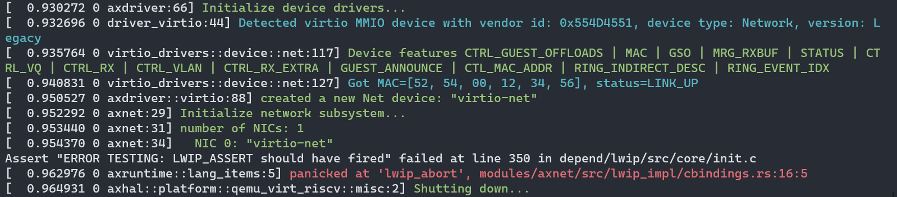

# 第八周汇报

**致理-信计01  佟海轩 2020012709**

## 本周进展

### 分析 lwip 

#### netif 数据结构

- `lwip` 对于网卡的抽象数据结构
- 多网卡组织为 `netif` 的链表，名为 `netif_list`
- 通过 `netif_add` 函数将网卡挂载到 `netif_list` 链表上，需要提供IP地址、子网掩码、默认网关、初始化网卡回调函数 `ethernetif_init`、收包回调函数等参数。在挂载前，`ethernetif_init` 会被调用。

#### 内存管理

- `lwip` 可以自行管理内存。它的内存管理策略有两种：内存堆和内存池。

#### pbuf 数据结构

存储数据区域指针、长度、pbuf 类型、引用数量等信息的结构，可以组织成链表形式。

##### pbuf 类型

- `PBUF_RAM`：内存堆中分配，数据区域紧跟在 pbuf 结构体地址后（会预留 layer 的头部空间），协议栈中最常用
- `PBUF_POOL`：内存池中分配，数据区域紧跟在 pbuf 结构体地址后（会预留 layer 的头部空间），收包时用
- `PBUF_ROM`：内存池中分配，分配时不包含数据区域，数据区位于 ROM
- `PBUF_RAM`：内存池中分配，分配时不包含数据区域，数据区位于 RAM

### 移植 lwip

先主要完成驱动的适配，以类似裸机的形式运行。

#### 需要实现的函数

- `low_level_init()`：网卡初始化函数，供 `ethernetif_init` 调用
- `low_level_output()`：网卡的发送函数，将 pbuf 数据结构解包并发出
- `low_level_input()`：网卡的接收函数，将收到的数据封装为 pbuf 数据结构
- `sys_now()`：时钟

#### 需要移植的头文件

- `lwipopts.h`
- `cc.h`
- `sys_arch.h`

### 移植 lwip 实操

#### 引入 lwip 模块

在 `crate` 中创建模块 `lwip_rust`，目录组织如下：

- `custom/`：移植需要的文件
- `depend/`：以 git submodule 的形式导入的 lwip 库
- `src/`：包装为 rust 模块
- `build.rs`：编译和生成接口脚本，参考 https://github.com/eycorsican/leaf/blob/b0779107921683204a65bb1d41edc07a52688613/leaf/build.rs
- `wrapper.h`：所有需要生成接口的头文件

#### 编译与链接

##### 编译

- 使用 crate `cc`，在 `build.rs` 里将 lwip 编译为静态库 `liblwip.a`

    ```rust
    let mut base_config = cc::Build::new();
    ```

- 头文件目录分别为 lwip 的 include 目录、用于移植的头文件目录、`c_libax` 中的 `libc`（主要使用到一些类型和宏的定义）：

    ```rust
    base_config
        .include("depend/lwip/src/include")
        .include("custom")
        .include("../../ulib/c_libax/include");
    ```

- 然后将所有需要的源文件导入：

    ```rust
    base_config.file("depend/lwip/src/core/xxx.c");
    ```

- 然后需手动在 `build.rs` 中指定

    ```rust
    base_config
        .flag("-march=rv64gc")
        .flag("-mabi=lp64d")
        .flag("-mcmodel=medany");
    ```
    
    否则会导致  `cannot link object files with different floating-point ABI from /tmp/rustcjJ6QUD/symbols.o` 。
    
- 最后定义编译参数并编译：

    ```rust
    base_config
        .warnings(false)
        .flag("-static")
        .flag("-no-pie")
        .flag("-fno-builtin")
        .flag("-ffreestanding")
        .flag("-nostdinc")
        .compile("liblwip.a");
    ```

##### 生成 Rust 接口

- 先指明需要链接的库：

  ```rust
  println!("cargo:rustc-link-lib=lwip");
  println!("cargo:include=depend/lwip/src/include/");
  ```

- 然后使用 crate `bindgen` 生成接口，`wrapper.h` 中包含了所有需要生成接口的头文件：

  ```rust
  let bindings = bindgen::Builder::default()
      .use_core()
      .header("wrapper.h")
      .clang_arg("-I./depend/lwip/src/include")
      .clang_arg("-I./custom")
      .clang_arg("-Wno-everything")
      .layout_tests(false)
      .parse_callbacks(Box::new(bindgen::CargoCallbacks))
      .generate()
      .expect("Unable to generate bindings");
  ```

- 最后输出 `bindings.rs` 到 `src/` 中供 `lib.rs` 使用：

  ```rust
  let out_path = PathBuf::from("src");
  bindings
      .write_to_file(out_path.join("bindings.rs"))
      .expect("Couldn't write bindings!");
  ```

#### 适配 axnet

创建 `lwip_impl`，实现以下内容：

- [ ] `IpAddr`
- [ ] `Ipv4Addr`
- [ ] `SocketAddr`
- [ ] `TcpSocket`
  - [ ] `pub fn new() -> Self`
  - [ ] `pub fn local_addr(&self) -> AxResult<SocketAddr>`
  - [ ] `pub fn peer_addr(&self) -> AxResult<SocketAddr>`
  - [ ] `pub fn connect(&mut self, _addr: SocketAddr) -> AxResult`
  - [ ] `pub fn bind(&mut self, _addr: SocketAddr) -> AxResult`
  - [ ] `pub fn listen(&mut self) -> AxResult`
  - [ ] `pub fn accept(&mut self) -> AxResult<TcpSocket>`
  - [ ] `pub fn shutdown(&self) -> AxResult`
  - [ ] `pub fn recv(&self, _buf: &mut [u8]) -> AxResult<usize>`
  - [ ] `pub fn send(&self, _buf: &[u8]) -> AxResult<usize>`
  - [ ] `fn drop(&mut self) {}`
- [x] `pub(crate) fn init(_net_devs: NetDevices)`

未实现的置为空或 `ax_err!(Unsupported, "LWIP Unsupported")` 即可通过编译。

#### 添加调试信息输出

使用 `printf-compat` crate，在 `lwip_impl` 中实现供 lwip 输出调试信息的 printf 函数：

```rust
use alloc::string::String;
use axlog::ax_print;
use core::ffi::{c_int, c_uchar};

#[no_mangle]
unsafe extern "C" fn lwip_print(str: *const c_uchar, mut args: ...) -> c_int {
    use printf_compat::{format, output};
    let mut s = String::new();
    let bytes_written = format(str, args.as_va_list(), output::fmt_write(&mut s));
    ax_print!("{}", s);
    bytes_written
}

#[no_mangle]
extern "C" fn lwip_abort() {
    panic!("lwip_abort");
}
```

在 `cc.h` 中补充 printf 所需的宏和用于自定义输出的宏：

```c
#define lwip_NO_INTTYPES_H 1
#define U8_F               "hhu"
#define S8_F               "hhd"
#define X8_F               "hhx"
#define U16_F              "hu"
#define S16_F              "hd"
#define X16_F              "hx"
#define U32_F              "u"
#define S32_F              "d"
#define X32_F              "x"
#define SZT_F              "zu"

extern int lwip_print(const char *fmt, ...);
extern void lwip_abort();

#define LWIP_PLATFORM_DIAG(x) \
    do {                      \
        lwip_print x;         \
    } while (0)

#define LWIP_PLATFORM_ASSERT(x)                                                       \
    do {                                                                              \
        lwip_print("Assert \"%s\" failed at line %d in %s\n", x, __LINE__, __FILE__); \
        lwip_abort();                                                                 \
    } while (0)
```

效果：





### 踩坑

调试：`make A=apps/net/lwip_test/ ARCH=riscv64 LOG=trace NET=y MODE=debug debug`

#### 链接脚本问题

初始化 lwip 时出现 `Unhandled trap Exception(StorePageFault) @ 0xffffffc080206ce2`，gdb 跟踪调试发现访问了未在页表中的内存，进一步发现是在 lwip 访问 static 变量时出现。objdump 发现 .bss 段并未全部被包含在对应页表项中，于是怀疑 `axhal/linker.lds.S` 链接脚本中的 ebss 计算有问题。

从

```
.bss : ALIGN(4K) {
    boot_stack = .;
    *(.bss.stack)
    . = ALIGN(4K);
    boot_stack_top = .;

    sbss = .;
    *(.bss .bss.*)
    *(.sbss .sbss.*)
    . = ALIGN(4K);
    ebss = .;
}
```

改为

```
.bss : ALIGN(4K) {
    boot_stack = .;
    *(.bss.stack)
    . = ALIGN(4K);
    boot_stack_top = .;

    sbss = .;
    *(.bss .bss.*)
    *(.sbss .sbss.*)
}
. = ALIGN(4K);
ebss = .;
```

即可。

#### cargo 构建问题

在 no_std 情况下使用 `printf-compat` crate 需要指定 `default-features = false`，然后也需要保证它的依赖 也都不启用 std 的 feature。然而它的依赖 `memchr` 在构建模块 `bindgen` 中被使用，于是被开启了 std feature，导致 cargo build 出错。

问题同：https://github.com/rust-lang/cargo/issues/5730

该问题实际上已被解决，可以在 build 参数中添加 `-Z features=build_dep`（https://github.com/rust-lang/cargo/issues/7915），或者在 `[workspace]` 中指定 `resolver = "2"`（https://doc.rust-lang.org/cargo/reference/features.html#feature-resolver-version-2），即可将 `dependencies` 和 `build-dependencies` 的 features 分开。

## 下周计划

- 
