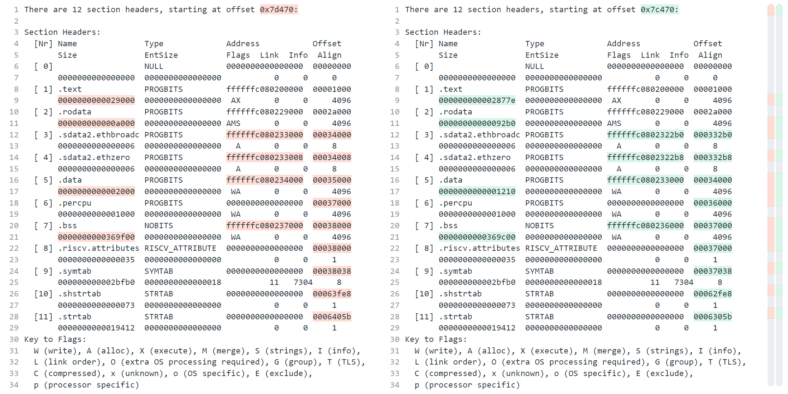
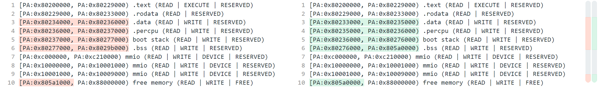
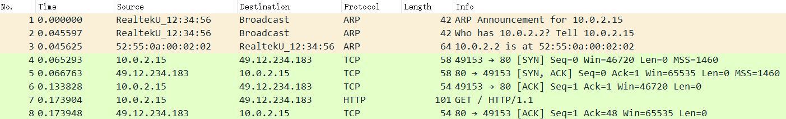

# 第九周汇报

**致理-信计01  佟海轩 2020012709**

## 本周进展

### 上周遗留问题

#### Timer 适配

- `u32_t sys_now(void)`：获取当前时钟，用于实现定时器。使用 `axhal::time::current_time`

- 循环中添加 `sys_check_timeouts();`

#### 优化调试信息输出

- 添加输出时间戳和 CPU ID
- `lwipopts.h` 中完善调试开关模板

#### 链接脚本问题

使用 readelf 读取编译得的文件。

左为原来有问题的；右为修正后的。





### 上层接口适配

- [x] `IpAddr`
  - [x] `pub fn from_str(s: &str) -> Result<IpAddress>`

- [x] `Ipv4Addr`
- [x] `SocketAddr`
- [ ] `TcpSocket`
  - [x] `pub fn new() -> Self`
  - [ ] `pub fn local_addr(&self) -> AxResult<SocketAddr>`
  - [ ] `pub fn peer_addr(&self) -> AxResult<SocketAddr>`
  - [x] `pub fn connect(&mut self, _addr: SocketAddr) -> AxResult`
  - [ ] `pub fn bind(&mut self, _addr: SocketAddr) -> AxResult`
  - [ ] `pub fn listen(&mut self) -> AxResult`
  - [ ] `pub fn accept(&mut self) -> AxResult<TcpSocket>`
  - [ ] `pub fn shutdown(&self) -> AxResult`
  - [x] `pub fn recv(&self, _buf: &mut [u8]) -> AxResult<usize>`
  - [x] `pub fn send(&self, _buf: &[u8]) -> AxResult<usize>`
  - [ ] `fn drop(&mut self) {}`
- [x] `pub(crate) fn init(_net_devs: NetDevices)`

#### 关于 `TcpSocket` 的实现

```rust
struct TcpSocketInner {
    remote_closed: bool,
    connect_result: i8,
    recv_queue: VecDeque<*mut pbuf>,
}
pub struct TcpSocket {
    pcb: *mut tcp_pcb,
    inner: Pin<Box<TcpSocketInner>>,
}
```

lwip 以回调函数的形式执行各种操作。

为了可以在回调函数中获取到对应的 `TcpSocket` 里的内容，在初始化时将自定义的传给回调函数的参数设为 `inner` 的地址。

`TcpSocket` 本身地址可能发生变化，故使用 `Pin<Box<T>>` 创建 `inner`，将地址固定住。

```rust
extern "C" fn connect_callback(arg: *mut c_void, _tpcb: *mut tcp_pcb, err: err_t) -> err_t {
    debug!("[TcpSocket] connect_callback: {:#?}", err);
    let socket_inner = unsafe { &mut *(arg as *mut TcpSocketInner) };
    socket_inner.connect_result = err;
    err
}

pub fn connect(&mut self, addr: SocketAddr) -> AxResult {
    debug!("[TcpSocket] connect to {:#?}", addr);
    let ip_addr: ip_addr_t = addr.addr.into();
    self.inner.connect_result = 1;

    // lock lwip
    let guard = LWIP_MUTEX.lock();
    unsafe {
        debug!("[TcpSocket] tcp_connect");
        match tcp_connect(self.pcb, &ip_addr, addr.port, Some(connect_callback)) {
            0 => {}
            _ => {
                return ax_err!(Unsupported, "LWIP Unsupported");
            }
        };
    }
    drop(guard);

    // wait for connect
    debug!("[TcpSocket] wait for connect");
    lwip_loop_once();
    while self.inner.connect_result == 1 {
        yield_now();
        lwip_loop_once();
    }
    debug!("[TcpSocket] connect result: {}", self.inner.connect_result);

    if self.inner.connect_result == 0 {
        Ok(())
    } else {
        ax_err!(Unsupported, "LWIP Unsupported")
    }
}
```

以 `connect` 为例：

- 在做任何 lwip 协议栈操作之前，获取 `LWIP_MUTEX` 协议栈锁
- 使用 `inner` 中存储的状态判断操作是否完成，若无法完成则 `lwip_loop_once` 并 `yield_now`，直到协议栈调用回调函数修改 `inner` 

### 效果

#### httpclient

`make A=apps/net/httpclient/ ARCH=riscv64 LOG=trace NET=y MODE=debug run`




## 下周计划

- 

